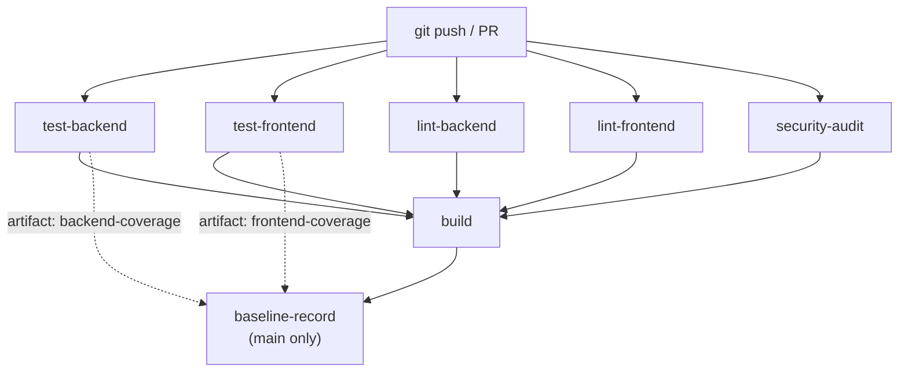

# Interface Design Specification

> **Title**: CI Pipeline, Docker Compose & Baseline Metrics — Infrastructure Interfaces
> **Phase**: 0 | **PR(s)**: 0.3.1, 0.3.2, 0.3.3, 0.3.4, 0.3.5
> **Author**: Tech Lead
> **Date**: 2026-04-05
> **Status**: Draft
> **Version**: 1.0

> Phase 0 introduces no HTTP APIs or user-facing endpoints. The "interfaces" in this spec are inter-component contracts between CI pipeline jobs, Docker Compose service definitions, and the baseline metrics script. These are infrastructure contracts — YAML schemas, shell script I/O formats, port allocations, healthcheck protocols, and artifact schemas — not REST APIs.
>
> Sections 3–6 (API Endpoints, Pagination, Streaming, WebSocket) are marked N/A since Phase 0 has no application API changes. The focus is on Sections 2, 7, 8, and 10.

---

## 1. Overview

Phase 0 stabilizes the existing Legal AI Platform by expanding the CI pipeline from 3 jobs to 7+ jobs, validating Docker Compose service interfaces, and introducing a baseline metrics recording script. This ID Spec defines the contracts between these infrastructure components.

| Role | Component |
|------|-----------|
| **Producer** | CI pipeline jobs (test-backend, test-frontend, lint-backend, lint-frontend, security-audit, build, baseline-record) |
| **Consumer** | Downstream CI jobs (build depends on parallel gates; baseline-record depends on all); developers (artifact consumers); Phase 1+ specs (baseline.json consumers) |
| **Producer** | Docker Compose service definitions (`docker-compose.yml`, `docker-compose.dev.yml`) |
| **Consumer** | Backend application (`backend` service), CI build job, developer workstations |
| **Producer** | `scripts/record-baseline.sh` |
| **Consumer** | CI artifact store, Phase 1+ threshold enforcement, trend analysis |

### Interface Inventory

| Interface | Type | Producer | Consumer | Section |
|-----------|------|----------|----------|---------|
| CI Workflow YAML Contract | Gitea Actions YAML | `.gitea/workflows/ci.yml` | Gitea CI Runner | §2, §7.1 |
| CI Job Dependency Graph | YAML `needs:` directives | CI job definitions | Gitea runner orchestrator | §7.2 |
| CI Artifact Schema | File artifacts | Individual CI jobs | `baseline-record` job, developers | §7.3 |
| Docker Compose Port Map | YAML port bindings | `docker-compose.yml` / `.dev.yml` | Application services, developer tools | §7.4 |
| Docker Compose Healthcheck Protocol | Shell commands | Container healthchecks | Docker daemon, `depends_on` conditions | §7.5 |
| Docker Compose Volume Map | YAML volume bindings | Compose definitions | Containers, host filesystem | §7.6 |
| Docker Compose Environment Contract | `.env` → YAML interpolation | `.env` file | Compose service definitions | §7.7 |
| Baseline Metrics JSON Schema | JSON file | `scripts/record-baseline.sh` | CI artifact store, Phase 1+ consumers | §7.8 |
| Security Audit Report Schema | JSON files | pip-audit, npm audit | Security stakeholder, CI artifacts | §7.9 |
| Coverage Report Schema | XML (Cobertura) + HTML | pytest-cov, vitest | `record-baseline.sh`, developers | §7.10 |

## 2. Global API Policies

N/A — Phase 0 introduces no HTTP APIs. The existing backend API at `/api/v1/` is unchanged.

For reference, the existing infrastructure uses these network policies:

| Policy | Value | Notes |
|--------|-------|-------|
| Backend API Base URL | `/api/v1` | Unchanged in Phase 0; documented for context |
| Docker internal network | Default bridge (`legal-ai-*` containers) | All Compose services share a single Docker bridge network |
| Host-exposed port range | 3000–9001 (see §7.4 for full map) | Configurable via `.env` variables |
| CI runner network | `ubuntu-latest` container network | No database services in CI for Phase 0 |

### Rate Limiting Strategy

N/A — No new endpoints. Existing rate limiting configuration (`RATE_LIMIT_PER_MINUTE=60`, `RATE_LIMIT_PER_HOUR=1000` in `.env`) is unchanged.

## 3. API Endpoints

N/A — Phase 0 makes no API changes. No endpoints are added, modified, or removed. The existing health endpoint (`GET /api/v1/health/ready`) used in the backend Docker healthcheck is pre-existing and unchanged.

## 4. Pagination

N/A — No new list endpoints in Phase 0.

## 5. Streaming Responses

N/A — No streaming endpoints in Phase 0. AI streaming begins in Phase 3.

## 6. WebSocket Protocols (if applicable)

N/A — No WebSocket protocols in Phase 0.

## 7. Data Models / Schemas

### 7.1 CI Workflow YAML Contract

The expanded CI pipeline in `.gitea/workflows/ci.yml` must conform to this structural contract. This is the canonical reference for what the pipeline looks like after Phase 0.

```yaml
# .gitea/workflows/ci.yml — Phase 0 Target State
name: CI/CD Pipeline

on:
  push:
    branches: [main, develop]
  pull_request:
    branches: [main]

jobs:
  # ── Parallel Quality Gates ────────────────────────────────
  test-backend:
    runs-on: ubuntu-latest
    steps:
      - uses: actions/checkout@v3
      - uses: actions/setup-python@v4
        with:
          python-version: "3.11"
      - name: Install dependencies
        run: |
          cd backend
          pip install -r requirements.lock
          pip install pytest pytest-cov
      - name: Run tests with coverage
        run: |
          cd backend
          pytest --cov=app --cov-report=xml:coverage.xml \
                 --cov-report=html:htmlcov/ -v \
                 | tee pytest-output.txt
      - name: Upload coverage artifacts
        uses: actions/upload-artifact@v3
        with:
          name: backend-coverage
          path: |
            backend/coverage.xml
            backend/htmlcov/
            backend/pytest-output.txt
          retention-days: 90

  test-frontend:
    runs-on: ubuntu-latest
    steps:
      - uses: actions/checkout@v3
      - uses: actions/setup-node@v3
        with:
          node-version: "18"
      - name: Install dependencies
        run: |
          cd frontend
          npm ci
      - name: Run tests with coverage
        run: |
          cd frontend
          npx vitest run --coverage | tee vitest-output.txt
      - name: Upload coverage artifacts
        uses: actions/upload-artifact@v3
        with:
          name: frontend-coverage
          path: |
            frontend/coverage/
            frontend/vitest-output.txt
          retention-days: 90

  lint-backend:
    runs-on: ubuntu-latest
    steps:
      - uses: actions/checkout@v3
      - uses: actions/setup-python@v4
        with:
          python-version: "3.11"
      - name: Install linters
        run: pip install ruff mypy
      - name: Run ruff
        run: |
          cd backend
          ruff check .
      - name: Run mypy
        run: |
          cd backend
          mypy app/ --ignore-missing-imports

  lint-frontend:
    runs-on: ubuntu-latest
    steps:
      - uses: actions/checkout@v3
      - uses: actions/setup-node@v3
        with:
          node-version: "18"
      - name: Install dependencies
        run: |
          cd frontend
          npm ci
      - name: Run eslint
        run: |
          cd frontend
          npx eslint .
      - name: Run tsc
        run: |
          cd frontend
          npx tsc --noEmit

  security-audit:
    runs-on: ubuntu-latest
    steps:
      - uses: actions/checkout@v3
      - uses: actions/setup-python@v4
        with:
          python-version: "3.11"
      - uses: actions/setup-node@v3
        with:
          node-version: "18"
      - name: Python audit
        run: |
          cd backend
          pip install pip-audit
          pip-audit -r requirements.lock --format json \
                    --output pip-audit-report.json || true
      - name: npm audit
        run: |
          cd frontend
          npm ci
          npm audit --json > npm-audit-report.json || true
      - name: Upload audit reports
        uses: actions/upload-artifact@v3
        with:
          name: security-audit-reports
          path: |
            backend/pip-audit-report.json
            frontend/npm-audit-report.json
          retention-days: 90

  # ── Sequential Gate ───────────────────────────────────────
  build:
    needs: [test-backend, test-frontend, lint-backend, lint-frontend, security-audit]
    runs-on: ubuntu-latest
    steps:
      - uses: actions/checkout@v3
      - name: Build Docker images
        run: docker-compose build
      - name: Record build duration
        id: build-time
        run: echo "duration=$SECONDS" >> $GITHUB_OUTPUT

  baseline-record:
    needs: [build, test-backend, test-frontend]
    runs-on: ubuntu-latest
    if: github.ref == 'refs/heads/main'
    steps:
      - uses: actions/checkout@v3
      - name: Download backend coverage
        uses: actions/download-artifact@v3
        with:
          name: backend-coverage
          path: backend/
      - name: Download frontend coverage
        uses: actions/download-artifact@v3
        with:
          name: frontend-coverage
          path: frontend/
      - name: Record baseline
        run: |
          chmod +x scripts/record-baseline.sh
          bash scripts/record-baseline.sh
      - name: Upload baseline
        uses: actions/upload-artifact@v3
        with:
          name: baseline-metrics
          path: baseline.json
          retention-days: 90
```

**Contract invariants:**
- All 5 parallel jobs (`test-backend`, `test-frontend`, `lint-backend`, `lint-frontend`, `security-audit`) MUST run concurrently (no `needs:` between them)
- `build` MUST declare `needs: [test-backend, test-frontend, lint-backend, lint-frontend, security-audit]`
- `baseline-record` MUST declare `needs: [build, test-backend, test-frontend]` and `if: github.ref == 'refs/heads/main'`
- All artifact uploads MUST use `retention-days: 90` (NFR-08)
- Python version MUST be `3.11` across all Python jobs
- Node version MUST be `18` across all Node jobs
- Backend MUST install from `requirements.lock` (not `requirements.txt`)
- Frontend MUST use `npm ci` (not `npm install`)

### 7.2 CI Job Dependency Graph



**Dependency contract:**

| Job | `needs:` | `if:` | Inputs | Outputs |
|-----|----------|-------|--------|---------|
| `test-backend` | — | — | `requirements.lock` | `backend-coverage` artifact (coverage.xml, htmlcov/, pytest-output.txt) |
| `test-frontend` | — | — | `package-lock.json` | `frontend-coverage` artifact (coverage/, vitest-output.txt) |
| `lint-backend` | — | — | `pyproject.toml` [tool.ruff], [tool.mypy] | Exit code 0 or non-zero |
| `lint-frontend` | — | — | `.eslintrc.*` or `eslint.config.*`, `tsconfig.json` | Exit code 0 or non-zero |
| `security-audit` | — | — | `requirements.lock`, `package-lock.json` | `security-audit-reports` artifact (pip-audit-report.json, npm-audit-report.json) |
| `build` | `[test-backend, test-frontend, lint-backend, lint-frontend, security-audit]` | — | `docker-compose.yml`, `Dockerfile`s | Docker images built |
| `baseline-record` | `[build, test-backend, test-frontend]` | `github.ref == 'refs/heads/main'` | Downloaded `backend-coverage` + `frontend-coverage` artifacts | `baseline-metrics` artifact (baseline.json) |

### 7.3 CI Artifact Schema

All CI artifacts follow these conventions:

| Artifact Name | Produced By | Contents | Format | Retention | Consumed By |
|---------------|-------------|----------|--------|-----------|-------------|
| `backend-coverage` | `test-backend` | `coverage.xml`, `htmlcov/`, `pytest-output.txt` | Cobertura XML, HTML, plaintext | 90 days | `baseline-record`, developers |
| `frontend-coverage` | `test-frontend` | `coverage/`, `vitest-output.txt` | lcov/v8, plaintext | 90 days | `baseline-record`, developers |
| `security-audit-reports` | `security-audit` | `pip-audit-report.json`, `npm-audit-report.json` | JSON | 90 days | Security stakeholder |
| `baseline-metrics` | `baseline-record` | `baseline.json` | JSON (schema in §7.8) | 90 days | Phase 1+ threshold specs |

### 7.4 Docker Compose Port Map

The canonical port allocation for all Docker Compose services. Both `docker-compose.yml` (full stack) and `docker-compose.dev.yml` (databases only) use the same port variables.

| Service | Container Port | Host Port (`.env` var) | Default | Protocol | Purpose |
|---------|---------------|----------------------|---------|----------|---------|
| PostgreSQL | 5432 | `${POSTGRES_PORT}` | 5432 | TCP (libpq) | SQL connections |
| Redis | 6379 | `${REDIS_PORT}` | 6379 | TCP (RESP) | Cache, session, Celery broker |
| Neo4j HTTP | 7474 | `${NEO4J_HTTP_PORT}` | 7474 | HTTP | Neo4j Browser UI |
| Neo4j Bolt | 7687 | `${NEO4J_PORT}` | 7687 | TCP (Bolt) | Cypher query protocol |
| Qdrant HTTP | 6333 | `${QDRANT_PORT}` | 6333 | HTTP/REST | Vector operations API |
| Qdrant gRPC | 6334 | `${QDRANT_GRPC_PORT}` | 6334 | gRPC | High-performance vector operations |
| MinIO API | 9000 | `${MINIO_PORT}` | 9000 | HTTP (S3-compatible) | Object storage API |
| MinIO Console | 9001 | `${MINIO_CONSOLE_PORT}` | 9001 | HTTP | Admin web UI |
| ClamAV | 3310 | `${CLAMAV_PORT}` | 3310 | TCP (clamd) | Antivirus scanning |
| Backend API | 8000 | `${BACKEND_PORT}` | 8000 | HTTP | FastAPI application |
| Frontend | 3000 | `${FRONTEND_PORT}` | 3000 | HTTP | Vite dev server |

**Contract invariants:**
- All host ports are configurable via `.env` to avoid conflicts on developer machines
- Container-internal ports are fixed (e.g., PostgreSQL always listens on 5432 inside the container)
- `docker-compose.dev.yml` exposes database ports only (no backend/frontend/celery)
- `docker-compose.yml` exposes all ports including application services
- Port conflicts are detected by `scripts/check-ports.sh` (pre-existing utility)

### 7.5 Docker Compose Healthcheck Protocol

Each service defines a healthcheck that Docker uses for `depends_on: condition: service_healthy`. These are contracts — changing a healthcheck command or timing can break service startup ordering.

#### PostgreSQL

| Property | `docker-compose.yml` | `docker-compose.dev.yml` | Consistent? |
|----------|---------------------|-------------------------|-------------|
| Command | `pg_isready -U ${POSTGRES_USER} -d ${POSTGRES_DB}` | `pg_isready -U ${POSTGRES_USER} -d ${POSTGRES_DB}` | ✅ Yes |
| Interval | 10s | 10s | ✅ Yes |
| Timeout | 5s | 5s | ✅ Yes |
| Retries | 5 | 5 | ✅ Yes |
| Start period | 30s | 30s | ✅ Yes |

**Readiness signal**: Exit code 0 from `pg_isready` = accepting connections on port 5432.

#### Redis

| Property | `docker-compose.yml` | `docker-compose.dev.yml` | Consistent? |
|----------|---------------------|-------------------------|-------------|
| Command | `redis-cli ping` | `redis-cli ping` | ✅ Yes |
| Interval | 10s | 10s | ✅ Yes |
| Timeout | 3s | 3s | ✅ Yes |
| Retries | 5 | 5 | ✅ Yes |
| Start period | (none) | (none) | ✅ Yes |

**Readiness signal**: Redis responds `PONG` to `PING` command.

#### Neo4j

| Property | `docker-compose.yml` | `docker-compose.dev.yml` | Consistent? |
|----------|---------------------|-------------------------|-------------|
| Command | `cypher-shell -u neo4j -p ${NEO4J_PASSWORD} "RETURN 1"` | `cypher-shell -u neo4j -p ${NEO4J_PASSWORD} 'RETURN 1'` | ⚠️ Quote style differs (functional equivalent) |
| Interval | 10s | 30s | ❌ **Inconsistent** |
| Timeout | 10s | 10s | ✅ Yes |
| Retries | 10 | 5 | ❌ **Inconsistent** |
| Start period | 40s | 60s | ❌ **Inconsistent** |

**Readiness signal**: `cypher-shell` successfully executes `RETURN 1` query = Bolt protocol accepting queries.

**⚠️ Noted inconsistency**: The healthcheck timings differ between the two Compose files. `docker-compose.yml` is more aggressive (10s interval, 10 retries, 40s start) while `.dev.yml` is more relaxed (30s interval, 5 retries, 60s start). This is tech debt flagged in Tech Spec §14 Open Question #6 — not Phase 0 remediation scope.

#### Qdrant

| Property | `docker-compose.yml` | `docker-compose.dev.yml` | Consistent? |
|----------|---------------------|-------------------------|-------------|
| Command | `test -d /qdrant/storage && echo 'healthy' \|\| exit 1` | `curl -f http://localhost:6333/ \|\| exit 1` | ❌ **Inconsistent — different check type** |
| Interval | 30s | 30s | ✅ Yes |
| Timeout | 5s | 10s | ❌ **Inconsistent** |
| Retries | 3 | 3 | ✅ Yes |
| Start period | 30s | 60s | ❌ **Inconsistent** |

**Readiness signal**: Divergent.
- `docker-compose.yml`: Filesystem check (directory exists) — checks storage init, NOT API readiness
- `docker-compose.dev.yml`: HTTP check (`curl` to REST API) — checks actual API readiness

**⚠️ Known issue**: The `docker-compose.yml` healthcheck is weaker — a directory can exist before the HTTP API is ready. The `docker-compose.dev.yml` curl-based check is the correct approach. Documented for Phase 1 remediation.

#### MinIO

| Property | `docker-compose.yml` | `docker-compose.dev.yml` | Consistent? |
|----------|---------------------|-------------------------|-------------|
| Command | `curl -f http://localhost:9000/minio/health/live` | `curl -f http://localhost:9000/minio/health/live` | ✅ Yes |
| Interval | 10s | 30s | ❌ **Inconsistent** |
| Timeout | 5s | 20s | ❌ **Inconsistent** |
| Retries | 5 | 3 | ❌ **Inconsistent** |
| Start period | 30s | 60s | ❌ **Inconsistent** |

**Readiness signal**: MinIO liveness endpoint returns HTTP 200.

#### ClamAV

| Property | `docker-compose.yml` | `docker-compose.dev.yml` | Consistent? |
|----------|---------------------|-------------------------|-------------|
| Command | `clamdscan --ping \|\| test -f /tmp/clamd.pid` | `clamdscan --ping` | ❌ **Inconsistent — fallback differs** |
| Interval | 60s | 60s | ✅ Yes |
| Timeout | 30s | 30s | ✅ Yes |
| Retries | 5 | 3 | ❌ **Inconsistent** |
| Start period | 300s | 300s | ✅ Yes |

**Readiness signal**: `clamdscan --ping` succeeds (clamd daemon responding). The `docker-compose.yml` version has a fallback to PID file check which is weaker.

#### Backend (full stack only)

| Property | Value |
|----------|-------|
| Command | `curl -f http://localhost:8000/api/v1/health/ready` |
| Interval | 10s |
| Timeout | 5s |
| Retries | 10 |
| Start period | 60s |
| Depends on | postgres (healthy), redis (healthy), neo4j (healthy), qdrant (healthy), minio (healthy) |

**Readiness signal**: Backend health endpoint returns HTTP 200, meaning all upstream DB connections initialized and Alembic migrations completed.

#### Celery (full stack only)

| Property | Value |
|----------|-------|
| Command | `celery -A app.workers.celery_app inspect ping` |
| Interval | 30s |
| Timeout | 10s |
| Retries | 3 |
| Start period | (none) |
| Depends on | redis (healthy), postgres (healthy) |

**Readiness signal**: At least one Celery worker responds to ping.

#### Frontend (full stack only)

| Property | Value |
|----------|-------|
| Command | `curl -f http://localhost:3000` |
| Interval | 30s |
| Timeout | 10s |
| Retries | 3 |
| Start period | 60s |
| Depends on | backend (started) |

**Readiness signal**: Vite dev server returns HTTP 200 on root path.

### 7.6 Docker Compose Volume Map

| Volume Name | Mount Path | Service | Purpose | Persistent? |
|-------------|-----------|---------|---------|-------------|
| `postgres_data` | `/var/lib/postgresql/data` | postgres | Database files | Yes (named volume) |
| `redis_data` | `/data` | redis | AOF persistence | Yes (named volume) |
| `neo4j_data` | `/data` | neo4j | Graph database files | Yes (named volume) |
| `neo4j_logs` | `/logs` | neo4j | Neo4j log files | Yes (named volume) |
| `qdrant_data` | `/qdrant/storage` | qdrant | Vector index files | Yes (named volume) |
| `minio_data` | `/data` | minio | Object storage blobs | Yes (named volume) |
| `clamav_data` | `/var/lib/clamav` | clamav | Virus definition DBs | Yes (named volume) |
| `frontend_node_modules` | `/app/node_modules` | frontend | npm dependencies | Yes (named volume) |
| `./backend` | `/app` | backend, celery | Source code (hot reload) | Bind mount |
| `./frontend` | `/app` | frontend | Source code (hot reload) | Bind mount |
| `./scripts` | `/scripts` | backend | Utility scripts | Bind mount |
| `./scripts/init-neo4j.cypher` | `/var/lib/neo4j/import/init.cypher` | neo4j | DB initialization | Bind mount |
| `./scripts/init-postgres.sql` | `/docker-entrypoint-initdb.d/init.sql` | postgres | DB initialization | Bind mount |
| `./quarantine` | `/var/quarantine` | clamav | Quarantined files | Bind mount (full stack only) |

**Contract invariant**: `docker-compose.dev.yml` uses `*_dev_data` volume names (e.g., `postgres_dev_data`) to avoid collision with full-stack volumes. This allows running dev databases and full stack simultaneously without data corruption.

### 7.7 Docker Compose Environment Contract

The `.env` file serves as the single source of truth for all configurable values interpolated into Docker Compose files. This is the contract between `.env` and the Compose YAML.

**Required variables** (Compose will fail if missing and no default exists in the YAML):

| Variable | Used By | Example Value |
|----------|---------|---------------|
| `POSTGRES_USER` | postgres | `postgres` |
| `POSTGRES_PASSWORD` | postgres, backend | `password` |
| `POSTGRES_DB` | postgres, backend | `legal_ai` |
| `POSTGRES_PORT` | postgres | `5432` |
| `REDIS_PORT` | redis | `6379` |
| `NEO4J_HTTP_PORT` | neo4j | `7474` |
| `NEO4J_PORT` | neo4j | `7687` |
| `NEO4J_AUTH` | neo4j | `neo4j/password` |
| `NEO4J_PASSWORD` | neo4j (healthcheck), backend | `password` |
| `QDRANT_PORT` | qdrant | `6333` |
| `QDRANT_GRPC_PORT` | qdrant | `6334` |
| `MINIO_PORT` | minio | `9000` |
| `MINIO_CONSOLE_PORT` | minio | `9001` |
| `MINIO_ROOT_USER` | minio | `minioadmin` |
| `MINIO_ROOT_PASSWORD` | minio | `minioadmin` |
| `CLAMAV_PORT` | clamav | `3310` |
| `CLAMAV_NO_FRESHCLAM` | clamav | `false` |
| `CLAMAV_NO_CLAMD` | clamav | `false` |

**Additional variables for full stack** (`docker-compose.yml` only):

| Variable | Used By | Example Value |
|----------|---------|---------------|
| `BACKEND_HOST` | backend | `localhost` |
| `BACKEND_PORT` | backend | `8000` |
| `FRONTEND_PORT` | frontend | `3000` |
| `FRONTEND_URL` | backend | `http://localhost:3000` |
| `BACKEND_CORS_ORIGINS` | backend | `["http://localhost:3000"]` |
| `SECRET_KEY` | backend | `your-secret-key-here` |
| `JWT_SECRET_KEY` | backend | `your-jwt-secret-key-here` |
| `DEBUG` | backend | `true` |
| `ENVIRONMENT` | backend | `development` |
| `MINIO_ACCESS_KEY` | backend | `minioadmin` |
| `MINIO_SECRET_KEY` | backend | `minioadmin` |
| `VITE_API_BASE_URL` | frontend | `http://localhost:8000` |
| `VITE_APP_NAME` | frontend | `Legal AI Platform` |
| `VITE_APP_VERSION` | frontend | `1.0.0` |
| `VITE_ENABLE_ANALYTICS` | frontend | `false` |
| `VITE_ENABLE_DEBUG` | frontend | `true` |

### 7.8 Baseline Metrics JSON Schema

`scripts/record-baseline.sh` produces `baseline.json` as its sole output artifact. This is the contract for that file.

**Schema:**

```python
from pydantic import BaseModel, Field
from datetime import datetime
from typing import Optional


class BaselineMetrics(BaseModel):
    """Schema for baseline.json produced by scripts/record-baseline.sh.

    This is the contract between the CI baseline-record job and any
    downstream consumer (Phase 1+ threshold enforcement, trend analysis).
    """

    timestamp: datetime = Field(
        ...,
        description="UTC ISO-8601 timestamp of when the baseline was recorded",
        json_schema_extra={"example": "2026-04-05T14:30:00Z"},
    )
    commit: str = Field(
        ...,
        min_length=40,
        max_length=40,
        description="Full SHA-1 commit hash from git rev-parse HEAD",
        json_schema_extra={"example": "a1b2c3d4e5f6a7b8c9d0e1f2a3b4c5d6e7f8a9b0"},
    )
    backend_test_count: int = Field(
        ...,
        ge=0,
        description="Number of backend test cases executed (from pytest output)",
        json_schema_extra={"example": 142},
    )
    backend_coverage_pct: float = Field(
        ...,
        ge=0.0,
        le=100.0,
        description="Backend line coverage percentage (from coverage.xml line-rate × 100)",
        json_schema_extra={"example": 45.3},
    )
    frontend_test_count: int = Field(
        ...,
        ge=0,
        description="Number of frontend test cases executed (from vitest output)",
        json_schema_extra={"example": 87},
    )
    frontend_coverage_pct: float = Field(
        ...,
        ge=0.0,
        le=100.0,
        description="Frontend line coverage percentage (from coverage summary)",
        json_schema_extra={"example": 62.1},
    )
    build_time_s: int = Field(
        ...,
        ge=0,
        description="Docker Compose build duration in seconds",
        json_schema_extra={"example": 145},
    )
    bundle_size_kb: int = Field(
        ...,
        ge=0,
        description="Frontend production bundle size in kilobytes (du -sk frontend/dist/)",
        json_schema_extra={"example": 1024},
    )

    model_config = {
        "json_schema_extra": {
            "example": {
                "timestamp": "2026-04-05T14:30:00Z",
                "commit": "a1b2c3d4e5f6a7b8c9d0e1f2a3b4c5d6e7f8a9b0",
                "backend_test_count": 142,
                "backend_coverage_pct": 45.3,
                "frontend_test_count": 87,
                "frontend_coverage_pct": 62.1,
                "build_time_s": 145,
                "bundle_size_kb": 1024,
            }
        }
    }
```

**Example output (`baseline.json`):**

```json
{
  "timestamp": "2026-04-05T14:30:00Z",
  "commit": "a1b2c3d4e5f6a7b8c9d0e1f2a3b4c5d6e7f8a9b0",
  "backend_test_count": 142,
  "backend_coverage_pct": 45.3,
  "frontend_test_count": 87,
  "frontend_coverage_pct": 62.1,
  "build_time_s": 145,
  "bundle_size_kb": 1024
}
```

**Contract invariants:**
- All 8 fields MUST be present (no optional fields)
- If a metric cannot be collected, the field defaults to `0` (not `null`, not omitted)
- `timestamp` MUST be UTC ISO-8601 format
- `commit` MUST be the full 40-character SHA-1 hash
- `backend_coverage_pct` and `frontend_coverage_pct` are percentages (0.0–100.0), not ratios (0.0–1.0)
- JSON MUST be valid and parseable by `python -m json.tool`

### 7.9 Security Audit Report Schema

#### pip-audit Report (`pip-audit-report.json`)

Produced by: `pip-audit -r requirements.lock --format json --output pip-audit-report.json`

```json
{
  "dependencies": [
    {
      "name": "package-name",
      "version": "1.2.3",
      "vulns": [
        {
          "id": "PYSEC-2026-001",
          "fix_versions": ["1.2.4"],
          "description": "Description of vulnerability"
        }
      ]
    }
  ],
  "fixes": []
}
```

**Contract**: This is pip-audit's native JSON output format. Consumers should parse `dependencies[].vulns[]` to count vulnerabilities. An empty `vulns` array means the package has no known CVEs.

#### npm Audit Report (`npm-audit-report.json`)

Produced by: `npm audit --json > npm-audit-report.json`

```json
{
  "auditReportVersion": 2,
  "vulnerabilities": {
    "package-name": {
      "name": "package-name",
      "severity": "high",
      "range": ">=1.0.0 <1.2.4",
      "fixAvailable": true
    }
  },
  "metadata": {
    "vulnerabilities": {
      "info": 0,
      "low": 2,
      "moderate": 1,
      "high": 0,
      "critical": 0,
      "total": 3
    }
  }
}
```

**Contract**: This is npm's native audit JSON format (v2). Consumers should read `metadata.vulnerabilities` for summary counts and `vulnerabilities.*` for per-package details.

### 7.10 Coverage Report Schema

#### Backend Coverage (`coverage.xml`)

Produced by: `pytest --cov=app --cov-report=xml:coverage.xml`

Format: Cobertura XML. Key attributes consumed by `record-baseline.sh`:

```xml
<?xml version="1.0" ?>
<coverage version="7.4.0" timestamp="1712345678" lines-valid="5000" lines-covered="2265" line-rate="0.453" branch-rate="0" complexity="0">
  <packages>
    <package name="app" line-rate="0.453">
      <classes>
        <class name="main.py" filename="app/main.py" line-rate="0.80">
          <!-- line-by-line coverage data -->
        </class>
      </classes>
    </package>
  </packages>
</coverage>
```

**Contract**: `record-baseline.sh` extracts `line-rate` from the root `<coverage>` element and multiplies by 100 to get percentage.

```python
# Extraction logic in record-baseline.sh
float(ET.parse('backend/coverage.xml').getroot().attrib['line-rate']) * 100
```

#### Frontend Coverage (`vitest-output.txt`)

Produced by: `npx vitest run --coverage | tee vitest-output.txt`

Format: Plaintext table with coverage summary. Key line consumed by `record-baseline.sh`:

```
 % Coverage report from v8
----------|---------|----------|---------|---------|---
File      | % Stmts | % Branch | % Funcs | % Lines |
----------|---------|----------|---------|---------|---
All files |   62.1  |   48.3   |  55.7   |  62.1   |
----------|---------|----------|---------|---------|---
```

**Contract**: `record-baseline.sh` extracts the `% Lines` value from the `All files` row using pattern matching.

```bash
# Extraction logic in record-baseline.sh
grep -oP 'All files\s+\|\s+\K[\d.]+' frontend/vitest-output.txt
```

**Note**: The exact output format depends on the vitest coverage provider (v8 vs istanbul) configured in `vitest.config.ts`. The grep pattern should work for both but should be validated during PR 0.3.2.

## 8. Tool Interfaces (for Agent SDK tools)

N/A — Phase 0 does not involve agent tools. Agent SDK interfaces are Phase 3+ scope.

## 9. Webhook Callbacks (if applicable)

N/A — Phase 0 has no async operations requiring webhook callbacks.

## 10. Versioning & Compatibility

### Versioning Strategy

| Aspect | Approach |
|--------|----------|
| CI workflow versioning | Implicit via git history — `.gitea/workflows/ci.yml` is version-controlled. No explicit versioning header |
| Docker Compose versioning | Implicit via git history. Image tags pinned (e.g., `postgres:15`, `redis:7-alpine`). Phase 1 upgrades change these tags |
| `baseline.json` schema versioning | Schema is additive-only in Phase 0. New fields may be added in Phase 1+ but existing fields must not be removed or renamed |
| Lock file versioning | `requirements.lock` regenerated on dependency changes; `package-lock.json` updated by `npm install` |
| Breaking change definition | Removing a field from `baseline.json`, changing a CI job name (breaks `needs:` references), changing a port default |
| Non-breaking changes | Adding new CI jobs, adding fields to `baseline.json`, adding new Docker Compose services |

### Version History

| Version | Changes | Backward Compatible |
|---------|---------|---------------------|
| 1.0 | Initial Phase 0 interfaces — CI pipeline (7 jobs), Docker Compose contracts, baseline.json schema | N/A |

### Deprecation Flow

N/A — Phase 0 is the initial release. No existing interfaces are being deprecated. When Phase 1 changes image tags (e.g., `postgres:15` → `postgres:17`), the migration guide will document the transition.

## 11. Related Documents

| Document | Link |
|----------|------|
| Tech Spec (upstream) | [0.0_tech-spec_stabilization.md](./0.0_tech-spec_stabilization.md) |
| ADR — Multi-Database Infrastructure (upstream) | [0.0_adr_multi-database-infrastructure.md](./0.0_adr_multi-database-infrastructure.md) |
| BRD (upstream) | [0.0_brd_stabilization.md](./0.0_brd_stabilization.md) |
| PRD (upstream) | [0.0_prd_stabilization.md](./0.0_prd_stabilization.md) |
| Dep Review — Infrastructure Dependencies | [0.2_dep-review_infrastructure-deps.md](./0.2_dep-review_infrastructure-deps.md) |
| Test Spec | [0.0_test-spec_stabilization.md](./0.0_test-spec_stabilization.md) *(to be created)* |
| Perf Spec | [0.0_perf-spec_baseline-metrics.md](./0.0_perf-spec_baseline-metrics.md) *(to be created)* |
| Docker Compose (full stack) | [docker-compose.yml](../../docker-compose.yml) |
| Docker Compose (dev) | [docker-compose.dev.yml](../../docker-compose.dev.yml) |
| Environment config | [.env](../../.env) |
| Current CI pipeline | [.gitea/workflows/ci.yml](../../.gitea/workflows/ci.yml) |

## Version History

| Date | Change | Author |
|------|--------|--------|
| 2026-04-05 | Initial draft — CI pipeline YAML contract, Docker Compose service interfaces (ports, volumes, healthchecks, env vars), baseline.json schema, coverage/audit report schemas | Tech Lead |
