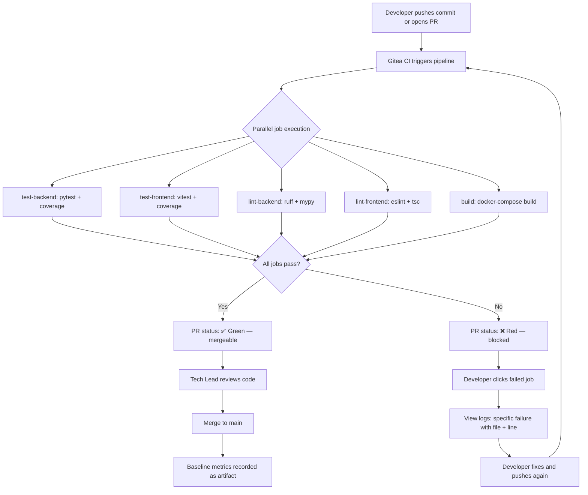

# Product Requirements Document

> **Feature**: Stabilization — Test Fixes, Dependency Audit, CI Pipeline & Baseline Metrics
> **Phase**: Phase 0
> **Author**: PM
> **Date**: 2026-04-05
> **Status**: Draft

---

## 1. Problem Statement

**Who experiences the problem**: Every engineer on the team (currently 2 backend + 2 frontend), the Tech Lead (PR reviewer), and the PM (roadmap owner).

**What the problem is**: The platform's ~75K-line codebase has no reliable quality safety net. Test suites have unknown pass rates, dependency trees are non-reproducible, no security scanning exists, and CI runs a minimal 3-job pipeline with no coverage reporting or linting enforcement. Engineers cannot confidently answer: "Is this PR safe to merge?"

**How often**: Every PR — approximately 158 PRs across the 12–15 week Modernization Roadmap. Without a green baseline, each PR is a blind merge.

**Cost of inaction**: Quantified in the upstream BRD (§3):
- **$500K–$2M** potential breach remediation from unscanned CVEs across 180+ transitive dependencies.
- **7.5 person-weeks (~$75K)** of undetected regression debugging across Phases 1–5.
- **79 hours** of manual test running across 158 PRs (no CI feedback loop).
- **2–4 hours/week** wasted on "works on my machine" failures (no lock files) × 15 weeks = 30–60 hours.
- **$40K/week** in extended timeline cost for each week Phase 0 slips, since Phases 1–5 are blocked.

## 2. Prior Art / Alternatives

| Solution / Tool | How It Addresses This Problem | Limitations | How This Feature Differs |
|----------------|-------------------------------|-------------|--------------------------|
| Current CI (3-job pipeline) | Runs `pytest`, `npm test`, `docker-compose build` on PRs | No coverage, no linting, no type checking, no baseline recording. Failures are noise — no one knows what "green" looks like | Adds 7+ CI jobs with coverage thresholds, static analysis, and recorded baselines |
| Manual test running before merge | Developer runs tests locally, reports pass/fail in PR description | Inconsistent — different environments, different results. No enforcement. Costs ~30 min/PR | CI-automated with deterministic results; zero manual effort per PR |
| Skip stabilization — start Phase 1 directly | Saves 2 weeks on calendar | Unacceptable risk: Phase 1 changes PG version, cache backend, and vector store underneath 75K LOC with no test safety net. Regressions are invisible | Phase 0 creates the safety net first — 2 weeks now saves 7.5+ weeks later (3.75× ROI) |
| Outsource to security vendor for dependency audit | Professional CVE assessment | Overkill for initial inventory; `pip-audit` + `npm audit` are free, automated, and sufficient for Phase 0. Vendor engagement is appropriate for Phase 2 Sec Review | Automated tooling integrated into CI — scans run on every PR, not as a one-time engagement |

## 3. User Stories

### Primary

#### US-01: Green Test Baseline
```
As a backend or frontend engineer,
I want all tests to either pass or be explicitly skipped with a documented reason,
so that when I open a PR, a failing test means my code broke something — not that the suite was already broken.
```

#### US-02: Reproducible Builds
```
As a backend or frontend engineer,
I want all transitive dependencies pinned in lock files (requirements.lock + package-lock.json),
so that my local environment, CI, and every teammate's machine resolve the exact same dependency tree.
```

#### US-03: Automated Quality Gates
```
As a Tech Lead reviewing PRs,
I want CI to automatically run tests with coverage, linting (ruff, eslint), and type checking (mypy, tsc) on every PR,
so that I can trust CI status checks and focus code review on logic and design — not style, types, or missing tests.
```

#### US-04: Security Visibility
```
As a Tech Lead or Security stakeholder,
I want a documented inventory of all known CVEs in our Python and npm dependency trees,
so that I can make informed prioritization decisions for dependency upgrades in Phase 1–2.
```

### Secondary

#### US-05: Baseline Metrics for Regression Detection
```
As a PM or Tech Lead,
I want recorded baseline metrics (test count, coverage %, build time, frontend bundle size) stored as CI artifacts,
so that any Phase 1–5 PR that regresses these metrics is caught before merge.
```

#### US-06: Clean Test Suite (No Stale Variants)
```
As a frontend engineer,
I want all stale `_green` test variants audited — duplicates deleted, valid tests merged into canonical suites,
so that there is exactly one test per behavior and no ambiguity about which test file is authoritative.
```

#### US-07: Skip Transparency
```
As a QA engineer or Tech Lead,
I want every skipped test to have a `reason=` parameter linking to a ticket or justification,
so that skipped tests are tracked debt — not forgotten.
```

## 4. Personas Affected

| Persona | How They Interact | Priority |
|---------|-------------------|----------|
| Backend Engineer | Executes PRs 0.1.4, 0.2.1–0.2.3, 0.3.1, 0.3.3. Consumes CI feedback on every subsequent PR | P0 |
| Frontend Engineer | Executes PRs 0.1.1–0.1.3, 0.1.5, 0.2.4, 0.3.2, 0.3.4. Consumes CI feedback on every subsequent PR | P0 |
| Tech Lead | Reviews all 14 PRs. Makes skip/delete decisions for stale tests. Consumes baseline metrics for gate decisions | P0 |
| PM / Product Owner | Consumes Phase 0 completion as the gate to unblock Phases 1–5. Consumes baseline metrics for roadmap tracking | P1 |
| QA / Test Engineering | Consulted on test audit decisions and skip justifications. Validates that the green baseline is trustworthy | P1 |
| Security Stakeholder | Consumes CVE report (PR 0.2.2 output). Reviews remediation plan | P1 |
| CTO / VP Engineering | Approves Phase 0 kickoff and completion gate. No direct interaction with CI artifacts | P2 |

## 5. Requirements

### Functional Requirements

| ID | Requirement | Priority | Acceptance Criteria |
|----|------------|----------|---------------------|
| FR-01 | Fix `WorkflowDesignerPage` test suite | P0 | `vitest --coverage` reports 100% pass rate for `WorkflowDesignerPage` tests (up from ~59%). CI run confirms green. |
| FR-02 | Fix `AdminDashboardPage` test suite | P0 | `vitest --coverage` reports 100% pass rate for `AdminDashboardPage` tests (up from ~83%). CI run confirms green. |
| FR-03 | Audit all `_green` test variants | P0 | `grep -r "_green" tests/` returns 0 results. Each deleted or merged variant has a commit message documenting the decision. |
| FR-04 | Fix or skip all failing backend tests | P0 | `pytest` exits with code 0. Every skipped test uses `pytest.mark.skip(reason="...")` with a ticket reference or technical justification. `grep -c "pytest.mark.skip" | grep -v "reason="` returns 0. |
| FR-05 | Fix or skip all failing frontend tests | P0 | `vitest` exits with code 0. Every skipped test has a documented reason in the skip annotation. |
| FR-06 | Add `pyproject.toml` with `[project]` metadata | P0 | `pyproject.toml` exists at repo root with `[project]` section including `name`, `version`, `requires-python`. `pip install -e .` succeeds. `pip install -r requirements.txt` continues to work (backward compatibility). |
| FR-07 | Run `pip-audit` and document all CVEs | P0 | `pip-audit` report exists as CI artifact. Every CVE with severity ≥ High has a row in the remediation plan with severity, affected package, and target phase for fix. |
| FR-08 | Run `npm audit` and document all CVEs | P0 | `npm audit` report exists as CI artifact. Every CVE with severity ≥ High has a row in the remediation plan with severity, affected package, and target phase for fix. |
| FR-09 | Pin all Python transitive dependencies | P0 | `requirements.lock` file exists, generated by `pip-compile`. All transitive dependencies have pinned versions (no unpinned ranges). `pip install -r requirements.lock` succeeds in a clean venv. |
| FR-10 | Commit `package-lock.json` | P0 | `package-lock.json` is committed and tracked in git. `npm ci` succeeds (fails if lock file is missing or out of sync). |
| FR-11 | Add backend `pytest` + coverage to CI | P0 | CI pipeline includes a `test-backend` job that runs `pytest --cov=app --cov-report=xml`. Coverage report is stored as CI artifact. Job failure blocks PR merge. |
| FR-12 | Add frontend `vitest` + coverage to CI | P0 | CI pipeline includes a `test-frontend` job that runs `vitest --coverage`. Coverage report is stored as CI artifact. Job failure blocks PR merge. |
| FR-13 | Add `ruff check` + `mypy` to CI | P1 | CI pipeline includes a `lint-backend` job that runs `ruff check .` and `mypy app/`. Job failure blocks PR merge. |
| FR-14 | Add `eslint` + `tsc --noEmit` to CI | P1 | CI pipeline includes a `lint-frontend` job that runs `eslint .` and `tsc --noEmit`. Job failure blocks PR merge. |
| FR-15 | Record baseline metrics as CI artifact | P1 | CI job captures and stores: backend test count, frontend test count, backend coverage %, frontend coverage %, CI build time (seconds), frontend bundle size (KB). Artifact is downloadable and diff-able across runs. |

### Non-Functional Requirements

| ID | Requirement | Target |
|----|------------|--------|
| NFR-01 | CI pipeline total duration (all jobs) | < 10 minutes end-to-end on existing Gitea runner |
| NFR-02 | CI feedback latency (time from push to status check visible) | < 12 minutes (including queue time) |
| NFR-03 | Lock file reproducibility | `pip install -r requirements.lock` and `npm ci` produce byte-identical environments on any machine with the same OS/arch |
| NFR-04 | Backend test pass rate after Phase 0 | 100% (pass or explicitly skipped with `reason=`) |
| NFR-05 | Frontend test pass rate after Phase 0 | 100% (pass or explicitly skipped with `reason=`) |
| NFR-06 | Stale `_green` test variant count | 0 |
| NFR-07 | Skipped tests without documented reason | 0 |
| NFR-08 | CI artifact retention | Baseline metric artifacts retained for ≥ 90 days to enable trend analysis across Phases 1–5 |

## 6. AI Behavior Requirements

N/A — Phase 0 is a stabilization sprint covering test fixes, dependency management, and CI pipeline setup. No AI/ML components are introduced or modified in this phase.

## 7. User Experience

### User Flow

> "User" in Phase 0 is a developer or Tech Lead interacting with the CI pipeline and development environment.



### Key Screens / Interactions

Phase 0 has no application UI changes. The "screens" are CI dashboard views and terminal output:

1. **PR Status Checks**: GitHub/Gitea PR page shows pass/fail status for each CI job (test-backend, test-frontend, lint-backend, lint-frontend, build, baseline-record).
2. **CI Job Logs**: Clicking a failed job shows the specific test failure, lint error, or type error with file path and line number.
3. **Coverage Report Artifact**: Downloadable HTML/XML coverage report showing per-file and per-function coverage.
4. **Baseline Metrics Artifact**: JSON or Markdown file showing test count, coverage %, build time, bundle size — diff-able across CI runs.

#### UI State Matrix

| Screen / Component | Empty State | Loading State | Error State | Populated State | Edge State |
|-------------------|-------------|---------------|-------------|-----------------|------------|
| PR Status Checks | "Waiting for status checks..." (PR just opened, CI not yet triggered) | "⏳ In progress" spinner next to each job name | "❌ 2 of 5 jobs failed" with red badges on failed jobs | "✅ All checks passed" with green badges | Gitea runner offline: "Status checks not reporting" — developer must check runner health |
| CI Job Logs (failed test) | N/A — only visible when a job has run | "Loading logs..." spinner | "Failed to fetch logs — retry" (Gitea API error) | Scrollable log output with ANSI color: `FAILED tests/test_workflow.py::test_save — AssertionError` | Log exceeds 10MB: truncated with "Download full log" link |
| Coverage Report | "No coverage data available" (first run before PR 0.3.1 merged) | "Generating coverage report..." | "Coverage report generation failed — check pytest-cov configuration" | HTML report: per-file table with line/branch coverage %, clickable to source view | Coverage at 0% for a file: highlight in red as "uncovered" |
| Baseline Metrics Artifact | "No baseline recorded yet" (before PR 0.3.5) | "Recording metrics..." | "Metric collection failed — check CI job configuration" | JSON: `{"backend_test_count": 342, "backend_coverage_pct": 78.2, "frontend_test_count": 215, "frontend_coverage_pct": 71.5, "build_time_s": 127, "bundle_size_kb": 1842}` | Metric value is 0 or negative: flag as anomalous in artifact |

### Edge Cases

- **Gitea CI runner offline or overloaded**: PR status checks never report. Mitigation: CI job includes a 15-minute timeout; engineer checks runner dashboard if no status appears within 20 minutes.
- **Test flakiness**: A test passes locally but fails in CI (or vice versa). Mitigation: FR-04/FR-05 require all tests to be deterministically green. Any flaky test discovered during Phase 0 must be fixed or skipped with `reason="flaky — PROJ-NNN"`.
- **Lock file conflicts during concurrent PRs**: Two engineers update dependencies simultaneously; `requirements.lock` or `package-lock.json` conflicts on merge. Mitigation: regenerate lock file from source (`pip-compile` / `npm install`) and re-commit.
- **`pip-audit` or `npm audit` reports a critical CVE (CVSS ≥ 9.0) in a core dependency**: Per BRD §11, escalate immediately; create a hotfix PR outside Phase 0 scope. Phase 0 documents the CVE — it does not remediate it (remediation is Phase 1–2 scope).
- **`pyproject.toml` migration breaks existing Docker build**: FR-06 requires backward compatibility — `pip install -r requirements.txt` must continue to work. If it breaks, revert `pyproject.toml` changes and debug before re-submitting.
- **Baseline metrics show unexpectedly low coverage (< 50%)**: Record as-is. Low coverage is information, not a blocker. Coverage improvement targets are set in Phase 1–5 Test Specs.

## 8. Accessibility

N/A — Phase 0 does not introduce or modify any user-facing application UI. All interactions are via CI dashboards (owned by Gitea) and terminal output. Accessibility of the Gitea CI dashboard is governed by Gitea's own accessibility compliance.

## 9. Analytics & Instrumentation

> Phase 0 does not instrument application analytics. Instead, it establishes CI-level metrics that serve as the measurement foundation for Phases 1–5.

| Event / Metric | Trigger | Properties | Purpose |
|----------------|---------|------------|---------|
| `ci.pipeline.completed` | CI pipeline finishes (pass or fail) | `duration_s`, `job_count`, `pass_count`, `fail_count`, `trigger` (push/PR) | Track CI reliability and throughput |
| `ci.test.backend.completed` | Backend test job finishes | `test_count`, `pass_count`, `fail_count`, `skip_count`, `coverage_pct`, `duration_s` | Track test health over time |
| `ci.test.frontend.completed` | Frontend test job finishes | `test_count`, `pass_count`, `fail_count`, `skip_count`, `coverage_pct`, `duration_s` | Track test health over time |
| `ci.lint.backend.completed` | Backend lint job finishes | `ruff_errors`, `mypy_errors`, `duration_s` | Track code quality drift |
| `ci.lint.frontend.completed` | Frontend lint job finishes | `eslint_errors`, `tsc_errors`, `duration_s` | Track code quality drift |
| `ci.baseline.recorded` | Baseline metrics artifact saved | `backend_test_count`, `frontend_test_count`, `backend_coverage_pct`, `frontend_coverage_pct`, `build_time_s`, `bundle_size_kb` | Regression detection across Phases 1–5 |

## 10. User Onboarding

> "Users" for Phase 0 are the engineering team. Onboarding = ensuring every engineer understands the new CI workflow and local development changes.

| Mechanism | Detail |
|-----------|--------|
| Discovery | Slack announcement in `#engineering` when Phase 0 PRs are merged. Pin a summary message with links to the new CI pipeline and lock file instructions |
| First-run experience | `CONTRIBUTING.md` updated with: (1) how to run the full test suite locally, (2) how to regenerate lock files, (3) how to interpret CI job failures, (4) how to read baseline metrics artifacts |
| Documentation | `README.md` updated with new developer setup instructions reflecting `pyproject.toml`, `requirements.lock`, and `package-lock.json`. CI pipeline documented in `.gitea/workflows/ci.yml` comments |
| Training | 30-minute team walkthrough (Tech Lead presents) covering: new CI jobs, how to read coverage reports, how to handle lock file conflicts, skip policy for tests |

## 11. Dependencies

### Feature Dependencies

| Dependency | Status | Blocking? | Notes |
|-----------|--------|-----------|-------|
| Existing Gitea CI runner | Operational | Yes | Phase 0 CI jobs run on the existing runner. If runner is down, all CI work is blocked |
| Existing `docker-compose.yml` and `docker-compose.dev.yml` | Functional | Yes | Backend tests require database services (PG, Redis) to be runnable via compose. Phase 0 does not modify compose files |
| Existing `pytest` configuration | Functional | Yes | `pytest.ini` or `pyproject.toml [tool.pytest]` must exist and be valid. FR-06 adds `pyproject.toml` which may consolidate config |
| Existing `vitest` configuration | Functional | Yes | `vitest.config.ts` must exist and be valid for frontend test execution |

### Service Dependencies

| Service | Purpose | Owner | SLA |
|---------|---------|-------|-----|
| Gitea CI Runner | Executes all CI pipeline jobs | Platform / DevOps | Best-effort (internal); target: available during business hours |
| PyPI (pypi.org) | `pip install` and `pip-compile` dependency resolution | External / PyPI | 99.9% (public infrastructure) |
| npm Registry (registry.npmjs.org) | `npm ci` and `npm audit` dependency resolution | External / npm | 99.9% (public infrastructure) |

### Data Prerequisites

| Data | Source | Status | Notes |
|------|--------|--------|-------|
| Full list of existing test files and their pass/fail status | Local test run (`pytest` + `vitest`) | Not yet collected | First task of Phase 0 — run suites, record baseline |
| Existing `requirements.txt` with direct dependencies | Repo | Exists | Input for `pip-compile` to generate `requirements.lock` |
| Existing `package.json` with direct dependencies | Repo | Exists | Input for `npm install` to generate `package-lock.json` |

## 12. Success Metrics

| Metric | Baseline | Target | Measurement |
|--------|----------|--------|-------------|
| Backend test pass rate | Unknown (not measured in CI) | 100% (all pass or skipped with `reason=`) | `pytest` exit code 0 in CI job `test-backend` |
| Frontend test pass rate | Unknown (not measured in CI) | 100% (all pass or skipped with `reason=`) | `vitest` exit code 0 in CI job `test-frontend` |
| WorkflowDesignerPage test pass rate | ~59% | 100% | `vitest --coverage` for that file |
| AdminDashboardPage test pass rate | ~83% | 100% | `vitest --coverage` for that file |
| Stale `_green` test variant count | Unknown (never audited) | 0 | `grep -r "_green" tests/` returns 0 results |
| Skipped tests without `reason=` | Unknown | 0 | Automated grep in CI: `grep -c "pytest.mark.skip" \| grep -v "reason="` returns 0 |
| Known CVEs documented (critical/high) | 0 (never scanned) | 100% of critical/high CVEs documented with remediation plan | `pip-audit` + `npm audit` reports as CI artifacts |
| Python transitive deps pinned | 0% (no lock file) | 100% — `requirements.lock` committed | File exists in repo; `pip install -r requirements.lock` succeeds |
| npm transitive deps pinned | Unknown (`package-lock.json` may not be committed) | 100% — `package-lock.json` committed | File exists in repo; `npm ci` succeeds |
| CI pipeline job count | 3 (test-backend, test-frontend, build) | ≥ 7 (test-backend+cov, test-frontend+cov, lint-backend, lint-frontend, build, audit, baseline-record) | `.gitea/workflows/ci.yml` job count |
| CI pipeline total duration | ~3 min (minimal jobs) | < 10 min with all quality gates | CI dashboard timing after all jobs are added |
| Baseline metrics recorded | None | 4+ metrics captured per CI run (test count, coverage %, build time, bundle size) | Baseline artifact exists and is downloadable in CI |
| Time to first CI feedback on PR | Not measured | < 12 min (push → status check visible) | Timestamp delta between push event and first status check |
| Manual test-running time per PR | ~30 min (estimated) | 0 min (fully automated) | CI handles all test + lint + type checking |

## 13. Out of Scope

- **Infrastructure upgrades** (PostgreSQL 17, Valkey, Qdrant 1.12, Neo4j 5, pgvector) — Phase 1 scope. Phase 0 tests against existing infrastructure versions.
- **CVE remediation** — Phase 0 documents CVEs and creates a remediation plan. Actual dependency upgrades to fix CVEs happen in Phase 1 (infrastructure) and Phase 2 (backend).
- **Monitoring stack** (Prometheus, Grafana, OpenTelemetry, Sentry) — Phase 2.5 scope per the Modernization Roadmap.
- **Application code changes** — Phase 0 fixes tests and adds CI tooling. It does not change business logic, API endpoints, or frontend components.
- **Docker Compose modifications** — The existing `docker-compose.yml` and `docker-compose.dev.yml` are functional; Phase 0 does not modify them.
- **Coverage threshold enforcement** — Phase 0 records baselines. Minimum coverage thresholds (e.g., "no PR may drop coverage below X%") are defined in Phase 1+ Test Specs.
- **Code formatting auto-fix** — Phase 0 adds `ruff check` and `eslint` to CI for detection. Auto-formatting PRs (e.g., `ruff format` or `prettier`) are deferred to avoid noisy diffs during stabilization.
- **Branch protection rules** — Phase 0 assumes PRs are merged with CI passing. Enforcing branch protection (required status checks, required reviewers) is a DevOps configuration task tracked separately.

## 14. Open Questions

| # | Question | Owner | Target Date | Resolution |
|---|----------|-------|-------------|------------|
| 1 | What is the current full backend `pytest` pass rate? We know `WorkflowDesignerPage` (~59%) and `AdminDashboardPage` (~83%) but not the aggregate | Backend Engineer | 2026-04-07 (Day 1 of Phase 0) | Pending — will be answered by first full test run |
| 2 | How many `_green` test variants exist? Need to scope the audit effort before PR 0.1.3 | Frontend Engineer | 2026-04-07 (Day 1 of Phase 0) | Pending — `grep -r "_green" tests/ \| wc -l` |
| 3 | Does the Gitea CI runner support parallel job execution, or are jobs sequential? Impacts NFR-01 (< 10 min total) | Tech Lead / DevOps | 2026-04-07 | Pending — check runner configuration |
| 4 | Should `ruff` replace `black` for formatting, or should both be kept? BRD mentions `black --check` in CI but `ruff format` can replace it | Tech Lead | 2026-04-08 | Pending |
| 5 | What is the target retention period for CI artifacts (coverage reports, baseline metrics)? Proposal: 90 days (covers Phases 1–5) | Tech Lead | 2026-04-09 | Pending — see NFR-08 |
| 6 | Should `pip-audit` and `npm audit` run on every PR (adds ~1 min to CI) or only on dependency-change PRs? | Tech Lead | 2026-04-10 | Pending — tradeoff between CI speed and security coverage |
| 7 | Are there any tests that intentionally depend on external services (e.g., live API calls) that will fail in CI without network access? | Backend + Frontend Engineers | 2026-04-08 | Pending — may need mock fixtures |

## 15. Related Documents

| Document | Link |
|----------|------|
| BRD (upstream) | [0.0_brd_stabilization.md](./0.0_brd_stabilization.md) |
| Modernization Roadmap | [MODERNIZATION_ROADMAP.md](../../MODERNIZATION_ROADMAP.md) |
| Phase 1 BRD (Infrastructure Upgrades) | [1.0_brd_infrastructure-upgrades.md](../phase-1/1.0_brd_infrastructure-upgrades.md) |
| Phase 0 Test Spec | [0.0_test-spec_stabilization.md](./0.0_test-spec_stabilization.md) *(to be created)* |
| Phase 0 Perf Spec | [0.0_perf-spec_baseline-metrics.md](./0.0_perf-spec_baseline-metrics.md) *(to be created)* |
| Phase 0 Sec Review (CVE Report) | [0.2.2_sec-review_dependency-audit.md](./0.2.2_sec-review_dependency-audit.md) *(to be created)* |
| Phase 0 Dep Review | [0.2_dep-review_infrastructure-deps.md](./0.2_dep-review_infrastructure-deps.md) |
| Project Brief | [memory-bank/projectbrief.md](../../memory-bank/projectbrief.md) |
| Document Matrix | [DOCUMENT_MATRIX.md](../../DOCUMENT_MATRIX.md) |
| Design Mockups | N/A — Phase 0 has no application UI changes |

## Version History

| Date | Change | Author |
|------|--------|--------|
| 2026-04-05 | Initial draft — covers all 3 workstreams (test fixes, dependency audit, CI pipeline) from Phase 0 BRD | PM |
