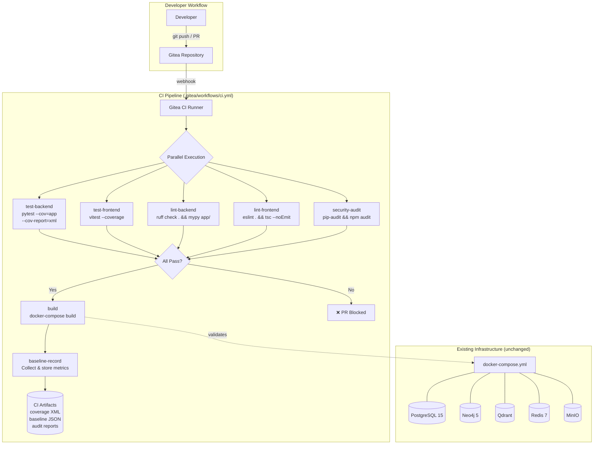
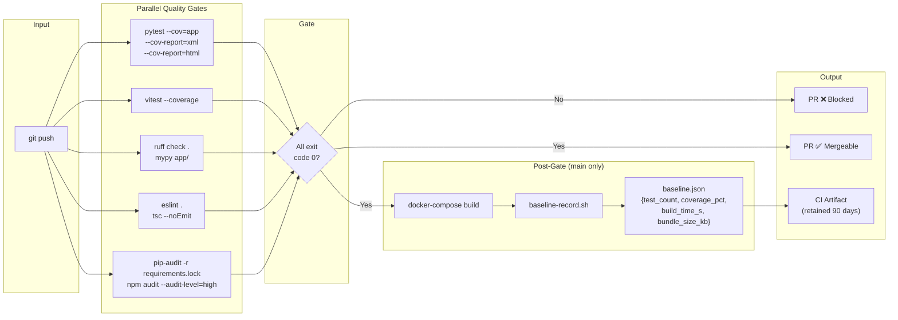
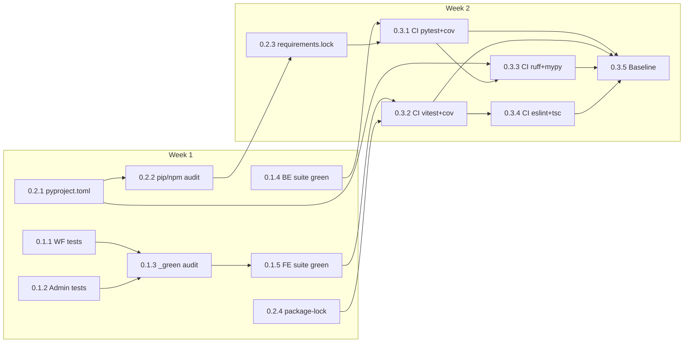

# Technical Specification

> **Title**: Phase 0 Stabilization — CI Pipeline, Test Infrastructure & Baseline Metrics
> **Phase**: 0 | **PR(s)**: 0.3.1, 0.3.2, 0.3.3, 0.3.4, 0.3.5 (CI & Baseline workstream); supports 0.1.x (test fixes) and 0.2.x (dependency audit)
> **Author**: Tech Lead
> **Date**: 2026-04-05
> **Status**: Draft
> **Reviewers**: Backend Lead, Frontend Lead, Platform Engineering

---

## 1. Overview

Phase 0 transforms the existing minimal 3-job CI pipeline (`.gitea/workflows/ci.yml`) into a comprehensive 7+ job quality gate that runs backend tests with coverage, frontend tests with coverage, backend linting (ruff + mypy), frontend linting (eslint + tsc), security auditing (pip-audit + npm audit), Docker build verification, and baseline metric recording on every PR. This is the engineering execution plan for the PRD's three workstreams: test fixes (0.1.x), dependency audit (0.2.x), and CI pipeline build-out (0.3.x).

No application code is modified. No Docker Compose files are changed. No database schemas are altered. Phase 0 adds tooling configuration, CI job definitions, and lock files around the existing ~75K LoC codebase.

### Goals
- **G1**: Expand CI from 3 jobs to ≥7 jobs covering tests, coverage, linting, type checking, security scanning, and baseline recording
- **G2**: Achieve 100% test pass rate (all tests pass or are explicitly skipped with `reason=`)
- **G3**: Pin all transitive dependencies via `requirements.lock` (pip-compile) and `package-lock.json`
- **G4**: Record baseline metrics (test count, coverage %, build time, bundle size) as CI artifacts on every `main` merge
- **G5**: CI total duration < 10 minutes; feedback latency < 12 minutes (NFR-01, NFR-02)

### Non-Goals
- **NG1**: Modifying Docker Compose files (`docker-compose.yml`, `docker-compose.dev.yml`) — they are functional as-is (BRD §4, PRD §13)
- **NG2**: Enforcing minimum coverage thresholds — Phase 0 records baselines; thresholds are Phase 1+ scope
- **NG3**: Auto-formatting code (ruff format, prettier) — detection only; formatting PRs deferred to avoid noisy diffs
- **NG4**: Remediating CVEs — Phase 0 documents them; fixes are Phase 1–2 scope
- **NG5**: Adding branch protection rules — DevOps configuration tracked separately
- **NG6**: Infrastructure upgrades (PG 17, Valkey, Qdrant 1.12) — Phase 1 scope

## 2. Background

The platform has ~75K lines of code integrated against 5 databases (PostgreSQL 15, Neo4j 5, Qdrant, Redis 7, MinIO) via Docker Compose. The current CI pipeline is minimal:

**Current state (`.gitea/workflows/ci.yml`):**
- `test-backend`: Python 3.11, `pip install -r requirements.txt`, `pytest` (no coverage, no flags)
- `test-frontend`: Node 18, `npm ci`, `npm test` (no coverage)
- `build`: `docker-compose build` (only on `main`)

**What's missing (per PRD §5):**
- Coverage reporting (FR-11, FR-12)
- Static analysis: ruff, mypy, eslint, tsc (FR-13, FR-14)
- Security scanning: pip-audit, npm audit (FR-07, FR-08)
- Baseline metric recording (FR-15)
- Lock file generation and enforcement (FR-09, FR-10)

**ADR context**: [ADR-001](./0.0_adr_multi-database-infrastructure.md) confirms the multi-database architecture continues as-is. Phase 0 stabilizes around this topology without changing it.

**Relevant files:**
- `.gitea/workflows/ci.yml` — current 3-job CI pipeline (to be expanded)
- `backend/app/core/config.py` — Pydantic `BaseSettings` with `os.getenv()` bypass pattern (tech debt, not Phase 0 scope)
- `backend/app/core/exceptions.py` — 8-class exception hierarchy (no retry/circuit-breaker logic)
- `backend/app/core/database.py` — module-level singleton DB clients (PG, Redis, Neo4j, Qdrant)
- `backend/app/core/graph.py` — Neo4j connection class + singleton factory
- `backend/app/core/vector_store.py` — Qdrant connection class + singleton factory
- `backend/app/core/cache.py` — Redis cache with multi-tenant key isolation
- `backend/app/core/storage.py` — MinIO storage with tenant-prefixed paths
- `backend/requirements.txt` — direct dependencies (no transitive pinning)
- `frontend/package.json` — npm dependencies
- `docker-compose.yml` — full stack (8 services + 2 app services)
- `docker-compose.dev.yml` — databases only (6 services)
- `backend/migrations/versions/` — 8 Alembic migrations (001–008)
- `scripts/init-neo4j.cypher` — Neo4j constraint and index initialization
- `scripts/init-postgres.sql/` — empty directory (no SQL init scripts)

## 3. Design

### Architecture



**Key relationships:**
- The CI pipeline is the **only new system** introduced in Phase 0. Infrastructure remains untouched.
- Jobs `test-backend`, `test-frontend`, `lint-backend`, `lint-frontend`, and `security-audit` run **in parallel** to meet the < 10 min NFR.
- `build` runs only after all parallel jobs pass (fail-fast gate).
- `baseline-record` runs after `build` on `main` merges only (not on PR branches) and stores metrics as downloadable CI artifacts.
- Backend test jobs run **without database service containers** in Phase 0 — tests use mocks/fixtures. Integration tests against real databases are Phase 1 scope (when `docker-compose.test.yml` is introduced).

### Data Flow



### Key Components

#### Component 1: CI Pipeline Definition (`.gitea/workflows/ci.yml`)

**Responsibility**: Orchestrate all quality gate jobs on push/PR events.

**Interface**:
```yaml
# Expanded CI pipeline — 7 jobs
# Triggers: push to main/develop, PR to main
# Parallel: test-backend, test-frontend, lint-backend, lint-frontend, security-audit
# Sequential: build (after parallel), baseline-record (after build, main only)
```

**Behavior**:
- All parallel jobs run on `ubuntu-latest` with language-specific setup (Python 3.11, Node 18)
- Each job installs from lock files (`pip install -r requirements.lock`, `npm ci`) for reproducibility
- Job failure in any parallel job blocks the `build` step
- `build` job uses `docker-compose build` to validate images
- `baseline-record` runs only on `main` branch (`if: github.ref == 'refs/heads/main'`)
- CI artifacts are uploaded with 90-day retention (NFR-08)

#### Component 2: Backend Test Job (`test-backend`)

**Responsibility**: Run pytest with coverage, produce XML/HTML reports.

**Interface**:
```bash
cd backend
pip install -r requirements.lock
pytest --cov=app --cov-report=xml:coverage.xml --cov-report=html:htmlcov/ -v
```

**Behavior**:
- Installs from `requirements.lock` (not `requirements.txt`) for deterministic deps
- Coverage output: XML for machine parsing (CI tools), HTML for human review
- Exit code 0 = all tests pass or are explicitly skipped with `reason=`
- Uploads `coverage.xml` and `htmlcov/` as CI artifacts

#### Component 3: Frontend Test Job (`test-frontend`)

**Responsibility**: Run vitest with coverage, produce coverage reports.

**Interface**:
```bash
cd frontend
npm ci
npx vitest run --coverage
```

**Behavior**:
- `npm ci` enforces `package-lock.json` (fails if lock file missing or out-of-sync with `package.json`)
- Coverage provider: v8 or istanbul (configured in `vitest.config.ts`)
- Uploads coverage report as CI artifact

#### Component 4: Backend Lint Job (`lint-backend`)

**Responsibility**: Enforce code quality and type safety for Python.

**Interface**:
```bash
cd backend
pip install ruff mypy
ruff check .
mypy app/ --ignore-missing-imports
```

**Behavior**:
- `ruff check` runs all default rules; configuration in `pyproject.toml [tool.ruff]`
- `mypy` runs with `--ignore-missing-imports` initially (strict mode deferred to Phase 1+)
- Either tool failing = job fails = PR blocked
- Note: PRD §14 open question on whether `ruff` replaces `black`; this spec uses `ruff check` only (no `ruff format` or `black --check` in Phase 0 — see NG3)

#### Component 5: Frontend Lint Job (`lint-frontend`)

**Responsibility**: Enforce code quality and type safety for TypeScript.

**Interface**:
```bash
cd frontend
npm ci
npx eslint .
npx tsc --noEmit
```

**Behavior**:
- `eslint` configuration from existing `.eslintrc.*` or `eslint.config.*`
- `tsc --noEmit` type-checks without producing output files
- Either tool failing = job fails = PR blocked

#### Component 6: Security Audit Job (`security-audit`)

**Responsibility**: Scan Python and npm dependencies for known CVEs.

**Interface**:
```bash
# Python
cd backend
pip install pip-audit
pip-audit -r requirements.lock --format json --output pip-audit-report.json

# npm
cd frontend
npm audit --json > npm-audit-report.json || true
```

**Behavior**:
- `pip-audit` scans against OSV database; JSON output for programmatic consumption
- `npm audit` runs with `|| true` to prevent non-critical CVEs from blocking PRs (PRD open question #6)
- Both reports uploaded as CI artifacts for Security stakeholder review
- **Phase 0 does not fail the build on CVE findings** — it documents them. Enforcement is Phase 1+ scope
- Critical CVEs (CVSS ≥ 9.0) trigger manual escalation per BRD §11

#### Component 7: Baseline Metrics Recorder (`baseline-record`)

**Responsibility**: Collect and persist quality metrics as a CI artifact on `main` merges.

**Interface**:
```bash
#!/bin/bash
# scripts/record-baseline.sh
set -euo pipefail

BASELINE=$(cat <<EOF
{
  "timestamp": "$(date -u +%Y-%m-%dT%H:%M:%SZ)",
  "commit": "$(git rev-parse HEAD)",
  "backend_test_count": $(grep -c 'test session starts' backend/pytest-output.txt || echo 0),
  "backend_coverage_pct": $(python -c "import xml.etree.ElementTree as ET; print(round(float(ET.parse('backend/coverage.xml').getroot().attrib['line-rate'])*100, 1))"),
  "frontend_test_count": $(grep -oP 'Tests\s+\K\d+' frontend/vitest-output.txt || echo 0),
  "frontend_coverage_pct": $(grep -oP 'All files\s+\|\s+\K[\d.]+' frontend/coverage-summary.txt || echo 0),
  "build_time_s": ${BUILD_DURATION:-0},
  "bundle_size_kb": $(du -sk frontend/dist/ 2>/dev/null | cut -f1 || echo 0)
}
EOF
)

echo "$BASELINE" > baseline.json
echo "$BASELINE" | python -m json.tool  # Pretty-print for logs
```

**Behavior**:
- Runs only on `main` branch after successful build
- Parses pytest XML coverage report and vitest output for metrics
- Produces `baseline.json` artifact (retained 90 days per NFR-08)
- JSON format enables diff-able comparison across CI runs
- If any metric collection fails, the field defaults to `0` (non-blocking — baseline is informational)

#### Component 8: Lock File Generation

**Responsibility**: Create reproducible dependency snapshots.

**Interface (Python)**:
```bash
# One-time generation (PR 0.2.3)
cd backend
pip install pip-tools
pip-compile requirements.txt -o requirements.lock --generate-hashes
```

**Interface (npm)**:
```bash
# Ensure committed (PR 0.2.4)
cd frontend
npm install  # Generates/updates package-lock.json
git add package-lock.json
```

**Behavior**:
- `requirements.lock` includes all transitive deps with pinned versions and hashes
- `package-lock.json` is committed to git; `npm ci` enforces it
- Lock file conflicts during concurrent PRs: regenerate from source and re-commit (PRD §7)
- CI jobs install from lock files, not from `requirements.txt` / `package.json`

#### Component 9: pyproject.toml (Python Packaging Metadata)

**Responsibility**: Serve as the single source of truth for Python project metadata and tool configuration.

**Interface**:
```toml
# backend/pyproject.toml (PR 0.2.1)
[project]
name = "legal-ai-platform"
version = "1.0.0"
requires-python = ">=3.11"

[tool.pytest.ini_options]
testpaths = ["tests"]
asyncio_mode = "auto"

[tool.ruff]
target-version = "py311"
line-length = 120
select = ["E", "F", "W", "I", "N", "UP"]

[tool.mypy]
python_version = "3.11"
ignore_missing_imports = true
warn_return_any = true
```

**Behavior**:
- FR-06: `pip install -e .` works; `pip install -r requirements.txt` continues to work (backward compat)
- Consolidates pytest, ruff, and mypy configuration into one file
- Does not replace `requirements.txt` — both coexist; `requirements.lock` is generated from `requirements.txt`

### State Machines / Lifecycles

N/A — Phase 0 does not introduce stateful entities. CI pipeline jobs have implicit states (queued → running → passed/failed) but these are managed by the Gitea CI runner, not by application code.

### Concurrency Model

| Concern | Approach |
|---------|----------|
| Async pattern | N/A — CI jobs are shell scripts, not async Python. No event loop considerations |
| Shared state | No shared mutable state between CI jobs. Each job runs in an isolated `ubuntu-latest` container. Artifacts are passed via CI artifact upload/download, not shared filesystem |
| Race conditions | Lock file conflicts when concurrent PRs modify dependencies. Mitigation: last-merged PR wins; subsequent PRs rebase and regenerate lock file |
| Connection pooling | N/A — CI jobs do not connect to databases in Phase 0. Backend tests use mocks/fixtures |
| Deadlock prevention | N/A — no shared resources between parallel jobs |
| CI job parallelism | 5 jobs run in parallel (test-backend, test-frontend, lint-backend, lint-frontend, security-audit). Depends on Gitea runner supporting parallel execution (PRD open question #3). If runner is single-threaded, jobs execute sequentially; total time ~8–9 min (still under NFR-01 10 min target) |

### Data Model Changes

N/A — Phase 0 makes no database schema changes. The existing 8 Alembic migrations (001–008) in `backend/migrations/versions/` are unchanged.

**For reference**, the existing schema covers:
- `001_initial_schema.py`: tenants, users, contracts, roles, permissions, user_roles
- `002_add_rbac_tables.py`: expanded RBAC tables
- `003_update_contracts_table.py`: contract table modifications
- `004_add_documents_table.py`: documents table
- `005_add_search_models.py`: search-related tables
- `006_add_billing_models.py`: billing models
- `007_add_feature_flags_oauth_api_keys.py`: feature flags, OAuth, API keys
- `008_add_refresh_tokens_table.py`: refresh tokens

**Note**: The `backend/app/models/` directory does not exist on disk. Model classes are imported as `app.models.user`, `app.models.tenant`, etc. in service files — these may be defined inline in migration files or in an untracked location. This is documented tech debt to investigate in Phase 1.

### Configuration

| Env Var | Type | Default | Description | Introduced In |
|---------|------|---------|-------------|---------------|
| `COVERAGE_BACKEND_MIN` | int | `0` | Minimum backend coverage % (informational in Phase 0; enforced in Phase 1+) | PR 0.3.1 |
| `COVERAGE_FRONTEND_MIN` | int | `0` | Minimum frontend coverage % (informational in Phase 0; enforced in Phase 1+) | PR 0.3.2 |
| `CI_ARTIFACT_RETENTION_DAYS` | int | `90` | How long CI artifacts are retained | PR 0.3.5 |
| `RUFF_TARGET_VERSION` | str | `py311` | Python version target for ruff linting | PR 0.3.3 |
| `MYPY_STRICT` | bool | `false` | Whether mypy runs in strict mode (false in Phase 0) | PR 0.3.3 |

**Existing env vars (unchanged)**: All database connection vars in `backend/app/core/config.py` (`DATABASE_URL`, `REDIS_URL`, `NEO4J_URI`, `QDRANT_HOST`, `S3_ENDPOINT`, etc.) remain unchanged. The scout identified that `config.py` bypasses Pydantic validation by using `os.getenv()` directly for several fields — this is tech debt for Phase 1, not Phase 0 scope (see PRD §5 NFR-09, ADR-001 §Assumptions A5).

## 4. Rejected Approaches

> Formal infrastructure decision analysis in [ADR-001](./0.0_adr_multi-database-infrastructure.md).

| Approach | Why Rejected |
|----------|-------------|
| **Create `docker-compose.test.yml` for CI integration tests** | Phase 0 scope is unit tests with mocks, not integration tests against real databases. Integration test infrastructure is Phase 1 scope. Adding DB service containers to CI would increase CI time beyond 10 min NFR and require solving DB initialization in CI — unnecessary complexity for Phase 0 goals |
| **Enforce coverage thresholds in Phase 0** | PRD §13 explicitly excludes threshold enforcement. The first baseline must be recorded before meaningful thresholds can be set. Setting arbitrary thresholds now risks blocking legitimate Phase 0 PRs. Thresholds will be defined in Phase 1+ Test Specs using Phase 0 baselines as input |
| **Run `ruff format` / `prettier` in CI** | Auto-formatting PRs during stabilization would create massive, noisy diffs that obscure the actual test fixes and dependency changes. Detection-only (`ruff check`, `eslint`) catches issues without reformatting. Formatting enforcement deferred to post-stabilization (PRD §13) |
| **Run pip-audit/npm-audit on every PR** | Adds ~1 min to every CI run. Most PRs don't change dependencies. Tradeoff: run on every PR for maximum coverage vs. run only on dependency-change PRs for speed. Decision: run on every PR in Phase 0 (pipeline is simple enough); revisit when CI approaches 10 min limit. This is PRD open question #6 — defaulting to "always run" for safety |
| **Use GitHub Actions instead of Gitea CI** | Platform already uses Gitea for source control and CI. Switching to GitHub Actions would require repository migration or dual-hosting. No benefit justifies this in Phase 0 |
| **Consolidate all CI into a single job** | Single job would be simpler but sequential — estimated ~8-9 min for all checks vs. ~4-5 min with parallel execution. Also loses granularity: a single "CI failed" status is less useful than knowing specifically that "lint-backend failed" |
| **Use `tox` or `nox` for Python test orchestration** | Adds another tool to learn and maintain. `pytest` with `pyproject.toml` configuration is sufficient for Phase 0. Revisit if multi-environment testing (Python 3.11 + 3.12) is needed in Phase 1+ |

## 5. API Changes

N/A — Phase 0 makes no API changes. No endpoints are added, modified, or removed.

**Detailed contract**: N/A

## 6. Migration Path

N/A — No schema changes or existing data affected.

| Aspect | Detail |
|--------|--------|
| Backward compatible? | Yes — existing `pip install -r requirements.txt` continues to work alongside new `requirements.lock` |
| Requires backfill? | No |
| Zero-downtime migration? | N/A — no production deployment in Phase 0 |
| Rollback safe? | Yes — reverting CI changes is a git revert of `.gitea/workflows/ci.yml` and config files |

**Migration guide**: N/A

## 7. Error Handling

### Error Classification

| Error Condition | Category | Behavior | User Impact | Propagation |
|-----------------|----------|----------|-------------|-------------|
| Test failure (pytest/vitest) | Fatal | Job exits non-zero; PR blocked | Developer sees ❌ on PR; clicks job for failure details with file + line | CI job → PR status check → developer reads logs |
| Lint error (ruff/eslint) | Fatal | Job exits non-zero; PR blocked | Developer sees ❌ on `lint-backend` or `lint-frontend` | CI job → PR status check → developer reads specific rule violation |
| Type error (mypy/tsc) | Fatal | Job exits non-zero; PR blocked | Developer sees ❌ on lint job | CI job → PR status check → developer reads type error with file + line |
| pip-audit finds CVE | Informational | Job succeeds (exit 0); report uploaded as artifact | No PR blocking in Phase 0; Security stakeholder reviews artifact | CI artifact → manual review |
| npm audit finds CVE | Informational | Job succeeds (`\|\| true`); report uploaded as artifact | No PR blocking in Phase 0; Security stakeholder reviews artifact | CI artifact → manual review |
| pip-audit finds CVSS ≥ 9.0 CVE | Fatal (escalation required) | Job succeeds but baseline.json flags critical finding | Manual escalation per BRD §11 — hotfix PR outside Phase 0 scope | CI artifact → Security stakeholder → escalation |
| Lock file out of sync | Fatal | `npm ci` fails if `package-lock.json` doesn't match `package.json`; `pip install -r requirements.lock` fails if file is corrupted | Developer regenerates lock file and re-pushes | CI job failure → developer action |
| CI runner offline | Infrastructure | Jobs queued indefinitely; no status check reported | Developer waits > 20 min with no feedback; checks runner dashboard | Gitea runner status → manual investigation |
| CI job timeout (> 15 min) | Transient | Job killed by runner; reported as failed | Developer investigates: likely hung test, network issue, or runner resource exhaustion | CI runner timeout → job failure → developer investigation |
| Baseline metric collection fails | Recoverable | Script defaults to `0` for failed metric; baseline.json still produced | Partial baseline — missing metric logged as warning | Script `|| echo 0` fallback → warning in logs |
| CI artifact upload fails | Recoverable | Job succeeds but artifact unavailable | Coverage reports and baseline not downloadable; CI status still correct | Gitea API error → warning in job logs |

### Error Propagation Chain

```
Test/Lint/Type error → CI job exit code != 0 → Gitea marks job as failed →
PR status check shows ❌ → Developer clicks job → Reads log with file:line →
Developer fixes code → pushes → CI re-runs
```

```
CVE found → pip-audit/npm-audit report → CI artifact uploaded →
Security stakeholder reviews → If CVSS ≥ 9.0: manual escalation →
Hotfix PR created outside Phase 0 scope
```

```
CI runner offline → No status check within 20 min →
Developer checks Gitea runner dashboard → Restarts runner or waits →
Manual re-trigger of CI pipeline
```

## 8. Security Considerations

- **No secrets in CI logs**: Database passwords and API keys are not used in Phase 0 CI jobs (no DB connections). Existing secrets in `config.py` (hardcoded defaults like `password`, `minioadmin`) are pre-existing tech debt, not introduced by Phase 0
- **Lock file integrity**: `requirements.lock` generated with `--generate-hashes` enables pip to verify package integrity at install time; protects against supply chain tampering
- **Audit reports as artifacts**: `pip-audit` and `npm audit` JSON reports are stored as CI artifacts accessible to authorized Gitea users only
- **No new attack surface**: Phase 0 adds CI configuration files and tool configs only — no new endpoints, services, or network listeners
- **Hardcoded credentials in `config.py`**: Scout confirmed `SECRET_KEY`, `JWT_SECRET_KEY`, `NEO4J_PASSWORD`, `S3_ACCESS_KEY`, `S3_SECRET_KEY` have hardcoded development defaults. This is pre-existing — not Phase 0 scope — but flagged for Phase 1 Security Review

See [Security Review](./0.2.2_sec-review_dependency-audit.md) for full CVE analysis.

## 9. Performance Considerations

| Operation | Target Latency | Target Throughput | Measurement |
|-----------|---------------|-------------------|-------------|
| CI pipeline total (all jobs) | < 10 min (NFR-01) | 1 pipeline per push | Gitea CI dashboard timing |
| CI feedback latency (push → status visible) | < 12 min (NFR-02) | — | Timestamp delta: push event → first status check |
| `test-backend` job | < 4 min | — | Individual job timing |
| `test-frontend` job | < 4 min | — | Individual job timing |
| `lint-backend` job | < 2 min | — | Individual job timing |
| `lint-frontend` job | < 2 min | — | Individual job timing |
| `security-audit` job | < 3 min | — | Individual job timing |
| `build` job | < 3 min | — | Individual job timing |
| `baseline-record` job | < 1 min | — | Individual job timing |

**Budget allocation** (parallel execution — critical path is the slowest parallel job + sequential jobs):
```
Critical path = max(test-backend, test-frontend, lint-backend, lint-frontend, security-audit)
             + build + baseline-record
             = max(4, 4, 2, 2, 3) + 3 + 1
             = 4 + 3 + 1 = 8 min (under 10 min NFR)
```

If the Gitea runner does **not** support parallel execution (PRD open question #3), sequential time = 4+4+2+2+3+3+1 = **19 min** (exceeds NFR). Mitigation plan with concrete decision gate:

1. **Day 1 (2026-04-07)**: Tech Lead / DevOps tests runner parallelism (Open Question #1).
2. **If sequential-only**: Combine lint jobs (`lint-backend` + `lint-frontend` → single `lint` job), reducing to ~14 min.
3. **If still > 10 min after combining**: Merge `security-audit` into `lint` job, reducing to ~11 min.
4. **If still > 10 min**: Escalate to Engineering Manager — budget approval for second runner or migration to runner with concurrency support. **Decision deadline: 2026-04-09 (Wed of Week 1)**.
5. **Hard ceiling**: If no solution achieves < 12 min by 2026-04-10, temporarily raise NFR-01 to 15 min with a Phase 1 remediation ticket and Tech Lead sign-off.

See [Perf Spec](./0.0_perf-spec_baseline-metrics.md) for detailed latency budgets.

## 10. Observability

| Type | Name | Description |
|------|------|-------------|
| Metric | `ci.pipeline.duration_s` | Total pipeline duration in seconds (from baseline.json `build_time_s`) |
| Metric | `ci.backend.test_count` | Number of backend tests executed (from baseline.json) |
| Metric | `ci.backend.coverage_pct` | Backend line coverage percentage (from coverage.xml) |
| Metric | `ci.frontend.test_count` | Number of frontend tests executed (from baseline.json) |
| Metric | `ci.frontend.coverage_pct` | Frontend line coverage percentage (from coverage summary) |
| Metric | `ci.frontend.bundle_size_kb` | Frontend production bundle size in KB (from baseline.json) |
| Artifact | `coverage.xml` | Backend pytest coverage in Cobertura XML format |
| Artifact | `htmlcov/` | Backend pytest coverage as browsable HTML report |
| Artifact | `frontend-coverage/` | Frontend vitest coverage report |
| Artifact | `baseline.json` | Consolidated metrics JSON — diff-able across runs |
| Artifact | `pip-audit-report.json` | Python CVE scan results |
| Artifact | `npm-audit-report.json` | npm CVE scan results |
| Log event | Job pass/fail | Each CI job logs its exit code and duration in Gitea CI logs |
| Dashboard | N/A | No Grafana/Prometheus in Phase 0. Baseline.json serves as the metric store. Monitoring stack is Phase 2.5 scope |

**Trend analysis**: By diffing `baseline.json` across sequential `main` merges, the team can detect regressions (test count drops, coverage drops, build time increases, bundle size increases) without a formal monitoring stack. Manual process in Phase 0; automated alerts in Phase 2.5.

## 11. AI-Specific Considerations

N/A — Phase 0 does not introduce or modify any AI/ML components. AI integration begins in Phase 3 (AI/ML Overhaul) per the Modernization Roadmap.

## 12. Testing Strategy

> Phase 0's "testing strategy" is meta: how do we test the CI pipeline itself?

- **Unit**: N/A — CI pipeline is YAML configuration, not application code. Individual tools (pytest, vitest, ruff, mypy, eslint, tsc) are tested by their own communities
- **Integration**: Each CI PR (0.3.1–0.3.5) is validated by:
  1. Pushing the PR itself and observing that the new CI job runs successfully
  2. Introducing a deliberate failure (failing test, lint error) on a test branch to verify the job catches it and blocks the PR
  3. Verifying artifact upload by downloading the artifact from the CI dashboard
- **Manual verification**:
  - PR 0.3.1: Verify `coverage.xml` contains valid Cobertura XML with per-file coverage data
  - PR 0.3.2: Verify frontend coverage report is browsable and shows per-file data
  - PR 0.3.3: Introduce a ruff violation (e.g., unused import) and verify CI catches it
  - PR 0.3.4: Introduce a TypeScript type error and verify CI catches it
  - PR 0.3.5: Verify `baseline.json` contains all 6 metrics with non-zero values after a successful `main` merge
- **Regression**: After all Phase 0 PRs are merged, run the full pipeline end-to-end on `main` and verify:
  - All 7+ jobs execute
  - Total time < 10 min
  - All artifacts are present and downloadable
  - `baseline.json` is valid JSON with all fields populated

Detailed test cases: [Test Spec](./0.0_test-spec_stabilization.md)

## 13. Rollout Plan

Phase 0 PRs are merged sequentially within each workstream, with workstreams partially parallelizable:

| Step | PR | Action | Dependencies | Owner | Target |
|------|----|--------|-------------|-------|--------|
| 1 | 0.1.1 | Fix WorkflowDesignerPage tests (59% → 100%) | None | Frontend Eng | Week 1, Day 2 |
| 2 | 0.1.2 | Fix AdminDashboardPage tests (83% → 100%) | None | Frontend Eng | Week 1, Day 2 |
| 3 | 0.1.3 | Audit all `_green` test variants | 0.1.1, 0.1.2 | Frontend Eng + Tech Lead | Week 1, Day 3 |
| 4 | 0.2.1 | Add `pyproject.toml` with `[project]` metadata | None | Backend Eng | Week 1, Day 3 |
| 5 | 0.1.4 | Fix or skip all failing backend tests | None | Backend Eng | Week 1, Day 4 |
| 6 | 0.1.5 | Fix or skip all failing frontend tests | 0.1.1, 0.1.2, 0.1.3 | Frontend Eng | Week 1, Day 4 |
| 7 | 0.2.2 | Run pip-audit + npm audit; document CVEs | 0.2.1 | Backend Eng | Week 1, Day 5 |
| 8 | 0.2.3 | Pin Python transitive deps (requirements.lock) | 0.2.1 | Backend Eng | Week 2, Day 1 |
| 9 | 0.2.4 | Commit package-lock.json | None | Frontend Eng | Week 1, Day 3 |
| 10 | 0.3.1 | CI: backend pytest + coverage | 0.1.4, 0.2.3 | Backend Eng | Week 2, Day 2 |
| 11 | 0.3.2 | CI: frontend vitest + coverage | 0.1.5, 0.2.4 | Frontend Eng | Week 2, Day 2 |
| 12 | 0.3.3 | CI: ruff + mypy | 0.2.1, 0.3.1 | Backend Eng | Week 2, Day 3 |
| 13 | 0.3.4 | CI: eslint + tsc | 0.3.2 | Frontend Eng | Week 2, Day 3 |
| 14 | 0.3.5 | Baseline metrics recording | 0.3.1, 0.3.2, 0.3.3, 0.3.4 | Backend Eng | Week 2, Day 4 |

**Dependency graph:**


### Feature Flags

N/A — Phase 0 ships directly without feature flags. CI pipeline changes are either merged (active) or not merged (inactive). There is no gradual rollout — each PR either adds a CI job or it doesn't.

## 14. Open Questions

| # | Question | Owner | Target Date | Resolution |
|---|----------|-------|-------------|------------|
| 1 | Does the Gitea CI runner support parallel job execution? If not, CI total time could reach ~19 min (exceeds NFR-01) | Tech Lead / DevOps | 2026-04-07 | Pending — check runner config on Day 1. Mitigation: combine jobs if sequential-only |
| 2 | Should `ruff` replace `black` for formatting? (PRD open question #4) | Tech Lead | 2026-04-08 | Pending — Phase 0 uses `ruff check` only (no formatting). Decision needed before Phase 1 |
| 3 | Should pip-audit/npm-audit block PRs or be informational-only? (PRD open question #6) | Tech Lead | 2026-04-10 | Pending — defaulting to informational in this spec. Revisit after first audit results |
| 4 | Where are the model classes? `backend/app/models/` doesn't exist on disk but is imported by services | Backend Eng | 2026-04-07 | Pending — investigate on Day 1. May be gitignored, generated, or missing |
| 5 | `init-postgres.sql/` is an empty directory — should it contain initialization SQL? | Backend Eng | 2026-04-08 | Pending — Alembic migrations may handle all schema setup; verify |
| 6 | Qdrant healthcheck inconsistency: `docker-compose.yml` uses directory check, `docker-compose.dev.yml` uses `curl` — which is correct? | Backend Eng | 2026-04-08 | Pending — not Phase 0 scope to fix, but document for Phase 1 |
| 7 | Are there tests that make live API calls (e.g., OpenAI) and will fail without network/keys in CI? (PRD open question #7) | Backend + Frontend Eng | 2026-04-08 | Pending — discover during test fix PRs (0.1.4, 0.1.5) |

## 15. Related Documents

| Document | Link |
|----------|------|
| BRD (upstream) | [0.0_brd_stabilization.md](./0.0_brd_stabilization.md) |
| PRD (upstream) | [0.0_prd_stabilization.md](./0.0_prd_stabilization.md) |
| ADR — Multi-Database Infrastructure | [0.0_adr_multi-database-infrastructure.md](./0.0_adr_multi-database-infrastructure.md) |
| Dep Review — Infrastructure Dependencies | [0.2_dep-review_infrastructure-deps.md](./0.2_dep-review_infrastructure-deps.md) |
| Test Spec | [0.0_test-spec_stabilization.md](./0.0_test-spec_stabilization.md) |
| Perf Spec | [0.0_perf-spec_baseline-metrics.md](./0.0_perf-spec_baseline-metrics.md) |
| Security Review | [0.2.2_sec-review_dependency-audit.md](./0.2.2_sec-review_dependency-audit.md) |
| ID Spec | [0.0_id-spec_ci-infrastructure-interfaces.md](./0.0_id-spec_ci-infrastructure-interfaces.md) |
| Migration Guide | [0.0_mig-guide_infrastructure-setup.md](./0.0_mig-guide_infrastructure-setup.md) |
| Runbook | [0.0_runbook_infrastructure-operations.md](./0.0_runbook_infrastructure-operations.md) |
| Modernization Roadmap | [MODERNIZATION_ROADMAP.md](../../MODERNIZATION_ROADMAP.md) |
| Phase 1 BRD | [1.0_brd_infrastructure-upgrades.md](../phase-1/1.0_brd_infrastructure-upgrades.md) |
| Document Matrix | [DOCUMENT_MATRIX.md](../../DOCUMENT_MATRIX.md) |

## Version History

| Date | Change | Author |
|------|--------|--------|
| 2026-04-05 | Initial draft — consolidated Tech Spec for Phase 0 CI pipeline, test infrastructure, dependency management, and baseline metrics | Tech Lead |
