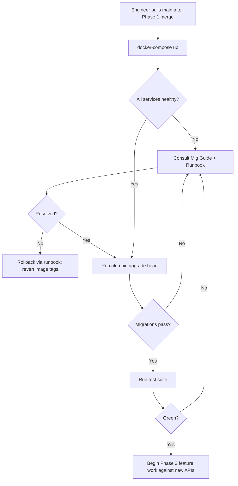

# Product Requirements Document

> **Feature**: Phase 1 — Data Infrastructure Upgrades (PG 17, pgvector, Valkey/Redis 8, Qdrant 1.12+, Neo4j latest)
> **Phase**: 1
> **Author**: PM
> **Date**: 2026-04-07
> **Status**: Draft

---

## 1. Problem Statement

The Legal AI Platform's data infrastructure is drifting out of support and capability: PostgreSQL 15 approaches community EOL (Nov 2027), Redis 7 runs under the SSPL license (flagged by 2 enterprise prospects representing ~$200K+ ARR in active procurement review), Qdrant 1.7 lacks named and sparse vector support, pgvector is not installed, and Neo4j 5 is pinned to an unspecified patch.

This is a platform/developer-facing initiative. The "users" are internal: Backend Engineers building Phase 3 AI features (blocked on named/sparse vectors), SREs operating the stack (exposed to license and EOL risk), and Security/Compliance reviewers (blocked on SSPL clearance for enterprise deals). Inaction cascades 4–8 weeks of delay into Phase 3 and keeps ~$200K+ ARR in procurement limbo. See [BRD §3](./1.0_brd_infrastructure-upgrades.md) for the full Impact of Inaction.

## 2. Prior Art / Alternatives

| Solution / Tool | How It Addresses This Problem | Limitations | How This Feature Differs |
|----------------|-------------------------------|-------------|--------------------------|
| Stay on PG 15 / Redis 7 / Qdrant 1.7 (status quo) | Zero migration risk today | Blocks Phase 3 (58 PRs), SSPL legal exposure, PG 15 EOL in ~18 months | Resolves all three on a single controlled upgrade window |
| Replace Qdrant entirely with pgvector | Collapses to one vector store | pgvector lacks named vectors, sparse vectors, and advanced filtering required for Phase 3.6 hybrid search | Keeps Qdrant as primary vector store; uses pgvector for co-located SQL+vector queries only |
| Upgrade only PG and Qdrant; defer Redis | Smaller scope (3 fewer PRs) | SSPL risk remains — enterprise deals stay blocked | Full upgrade clears legal + technical blockers in one phase |
| Defer entire upgrade to Q3 2026 | Preserves near-term feature velocity | Every week of delay pushes Phase 3 by the same amount; est. 4–8 week cascade | Completes in Weeks 2–4, unblocking Phase 3 critical path on schedule |

## 3. User Stories

### Primary

```
As a Backend Engineer building Phase 3 AI features,
I want Qdrant 1.12+ with named and sparse vector support and pgvector available in PostgreSQL,
so that I can implement hybrid search and multi-vector-per-document retrieval without waiting on an infrastructure upgrade.
```

### Secondary

```
As an SRE operating the platform,
I want PostgreSQL 17 with pg_stat_statements, Valkey (or Redis 8), and a pinned Neo4j patch with verified APOC/GDS,
so that I have query profiling, a BSD-licensed cache, and no silent plugin drift in production.
```

```
As a Security/Compliance reviewer supporting enterprise sales,
I want the platform's cache backend to be off the SSPL license,
so that I can clear procurement review for the 2 enterprise prospects currently blocked on this issue.
```

## 4. Personas Affected

| Persona | How They Interact | Priority |
|---------|-------------------|----------|
| Backend Engineer (Phase 3 builders) | Consumes new Qdrant named/sparse vector APIs and pgvector SQLAlchemy model | P0 |
| SRE / Platform Engineer | Operates upgraded services, runs migrations, validates CI | P0 |
| Tech Lead | Reviews ADR-001 and all 16 PRs | P0 |
| Security / Compliance | Validates license posture and dep review | P1 |
| Product / PM | Tracks phase completion as Phase 3 gating milestone | P2 |
| End users (contract reviewers) | No direct UX impact in Phase 1 | N/A |

## 5. Requirements

### Functional Requirements

| ID | Requirement | Priority | Acceptance Criteria |
|----|------------|----------|---------------------|
| FR-01 | PostgreSQL upgraded from 15 to 17 in docker-compose and CI | P0 | `SELECT version()` returns PG 17.x in dev, CI, and staging; docker-compose uses `postgres:17` image |
| FR-02 | All 8 existing Alembic migrations run cleanly on PG 17 | P0 | `alembic upgrade head` on empty PG 17 database exits 0; 8/8 migrations applied; schema matches PG 15 baseline diff-free |
| FR-03 | `pg_stat_statements` extension enabled | P0 | Extension present in `pg_extension`; sample query appears in `pg_stat_statements` view |
| FR-04 | pgvector extension installed with `document_embeddings` table | P0 | Table exists with `vector(1536)` column and HNSW index; Alembic migration applies idempotently |
| FR-05 | SQLAlchemy model and repository layer for `document_embeddings` | P0 | Repository supports insert, k-NN query, and delete; unit tests ≥ 90% coverage on the repo module |
| FR-06 | ADR-001 decides Valkey vs Redis 8 with documented rationale | P0 | ADR merged; decision supported by spike results covering Celery broker, sessions, and pubsub |
| FR-07 | Cache backend swapped per ADR-001 | P0 | docker-compose uses chosen image; existing Celery, session, and cache integration tests pass unchanged |
| FR-08 | `qdrant-client` bumped from 1.7.0 to 1.12.x | P0 | `pip show qdrant-client` reports ≥ 1.12.0; existing search tests pass without refactor regressions |
| FR-09 | Qdrant server upgraded to 1.12+ in docker-compose and CI | P0 | `GET /` on Qdrant returns ≥ 1.12.0; CI uses matching image tag |
| FR-10 | Qdrant collection schema supports named vectors | P0 | Integration test creates collection with ≥ 2 named vectors and performs k-NN on each |
| FR-11 | Qdrant collection schema supports sparse vectors | P0 | Integration test creates collection with sparse vector config and ingests a BM25-style sparse vector |
| FR-12 | Neo4j pinned to latest 5.x patch with APOC and GDS verified | P0 | docker-compose uses pinned patch tag; APOC and GDS plugins load; smoke test calls one function from each |
| FR-13 | Full application test suite passes on the upgraded stack | P0 | CI green on the branch containing all 16 Phase 1 PRs; zero new failing tests vs Phase 0 baseline |

### Non-Functional Requirements

| ID | Requirement | Target |
|----|------------|--------|
| NFR-01 | pgvector k-NN query latency (100K embeddings, k=10) | < 50 ms p95 on HNSW index in integration test environment |
| NFR-02 | Qdrant named-vector k-NN query latency | Within ±10% of Qdrant 1.7 baseline captured in Phase 0 |
| NFR-03 | Cache backend latency (GET/SET) after swap | Within ±10% of Redis 7 baseline captured in Phase 0 |
| NFR-04 | PG 17 Alembic migration runtime on empty DB | < 30 s end-to-end |
| NFR-05 | CI pipeline runtime after upgrades | Within +15% of Phase 0 baseline (no unbounded regression) |
| NFR-06 | License posture of cache backend | BSD-3-Clause (Valkey) or OSI-approved equivalent; zero SSPL components in runtime image |
| NFR-07 | PR size | Each of the 16 PRs ≤ 400 LOC diff to preserve reviewability |
| NFR-08 | Rollback time for any single upgrade | < 15 min via docker-compose image revert + documented runbook step |

## 6. AI Behavior Requirements

N/A — Phase 1 is infrastructure-only and does not add, modify, or invoke any AI/ML model, prompt, or inference path. AI behavior requirements will be authored in Phase 3 PRDs that consume this infrastructure (hybrid search, embedding pipeline, agent architecture).

## 7. User Experience

> Phase 1 has no end-user UI. The "user experience" here is the Developer Experience (DX) of engineers working against the upgraded stack.

### User Flow



### Key Screens / Interactions

No UI. Developer-facing surfaces:
- `docker-compose.yml` — updated image tags
- `alembic/versions/` — new pgvector migration
- `app/models/document_embedding.py` — new SQLAlchemy model
- `app/repositories/embedding_repository.py` — new repository
- `app/services/vector_store.py` — refactored for Qdrant named/sparse vectors
- `docs/phase-1/1.0_mig-guide_infrastructure-upgrades.md` — step-by-step upgrade procedure
- `docs/phase-1/1.0_runbook_infrastructure-deployment.md` — rollback and troubleshooting

#### UI State Matrix

N/A — no user interface. Developer-facing state is covered by the Migration Guide (happy path), Runbook (error/rollback states), and CI pipeline status (loading/populated/error states for the test suite).

### Edge Cases

- **PG 17 rejects a migration**: Migration Guide requires staging dry-run; failure triggers rollback to PG 15 image per runbook.
- **Valkey incompatible with a Celery/Redis usage pattern**: ADR-001 spike catches this; fallback path is Redis 8 OSS.
- **`qdrant-client` 1.12 introduces a breaking API change**: PR 1.4.1 bumps client first and runs existing tests in isolation before any refactor PRs land.
- **pgvector HNSW underperforms at scale**: NFR-01 test fails; fallback to IVFFlat index (documented in Tech Spec).
- **Neo4j APOC or GDS plugin fails to load on latest patch**: Pin to the last known-good 5.x patch; document in runbook.
- **Concurrent engineers upgrading local envs**: Migration Guide specifies order of operations and volume reset steps.

## 8. Accessibility

N/A — no user-facing UI in Phase 1. Accessibility requirements will apply to Phase 3 feature PRDs that surface the infrastructure capabilities to end users.

## 9. Analytics & Instrumentation

> Phase 1 has no product analytics. "Instrumentation" here means operational telemetry proving the upgrades are healthy.

| Event / Metric | Trigger | Properties | Purpose |
|----------------|---------|------------|---------|
| `pg_stat_statements` sample | Scheduled every 5 min | query_id, mean_exec_time, calls | Validate FR-03 and establish post-upgrade query profile |
| Qdrant version healthcheck | On container start + hourly | version, collections_count | Confirm FR-09 in deployed environments |
| pgvector query latency histogram | Per k-NN call in integration tests | p50, p95, p99, k, index_type | Validate NFR-01 |
| Cache backend latency histogram | Per GET/SET in load test | p50, p95, backend (valkey\|redis8) | Validate NFR-03 |
| CI pipeline duration | Per pipeline run | duration_s, commit_sha | Validate NFR-05 |
| Alembic migration duration | Per `alembic upgrade head` in CI | duration_s, migrations_applied | Validate NFR-04 |

## 10. User Onboarding

| Mechanism | Detail |
|-----------|--------|
| Discovery | Phase 1 completion announced in engineering standup and `#eng-platform` channel |
| First-run experience | Engineers run a single command from the Migration Guide to refresh their local stack; guide includes a "known differences from Phase 0" section |
| Documentation | Migration Guide (step-by-step), Runbook (rollback/troubleshooting), ADR-001 (Valkey vs Redis 8 rationale), updated `docs/SETUP.md` |
| Training | 30-min brown-bag from SRE lead walking through new Qdrant named/sparse vector APIs and pgvector repository; recording archived for Phase 3 builders |

## 11. Dependencies

### Feature Dependencies

| Dependency | Status | Blocking? | Notes |
|-----------|--------|-----------|-------|
| Phase 0 — green CI, audited deps, baseline metrics | In Progress | Yes | Cannot safely upgrade without Phase 0 safety net |
| ADR-001 (Valkey vs Redis 8) | Pending (PR 1.3.1) | Yes (for FR-06/FR-07) | Must land before PR 1.3.2 swap |

### Service Dependencies

| Service | Purpose | Owner | SLA |
|---------|---------|-------|-----|
| Docker Hub / GHCR | Source of PG 17, Valkey, Qdrant 1.12, Neo4j images | External | Best effort; mitigated by image pinning |
| GitHub Actions | CI runner for upgrade test matrix | External | 99.9% |
| Internal staging cluster | Pre-production validation of migrations | Platform team | Business hours |

### Data Prerequisites

| Data | Source | Status | Notes |
|------|--------|--------|-------|
| Phase 0 performance baselines (Qdrant, Redis, CI runtime) | Phase 0 PRs | In Progress | Required to validate NFR-02, NFR-03, NFR-05 |
| 8 existing Alembic migrations | Repository | Available | Input to FR-02 verification |

## 12. Success Metrics

| Metric | Baseline | Target | Measurement |
|--------|----------|--------|-------------|
| Phase 1 PRs merged | 0 / 16 | 16 / 16 | GitHub PR tracker by end of Week 4 |
| Phase 3 blocker count attributable to infrastructure | 5 (PG version, pgvector absent, Qdrant named vectors, Qdrant sparse vectors, Redis license) | 0 | Phase 3 readiness checklist |
| Enterprise deals blocked on SSPL | 2 (est. $200K+ ARR) | 0 | Sales procurement tracker, measured 1 week after FR-07 ships |
| PG EOL runway | ~18 months (to Nov 2027) | ~44 months (to Nov 2029, PG 17 EOL) | PostgreSQL community support calendar |
| Test suite pass rate post-upgrade | Phase 0 green baseline | ≥ Phase 0 baseline (no regressions) | CI on integration branch |
| pgvector k-NN p95 latency (100K vectors, k=10) | N/A (not installed) | < 50 ms | Integration test (FR-05, NFR-01) |
| Qdrant k-NN p95 vs Phase 0 baseline | Phase 0 baseline | ±10% | Integration test (NFR-02) |
| Cache GET/SET p95 vs Phase 0 baseline | Phase 0 baseline | ±10% | Load test (NFR-03) |

## 13. Out of Scope

- **Application feature code** — Backend/frontend features other than the pgvector model/repository and the Qdrant `vector_store.py` refactor stay untouched. New AI features are Phase 3.
- **Production data migration** — Dev/staging only; production migration is a deployment decision after Phase 1 approval and belongs to the Migration Guide execution runbook.
- **Embedding re-indexing / backfill** — Phase 3.5.5 scope.
- **Hybrid search implementation** — Phase 3.6 scope; Phase 1 only provides the schema capability.
- **Python dependency upgrades beyond `qdrant-client`** — Phase 2 scope.
- **Any end-user UI, onboarding, accessibility, or analytics work** — No end-user surface changes in this phase.

## 14. Open Questions

| # | Question | Owner | Target Date | Resolution |
|---|----------|-------|-------------|------------|
| 1 | Valkey vs Redis 8 OSS — which becomes the cache backend? | Tech Lead | 2026-04-14 | Pending (ADR-001) |
| 2 | HNSW vs IVFFlat as the default pgvector index? | Backend Engineer | 2026-04-17 | Pending (PR 1.2.5 performance test) |
| 3 | Which Neo4j 5.x patch version becomes the pinned tag? | SRE Lead | 2026-04-21 | Pending (PR 1.5.1 APOC/GDS compatibility test) |
| 4 | Does the pgvector `document_embeddings` table need a tenant_id partition key now, or defer to Phase 3? | Backend Engineer + Tech Lead | 2026-04-17 | Pending |
| 5 | Production cutover window and communication plan | SRE Lead + PM | Post-Phase 1 approval | Deferred to deployment runbook |

## 15. Related Documents

| Document | Link |
|----------|------|
| BRD | [1.0_brd_infrastructure-upgrades.md](./1.0_brd_infrastructure-upgrades.md) |
| Tech Spec | [1.0_tech-spec_infrastructure-upgrades.md](./1.0_tech-spec_infrastructure-upgrades.md) *(pending)* |
| Test Spec | [1.0_test-spec_infrastructure-upgrades.md](./1.0_test-spec_infrastructure-upgrades.md) *(pending)* |
| ADR-001 (Valkey vs Redis 8) | [1.3.1_adr_valkey-vs-redis.md](./1.3.1_adr_valkey-vs-redis.md) *(pending)* |
| Migration Guide | [1.0_mig-guide_infrastructure-upgrades.md](./1.0_mig-guide_infrastructure-upgrades.md) *(pending)* |
| Runbook | [1.0_runbook_infrastructure-deployment.md](./1.0_runbook_infrastructure-deployment.md) *(pending)* |
| Modernization Roadmap | [MODERNIZATION_ROADMAP.md](../../MODERNIZATION_ROADMAP.md) |
| Design Mockups | N/A — no UI |

## Version History

| Date | Change | Author |
|------|--------|--------|
| 2026-04-07 | Initial draft — authored against BRD 1.0 infrastructure-upgrades | PM |
