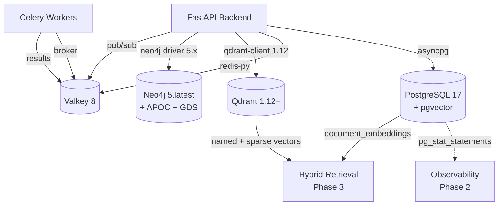
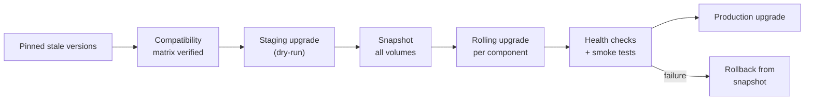
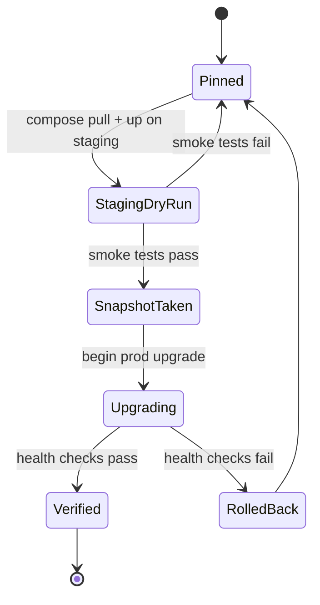

# Technical Specification

> **Title**: Phase 1 Infrastructure Upgrades — Datastore Modernization
> **Phase**: 1 | **PR(s)**: 1.1.1–1.5.2
> **Author**: Tech Lead (Platform)
> **Date**: 2026-04-09
> **Status**: Draft
> **Reviewers**: SRE Lead, Backend Eng Lead, Security Engineer

---

## 1. Overview

Phase 1 upgrades every datastore in the Legal AI Platform to a supported, patched, license-clean version: PostgreSQL 15→17 with pgvector, Redis 7.2→Valkey 8, Qdrant 1.7→1.12+, and Neo4j to the latest 5.x patch. This is an infrastructure-only phase — no application-facing behavior changes — but it is a hard prerequisite for Phase 2 (backend modernization) and Phase 3 (AI stack).

### Goals
- Eliminate EOL and license risk across all datastores (PG 15 EOL Nov 2027, Redis 7.2 EOL, SSPL exposure).
- Introduce pgvector as a first-class secondary vector store alongside Qdrant (enables hybrid retrieval in Phase 3).
- Upgrade Qdrant to a release line that supports named and sparse vectors.
- Establish a compatibility matrix and rollback procedure that all component-level PRs conform to.
- Keep all application code changes to client-library bumps only.

### Non-Goals
- No changes to application business logic, API surface, or user experience.
- No Celery replacement (deferred to Phase 2.4).
- No managed-cloud migration (ElastiCache, RDS, Aura) — all datastores remain self-hosted in Docker Compose for this phase.
- No new data models beyond the `document_embeddings` table required by pgvector.
- No Redis Cluster, Qdrant sharding, or Neo4j Causal Cluster topology changes.

## 2. Background

The platform currently runs a pinned, increasingly stale set of datastore images in `docker-compose.yml`. Each has a distinct trigger forcing the upgrade:

- **PostgreSQL 15**: Primary OLTP store. Approaches community EOL; 17 adds logical replication improvements and `pg_stat_statements` improvements we want for Phase 2 observability.
- **Redis 7.2**: Cache, session store, Celery broker, pub/sub. Relicensed to SSPL in Mar 2024; creates legal ambiguity for SaaS deployment. Decision recorded in ADR-002.
- **Qdrant 1.7**: Primary vector store. Missing named vectors, sparse vector support, and several storage-format fixes required by Phase 3 hybrid retrieval.
- **Neo4j 5.x**: Graph store. Behind on security patches; APOC/GDS plugin versions must be re-verified.
- **pgvector (new)**: Added to PostgreSQL to enable pgvector-based retrieval as a fallback and for small-collection cases where Qdrant is overkill.

**Relevant files:**
- `docker-compose.yml` — service definitions, pinned image tags, volumes, health checks
- `backend/app/core/config.py` — datastore connection settings
- `backend/app/core/db.py` — SQLAlchemy async engine
- `backend/app/core/cache.py` — Redis client wrapper
- `backend/app/services/vector_store.py` — Qdrant client (to be refactored in 1.4.3)
- `backend/app/services/graph_service.py` — Neo4j driver
- `backend/alembic/versions/` — 8 existing migrations (must replay cleanly on PG 17)
- `backend/pyproject.toml` — pinned client library versions
- `.github/workflows/ci.yml` — CI service containers

**Upstream decisions:**
- [ADR-002: Valkey vs Redis 8](./1.3.1_adr_valkey-vs-redis8.md) — chose Valkey 8 for license clarity.

## 3. Design

### Architecture



The topology does not change. Only versions, one new extension (`pgvector`), and one new table (`document_embeddings`) are introduced.

### Data Flow

This is an infrastructure phase with no runtime data-flow changes. The deployment flow is:



### Key Components

#### Compatibility Matrix

**Responsibility**: Source of truth for every pinned version and its verified-compatible client library. Every component-level PR in Phase 1 must update this table before merge.

**Interface**: Documented in this spec (section below) and mirrored in `docker-compose.yml` comments.

| Component | Current | Target | Client Lib | Client Version | Breaking Changes |
|-----------|---------|--------|------------|----------------|------------------|
| PostgreSQL | 15.x | 17.x | `asyncpg`, `psycopg2-binary` | current pin (verify) | Data directory incompatible; requires `pg_upgrade` or dump/restore |
| pgvector | — | 0.7.x+ | `pgvector` (Python) | latest | N/A — new |
| Redis / Valkey | redis:7.2 | valkey/valkey:8 | `redis-py` | current pin | None expected (wire-compat); health-check command changes |
| Qdrant | 1.7.x | 1.12.x+ | `qdrant-client` | 1.12.x+ | Named vector API, collection config format, sparse vector API |
| Neo4j | 5.x (stale) | 5.latest | `neo4j` Python driver | latest 5.x | APOC + GDS plugin versions must match server version |

#### Upgrade Order (Dependency-Driven)

**Responsibility**: Define the canonical order in which components are upgraded so that each step's rollback is independent.

**Order**:
1. Neo4j patch (1.5) — lowest blast radius, isolated from SQL stack.
2. Qdrant 1.12+ (1.4) — isolated vector store; client bump gated by Qdrant upgrade.
3. PostgreSQL 17 (1.1) — base upgrade first, *before* pgvector extension.
4. pgvector extension (1.2) — requires PG 17.
5. Redis → Valkey (1.3) — last because it touches Celery broker, cache, and pub/sub simultaneously; highest blast radius.

#### Rollback Procedure

**Responsibility**: Single procedure applied per component. Detailed in the phase-level Mig Guide (`1.0_mig-guide_infrastructure-upgrades.md`, pending).

**Behavior**:
- Every component upgrade begins with a volume snapshot (Docker volume or `pg_dumpall` / `qdrant` snapshot API / Neo4j `neo4j-admin dump`).
- Rollback = stop new container, restore snapshot, start old image.
- PG 17 → PG 15 rollback **is not supported** once `pg_upgrade` has run; rollback requires dump/restore from the pre-upgrade dump. This is the one point of no return and must be called out in the Mig Guide.
- All other components support in-place rollback via snapshot restore.

### State Machines / Lifecycles

Per-component upgrade lifecycle (applied to each of 1.1, 1.2, 1.3, 1.4, 1.5):



| State | Entry Condition | Valid Transitions | Side Effects |
|-------|----------------|-------------------|-------------|
| Pinned | Current state | StagingDryRun | None |
| StagingDryRun | Component PR merged to a staging branch | SnapshotTaken, Pinned | Staging env rebuilt, integration tests run |
| SnapshotTaken | Staging verified | Upgrading | Snapshot artifact stored (volume/dump) |
| Upgrading | Manual trigger in prod | Verified, RolledBack | Container replaced, downtime window |
| Verified | Health checks pass | Terminal | Compatibility matrix updated in this spec |
| RolledBack | Health checks fail | Pinned | Snapshot restored, incident report filed |

### Concurrency Model

| Concern | Approach |
|---------|----------|
| Async pattern | N/A — this is an infrastructure phase; no new application async code. |
| Shared state | N/A — no new shared state introduced. The `document_embeddings` table is write-serialized by the repository layer in Phase 1.2.4. |
| Race conditions | Upgrade steps are serialized per component; no two datastores are upgraded simultaneously in production. |
| Connection pooling | Unchanged. Verify pool sizes still valid against Valkey (same defaults) and PG 17 (same defaults). |
| Deadlock prevention | N/A — no new locking primitives introduced. |

### Data Model Changes

Only one schema change is introduced in Phase 1, as part of 1.2.1. Detailed schema design lives in `1.2.1_tech-spec_pgvector-schema.md` (pending).

```sql
-- 1.2.1 — pgvector extension and table (phase-level summary)
CREATE EXTENSION IF NOT EXISTS vector;

CREATE TABLE document_embeddings (
    id            UUID PRIMARY KEY DEFAULT gen_random_uuid(),
    tenant_id     UUID NOT NULL REFERENCES tenants(id) ON DELETE CASCADE,
    document_id   UUID NOT NULL REFERENCES documents(id) ON DELETE CASCADE,
    chunk_index   INTEGER NOT NULL,
    embedding     vector(1536) NOT NULL,
    model_name    TEXT NOT NULL,
    created_at    TIMESTAMPTZ NOT NULL DEFAULT NOW(),
    UNIQUE (document_id, chunk_index, model_name)
);

-- Index type (HNSW vs IVFFlat) decided in 1.2.1 sub-spec; default HNSW.
CREATE INDEX idx_document_embeddings_hnsw
    ON document_embeddings
    USING hnsw (embedding vector_cosine_ops);

CREATE INDEX idx_document_embeddings_tenant ON document_embeddings (tenant_id);
```

All other datastore upgrades are **schema-preserving**: PG 17 reads PG 15 data via `pg_upgrade`; Qdrant 1.12 reads 1.7 collections via snapshot/restore + re-index; Valkey 8 reads Redis 7.2 RDB files directly; Neo4j patch upgrade preserves store files.

### Configuration

| Env Var | Type | Default | Description |
|---------|------|---------|-------------|
| `POSTGRES_IMAGE` | str | `postgres:17-alpine` | Pinned PG image |
| `VALKEY_IMAGE` | str | `valkey/valkey:8` | Pinned Valkey image (replaces `REDIS_IMAGE`) |
| `QDRANT_IMAGE` | str | `qdrant/qdrant:v1.12.x` | Pinned Qdrant image |
| `NEO4J_IMAGE` | str | `neo4j:5.x.y` | Pinned Neo4j image |
| `PGVECTOR_INDEX_TYPE` | str | `hnsw` | Index type for `document_embeddings` (`hnsw` or `ivfflat`) |
| `PG_STAT_STATEMENTS_MAX` | int | `10000` | Tracked-statement limit for pg_stat_statements |

Existing connection env vars (`DATABASE_URL`, `REDIS_URL`, `QDRANT_URL`, `NEO4J_URI`) are unchanged. `REDIS_URL` continues to resolve to Valkey — schema stays `redis://` for client compatibility.

## 4. Rejected Approaches

| Approach | Why Rejected |
|----------|-------------|
| Upgrade PostgreSQL to 16 instead of 17 | 16 is already one major behind; would require a second upgrade within 18 months. 17 is current-stable with strong backport support. |
| Stay on Redis 7.2 (status quo) | EOL; no security patches. Unacceptable for a platform handling legal data. |
| Move to Redis 8 under AGPLv3 | Legal review overhead and single-vendor governance risk — see [ADR-002](./1.3.1_adr_valkey-vs-redis8.md). |
| Replace Qdrant with pgvector entirely | Phase 3 hybrid retrieval requires Qdrant's ANN performance at >1M vectors/tenant; pgvector complements, not replaces. |
| Migrate to managed cloud services (RDS, ElastiCache) in this phase | Out of scope — Phase 1 is a lift-in-place upgrade. Managed migration is a separate, larger decision deferred to Phase 4+. |
| Big-bang upgrade (all components in one PR) | Impossible to isolate failures; rollback becomes ambiguous. Per-component sequencing is the explicit mitigation. |

## 5. API Changes

N/A — no public API changes in Phase 1. Internal repository interfaces change in:
- `1.2.3` / `1.2.4` — new `PgVectorRepository` interface (see [1.2.4 ID Spec](./1.2.4_id-spec_pgvector-repository.md), pending)
- `1.4.3` — `vector_store.py` refactored for named vectors (see [1.4.3 ID Spec](./1.4.3_id-spec_qdrant-named-vectors.md), pending)

## 6. Migration Path

| Aspect | Detail |
|--------|--------|
| Backward compatible? | **Per component**: Neo4j, Qdrant, Valkey — yes. PostgreSQL — no (storage format change). pgvector — additive, fully compatible. |
| Requires backfill? | Only for pgvector: `document_embeddings` is initially empty; backfill is a Phase 3 concern, not Phase 1. |
| Zero-downtime migration? | No. PG 17 upgrade requires a maintenance window (est. 15–30 min depending on DB size). Other components can use rolling restart with <60s unavailability. |
| Rollback safe? | Yes except PG 17 after `pg_upgrade` completes — from that point rollback requires restore from pre-upgrade `pg_dumpall`. |

**Migration guide**: [1.0 Phase Mig Guide](./1.0_mig-guide_infrastructure-upgrades.md) (pending) — consolidates per-component procedures from 1.1.1, 1.2.1, 1.3.2, 1.4.2.

## 7. Error Handling

### Error Classification

| Error Condition | Category | Behavior | User Impact | Propagation |
|-----------------|----------|----------|-------------|-------------|
| Component health check fails post-upgrade | Fatal | Abort, rollback via snapshot | Maintenance window extended | SRE paged, runbook procedure followed |
| Client library incompatibility discovered mid-upgrade | Fatal | Abort, rollback, pin previous client | Maintenance window extended | Blocker on component PR; spec updated |
| pg_upgrade fails on a specific table | Fatal | Restore from pre-upgrade dump | Maintenance window extended | SRE paged; table-specific investigation |
| Qdrant collection format rejected by 1.12 | Recoverable | Use snapshot/restore + re-index path instead of in-place upgrade | Longer upgrade time | Documented fallback path in Mig Guide |
| Alembic migration replay fails on PG 17 | Fatal | Abort, investigate migration-specific PG 17 incompatibility | Upgrade blocked until fixed | Gate test in 1.1.2; caught pre-prod |
| Valkey RDB file rejected by Valkey 8 | Fatal (unexpected) | Restore from Redis 7.2 snapshot, re-plan | Maintenance window extended | Would invalidate ADR-002 assumption; trigger re-evaluation |
| Neo4j APOC/GDS version mismatch | Fatal | Pin matching plugin version, retry | Upgrade blocked until fixed | Caught in 1.5.2 compatibility check |

### Error Propagation Chain

```
Component upgrade step → health check → SRE (rollback decision) → snapshot restore → incident report → spec update
```

## 8. Security Considerations

- **Image provenance**: All upgraded images must come from official registries (`postgres`, `valkey/valkey`, `qdrant/qdrant`, `neo4j`) and be pinned by digest in production, not just tag.
- **Dependency vulnerabilities**: Client library bumps (qdrant-client, neo4j driver, pgvector Python) must pass the standard Dep Review (handled in 1.2.2, 1.4.1, 1.5.1).
- **License**: Valkey adoption specifically closes the SSPL exposure from Redis 7.2 (see ADR-002).
- **pg_stat_statements**: Enables per-query statistics; query text may contain parameter values if `pg_stat_statements.track = 'all'`. Configure with `track = 'top'` and rely on parameterized queries from SQLAlchemy to avoid PII leakage into statistics views. Access to `pg_stat_statements` view is restricted to the `monitoring` role, not the application role.
- **Credentials**: No credential changes. Existing secrets remain in `.env` / secret store.
- A full Sec Review is **not required by the Document Matrix for Phase 1** but any pg_stat_statements exposure concern should be covered during Phase 2's Sec Review.

## 9. Performance Considerations

| Operation | Target Latency | Target Throughput |
|-----------|---------------|-------------------|
| PG 17 baseline SELECT latency | Within ±10% of PG 15 baseline | No regression |
| Valkey GET/SET p95 | Within ±10% of Redis 7.2 baseline | No regression |
| Qdrant 1.12 search p95 (existing collection) | Within ±15% of 1.7 baseline | No regression |
| pgvector HNSW search (≤100K vectors/tenant) | < 50 ms p95 | ≥ 100 QPS |
| Celery broker round-trip via Valkey | Within ±10% of Redis 7.2 baseline | No regression |

Baselines are captured in [0.0_perf-spec_baseline-metrics.md](../phase-0/0.0_perf-spec_baseline-metrics.md). A dedicated Perf Spec for Phase 1 is **not mandated** by the Document Matrix; regression is validated by reusing the Phase 0 baseline harness.

## 10. Observability

| Type | Name | Description |
|------|------|-------------|
| Metric | `datastore_version_info` | Gauge with labels `{component, version}` — exposed by a startup probe; asserts running version matches pinned target. |
| Metric | `datastore_healthcheck_status` | Gauge `{component}` — 1/0 from Docker health check. |
| Metric | `pg_stat_statements_*` | Native PG metrics, scraped once pg_stat_statements is enabled (1.1.3). |
| Metric | `pgvector_query_duration_seconds` | Histogram `{index_type}` — pgvector search latency. |
| Log event | `infra.upgrade.start` | Structured log emitted at start of each component upgrade step with `component, from_version, to_version`. |
| Log event | `infra.upgrade.complete` | Same, on success. |
| Log event | `infra.upgrade.rollback` | Same, on rollback, with reason. |
| Trace span | N/A (infra-phase) | No new application spans. |
| Dashboard | Grafana: Datastore Health | New panels per component showing version, health, connection count. |

## 11. AI-Specific Considerations

N/A — Phase 1 introduces no AI/ML components. The `document_embeddings` table is provisioned but not populated; population happens in Phase 3.

## 12. Testing Strategy

- **Unit**: N/A — no new application logic at phase level. Component PRs (1.2.3, 1.2.4) add unit tests for the new repository layer.
- **Integration**: A consolidated integration test run per component exercises: connect, write, read, delete, health check, and version assertion. Detailed cases in [1.0 Phase Test Spec](./1.0_test-spec_infrastructure-upgrades.md) (pending) and sub-tests in 1.1.2, 1.2.5, 1.3.3, 1.4.5, 1.5.2.
- **Migration replay**: 1.1.2 specifically exercises replaying all 8 Alembic migrations on a fresh PG 17 instance.
- **Compatibility smoke**: End-to-end smoke test after all components upgraded — login, create contract, upload document, query, logout — must pass before production rollout.
- **Manual**: Snapshot/restore drill performed once per component in staging before the production upgrade.

## 13. Rollout Plan

| Step | Action | Tracked In |
|------|--------|------------|
| 1 | Merge component PRs to integration branch behind `docker-compose.override.yml` | Phase 1 tracker |
| 2 | Run Phase 1 integration test suite against integration branch | Phase 1 tracker |
| 3 | Deploy to staging; run smoke + perf baseline comparison | Phase 1 tracker |
| 4 | Component-by-component production upgrade in the order defined in §3 (Neo4j → Qdrant → PG → pgvector → Valkey) | Phase 1 tracker |
| 5 | Post-upgrade observation window: 72 hours of metrics before declaring Phase 1 complete | Phase 1 tracker |

### Feature Flags

N/A — datastore upgrades are not flag-gated. Rollback is via snapshot restore, not feature flag.

## 14. Open Questions

| # | Question | Owner | Target Date | Resolution |
|---|----------|-------|-------------|------------|
| 1 | `pg_upgrade` vs dump/restore for PG 15→17 on production-sized DB? | SRE Lead | 2026-04-23 | Pending — decided in 1.1.1 Mig Guide |
| 2 | HNSW vs IVFFlat as default pgvector index for ≤100K vectors/tenant? | Tech Lead | 2026-04-23 | Pending — decided in 1.2.1 sub-spec |
| 3 | Does `redis_exporter` scrape Valkey 8 correctly, or do we need `valkey_exporter`? | SRE Lead | 2026-04-30 | Pending — tested in 1.3.3 |
| 4 | Qdrant 1.7→1.12: in-place binary upgrade or snapshot/restore? | Backend Eng Lead | 2026-04-30 | Pending — decided in 1.4.2 Mig Guide |
| 5 | Matching APOC + GDS plugin versions for the target Neo4j patch? | Backend Eng Lead | 2026-04-23 | Pending — verified in 1.5.2 |

## 15. Related Documents

| Document | Link |
|----------|------|
| Phase 1 BRD | [Infrastructure Upgrades BRD](./1.0_brd_infrastructure-upgrades.md) |
| ADR-002: Valkey vs Redis 8 | [1.3.1 ADR](./1.3.1_adr_valkey-vs-redis8.md) |
| Phase 0 Baseline Perf Spec | [0.0 Perf Spec](../phase-0/0.0_perf-spec_baseline-metrics.md) |
| Phase 1 Test Spec | [1.0 Test Spec](./1.0_test-spec_infrastructure-upgrades.md) *(pending)* |
| Phase 1 Mig Guide | [1.0 Mig Guide](./1.0_mig-guide_infrastructure-upgrades.md) *(pending)* |
| Phase 1 Runbook | [1.0 Runbook](./1.0_runbook_infrastructure-upgrades.md) *(pending)* |
| 1.2.1 pgvector Schema Tech Spec | [1.2.1 Tech Spec](./1.2.1_tech-spec_pgvector-schema.md) *(pending)* |
| 1.2.4 PgVectorRepository ID Spec | [1.2.4 ID Spec](./1.2.4_id-spec_pgvector-repository.md) *(pending)* |
| 1.4.3 Qdrant Named Vectors ID Spec | [1.4.3 ID Spec](./1.4.3_id-spec_qdrant-named-vectors.md) *(pending)* |
| PRD | N/A — Document Matrix marks PRD "Not required" for Phase 1 (no user-facing changes) |

## Version History

| Date | Change | Author |
|------|--------|--------|
| 2026-04-09 | Initial draft | Tech Lead (Platform) |
