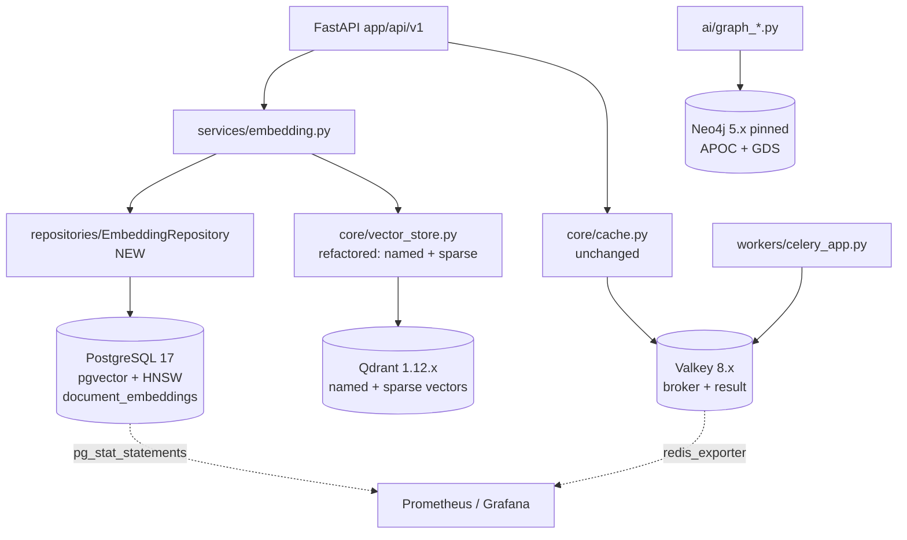
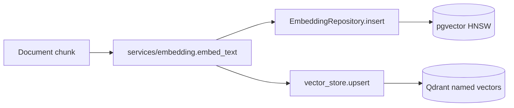
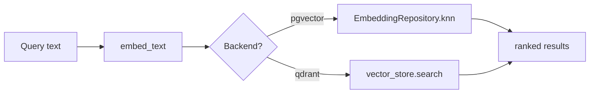

# Technical Specification

> **Title**: Phase 1 — Infrastructure Upgrades (PostgreSQL 17, pgvector, Valkey, Qdrant 1.12, Neo4j pin)
> **Phase**: 1 | **PR(s)**: 1.1.1 – 1.5.3 (16 PRs, ≤400 LOC each per NFR-07)
> **Author**: Tech Lead
> **Date**: 2026-04-07
> **Status**: Draft
> **Reviewers**: Backend Lead, SRE, Data Platform

---

## 1. Overview

Phase 1 upgrades the data tier of the Legal AI Platform: PostgreSQL 15→17 with the `pgvector` extension and a new `document_embeddings` table; the cache/broker is migrated from Redis 7 to Valkey 8 (per ADR-001); `qdrant-client` is upgraded 1.7→1.12 with named + sparse vector support enabled on collections; and Neo4j 5.x is pinned to a known-good patch version with APOC + GDS smoke-tested. All changes ship as 16 small, independently revertible PRs.

### Goals
- Land each upgrade behind an image pin or dependency bump that is rollback-safe in <15 min (NFR-08).
- Introduce pgvector as a first-class embedding store alongside Qdrant, with a repository-pattern data access layer.
- Unlock Qdrant hybrid retrieval (dense + sparse) for downstream Phase 2 RAG work.
- Preserve Phase 0 baselines: no >10% regression on cache, Qdrant k-NN, or CI runtime.

### Non-Goals
- No application-level code change to caching semantics (Valkey is wire-compatible — see ADR-001).
- No Phase 2 hybrid-retrieval logic; we ship the *capability*, not the query path.
- No Neo4j major version change (5.x only).
- No multi-node Valkey clustering (single-node, per ADR-001 A5).

## 2. Background

This phase consumes the [Phase 1 PRD](./1.0_prd_infrastructure-upgrades.md) and resolves dependency choices via the [Phase 1 Dependency Review](./1.0_dep-review_infrastructure-upgrades.md). Cache backend selection is recorded in [ADR-001 Valkey vs Redis](./1.3.1_adr_valkey-vs-redis.md). Phase 0 stabilization context is in [Phase 0 Tech Spec](../phase-0/0.0_tech-spec_stabilization.md) and the Phase 0 baselines in [Phase 0 Perf Spec](../phase-0/0.0_perf-spec_baseline-metrics.md) (NFR-02/03/05 inputs).

**Relevant files (modified):**
- `docker-compose.yml` (L5 postgres, L26 redis, L42 neo4j, L68 qdrant) — image pins
- `docker-compose.prod.yml` — same image pins, must stay in lockstep
- `.github/workflows/ci.yml` — service container images
- `backend/requirements.txt` (L9–L15) — `qdrant-client`, add `pgvector`
- `backend/app/core/vector_store.py` (L6–L8 imports, L47–56 client singleton, L72–87 `create_collection`) — extend for named + sparse vectors
- `backend/app/core/cache.py` — verify only; no expected change
- `backend/app/core/database.py`, `backend/app/core/config.py` — pgvector dialect registration
- `scripts/init-postgres.sql` — `CREATE EXTENSION vector;`, `pg_stat_statements`
- `backend/migrations/versions/` — currently 8 migrations (`001_initial_schema.py` … `008_add_refresh_tokens_table.py`); add `009_add_document_embeddings.py`

**New files (introduced):**
- `backend/app/models/__init__.py`, `backend/app/models/document_embedding.py`
- `backend/app/repositories/__init__.py`, `backend/app/repositories/embedding_repository.py`

> Note: `backend/app/models/` and `backend/app/repositories/` do not exist today; current code uses `backend/app/services/` and `backend/app/core/`. CLAUDE.md mandates the repository pattern, so this phase introduces both directories. See Open Question #3.

## 3. Design

### Architecture



The diagram reflects the *current* code layout (`app/core/`, `app/services/`, `app/workers/`, `app/ai/`) plus the two new directories (`app/models/`, `app/repositories/`). Cache and Celery paths are untouched in code; only the broker container image changes.

### Data Flow

**Embedding write path** (new):



**Embedding query path** (k-NN):



Both backends are written in parallel during Phase 1 to enable A/B comparison in Phase 2; only the read path will be selected per query.

### Key Components

#### `EmbeddingRepository` (NEW — `app/repositories/embedding_repository.py`)

**Responsibility**: Tenant-scoped CRUD + k-NN over `document_embeddings` using SQLAlchemy 2.0 async + the `pgvector` SQLAlchemy type.

**Interface**:
```python
from uuid import UUID
from pgvector.sqlalchemy import Vector
from sqlalchemy.ext.asyncio import AsyncSession

class EmbeddingRepository:
    def __init__(self, session: AsyncSession, tenant_id: UUID): ...

    async def insert(
        self, document_id: UUID, chunk_index: int, embedding: list[float], metadata: dict
    ) -> UUID: ...

    async def knn(
        self, query_vector: list[float], k: int = 10, filters: dict | None = None
    ) -> list["EmbeddingHit"]: ...

    async def delete_by_document(self, document_id: UUID) -> int: ...
```

**Behavior**:
- Every query is filtered by `tenant_id` in `WHERE` (multi-tenant isolation — CLAUDE.md mandate).
- k-NN uses `embedding <=> :q` (cosine) ordered ascending; HNSW index is selected by the planner.
- `insert` is idempotent on `(tenant_id, document_id, chunk_index)` via unique constraint.
- ≥90% line coverage required (PRD FR-05).

#### `DocumentEmbedding` model (NEW — `app/models/document_embedding.py`)

```python
class DocumentEmbedding(Base):
    __tablename__ = "document_embeddings"
    id: Mapped[UUID] = mapped_column(primary_key=True, default=uuid4)
    tenant_id: Mapped[UUID] = mapped_column(index=True, nullable=False)
    document_id: Mapped[UUID] = mapped_column(ForeignKey("documents.id"), nullable=False)
    chunk_index: Mapped[int] = mapped_column(nullable=False)
    embedding: Mapped[list[float]] = mapped_column(Vector(1536), nullable=False)
    meta: Mapped[dict] = mapped_column(JSONB, default=dict)
    created_at: Mapped[datetime] = mapped_column(server_default=func.now())
    __table_args__ = (
        UniqueConstraint("tenant_id", "document_id", "chunk_index"),
    )
```

#### `vector_store.create_collection` (REFACTORED — `app/core/vector_store.py` L72–87)

**Responsibility**: Create a Qdrant collection that supports multiple named dense vectors and one sparse vector (BM25-style), satisfying FR-10/11.

**Interface**:
```python
from qdrant_client.http.models import VectorParams, SparseVectorParams, Distance

def create_collection(
    name: str,
    dense_vectors: dict[str, VectorParams],   # e.g., {"text": VectorParams(1536, Distance.COSINE)}
    sparse_vectors: dict[str, SparseVectorParams] | None = None,  # e.g., {"bm25": SparseVectorParams()}
) -> None: ...
```

**Behavior**:
- Backward-compat shim: if a single positional `size`/`distance` is passed (legacy callers), wrap into `{"default": VectorParams(...)}`.
- Sparse config defaults to `None` for unchanged behavior.
- Idempotent: no-op if collection already exists with matching schema.

### State Machines / Lifecycles

N/A — this phase introduces no stateful entities. `document_embeddings` rows are immutable once written (delete-and-reinsert on document re-embed).

### Concurrency Model

| Concern | Approach |
|---------|----------|
| Async pattern | SQLAlchemy 2.0 `AsyncSession` throughout `EmbeddingRepository`; `qdrant-client` 1.12 `AsyncQdrantClient` in `vector_store`. No blocking I/O on the event loop. |
| Shared state | `_qdrant_client` module-level singleton in `vector_store.py` (already present, L47–56) — created lazily, immutable thereafter. No shared state in repository (per-request session). |
| Race conditions | `document_embeddings` `(tenant_id, document_id, chunk_index)` UNIQUE constraint → `INSERT ... ON CONFLICT DO NOTHING` for idempotent re-embed. |
| Connection pooling | SQLAlchemy async pool: `pool_size=20, max_overflow=10` (unchanged from Phase 0). Valkey: `redis-py` connection pool, `max_connections=10` per worker (unchanged). |
| Deadlock prevention | No multi-table transactions touch `document_embeddings` and `documents` together except the cascading delete, which acquires in FK order. |

### Data Model Changes

New table + HNSW index, shipped as Alembic revision `009_add_document_embeddings.py`:

```sql
CREATE EXTENSION IF NOT EXISTS vector;
CREATE EXTENSION IF NOT EXISTS pg_stat_statements;

CREATE TABLE document_embeddings (
    id            UUID PRIMARY KEY DEFAULT gen_random_uuid(),
    tenant_id     UUID NOT NULL,
    document_id   UUID NOT NULL REFERENCES documents(id) ON DELETE CASCADE,
    chunk_index   INTEGER NOT NULL,
    embedding     vector(1536) NOT NULL,
    meta          JSONB NOT NULL DEFAULT '{}'::jsonb,
    created_at    TIMESTAMPTZ NOT NULL DEFAULT now(),
    UNIQUE (tenant_id, document_id, chunk_index)
);

CREATE INDEX idx_doc_emb_tenant ON document_embeddings (tenant_id);
CREATE INDEX idx_doc_emb_hnsw
    ON document_embeddings
    USING hnsw (embedding vector_cosine_ops)
    WITH (m = 16, ef_construction = 64);
```

**Index choice (resolves PRD Q2):** **HNSW** is the default. Rationale: PRD NFR-01 (p95 < 50 ms at 100K rows, k=10) is achievable with HNSW at default parameters; IVFFlat requires periodic `REINDEX` after bulk inserts and has higher tail latency. IVFFlat is documented as fallback in the runbook if HNSW build time exceeds the migration window (NFR-04: <30s on empty DB — trivially met since the index is empty at migration time).

**Partitioning (resolves PRD Q4):** **Defer** native partitioning by `tenant_id`. We add the `tenant_id` column + index now so that future `PARTITION BY HASH (tenant_id)` is non-breaking. Triggering condition for partitioning: any single tenant exceeds 1M embedding rows, or total table exceeds 50M rows. Tracked as a Phase 3 candidate.

### Configuration

| Env Var | Type | Default | Description |
|---------|------|---------|-------------|
| `POSTGRES_IMAGE` | str | `pgvector/pgvector:pg17` | Bundles pgvector with PG17 |
| `VALKEY_IMAGE` | str | `valkey/valkey:8-alpine` | Cache + Celery broker |
| `QDRANT_IMAGE` | str | `qdrant/qdrant:v1.12.4` | Pinned patch (verify latest 1.12.x at PR time) |
| `NEO4J_IMAGE` | str | `neo4j:5.20.0` | Pinned 5.x patch (resolves PRD Q3) |
| `PGVECTOR_INDEX_TYPE` | str | `hnsw` | `hnsw` or `ivfflat` (rollback knob) |

## 4. Rejected Approaches

See [ADR-001](./1.3.1_adr_valkey-vs-redis.md) for the cache decision in full.

| Approach | Why Rejected |
|----------|-------------|
| Redis 8 OSS for cache/broker | AGPLv3 imposes legal review burden on every downstream image; ADR-001 D1. |
| Pin Redis 7.2.4 indefinitely | Receives no security patches; ADR-001 D1/D3. |
| Skip pgvector, keep Qdrant-only | PRD FR-04/05 explicitly requires a SQL-side embedding store for transactional joins with `documents`; Qdrant cannot participate in PG transactions. |
| IVFFlat as default index | Higher tail latency, requires post-bulk `REINDEX`; HNSW meets NFR-01 with no maintenance. Kept as configurable fallback. |
| Co-locate embedding DAO in `services/` (skip new `repositories/`) | Violates CLAUDE.md repository-pattern mandate; couples business logic to ORM. |
| Big-bang single PR | Violates NFR-07 (≤400 LOC/PR) and NFR-08 (rollback <15 min). |
| Upgrade `qdrant-client` and bump server in same PR | Hides which change caused any regression; we bump client first (1.4.x PRs), then server. |

## 5. API Changes

N/A — no public HTTP API surface changes. Internal Python signatures change (`vector_store.create_collection`); these are covered in §3 Key Components and do not require an ID Spec.

## 6. Migration Path

| Aspect | Detail |
|--------|--------|
| Backward compatible? | Yes — `vector_store.create_collection` retains a positional shim; `cache.py` is unchanged; PG17 reads PG15 dumps via `pg_dump --format=custom`. |
| Requires backfill? | No data backfill in Phase 1. `document_embeddings` starts empty; existing Qdrant points are untouched. |
| Zero-downtime migration? | Per-service: yes for Valkey (drop-in image), Qdrant (rolling restart), Neo4j (rolling restart). PostgreSQL 15→17 requires a brief maintenance window (`pg_dumpall` → restore on 17). |
| Rollback safe? | Yes for every step. Image revert restores previous behavior; Alembic `009` is `downgrade`-able (drops table + extension *only if no other objects depend*). |

**Migration guide**: [Migration Guide](./1.0_mig-guide_infrastructure-upgrades.md) (to be authored).

## 7. Error Handling

### Error Classification

| Error Condition | Category | Behavior | User Impact | Propagation |
|-----------------|----------|----------|-------------|-------------|
| pgvector extension missing on PG | Fatal | Alembic `009` aborts; CI fails | None (caught pre-deploy) | Migration runner → CI red |
| HNSW index build OOM during migration | Fatal | Migration aborts | None (rollback to PG15 image) | Alembic raises → operator runs runbook §rollback |
| `qdrant-client` 1.12 raises on legacy collection schema | Recoverable | `vector_store` logs WARN, recreates collection with named-vector layout | Brief unavailability of vector search for that collection | Caught in `vector_store.create_collection` |
| Valkey connection refused | Transient | `redis-py` retries (3x, exp backoff); Celery retries task | Slower task pickup | Surfaces as 503 only if retries exhaust |
| Neo4j APOC plugin fails to load on pinned image | Fatal | Container fails healthcheck; deployment blocked | None (caught at smoke test) | Compose healthcheck → deploy halts → revert image |
| pgvector k-NN p95 > 50 ms (NFR-01 violated) | Recoverable | Flip `PGVECTOR_INDEX_TYPE=ivfflat` and re-run `009` upgrade | Latency degradation until reindex | Detected by perf test, manual operator action |

### Error Propagation Chain

```
Alembic migration error → CI red → PR blocked
Runtime pgvector error → EmbeddingRepository → services/embedding → API 500 (global handler) → client retry
Qdrant client error → vector_store → services/embedding → caller decides (degrade vs fail)
Valkey error → redis-py retry → Celery retry → eventual DLQ alert
```

## 8. Security Considerations

- pgvector extension runs in-process inside PG; no new network surface.
- `EmbeddingRepository` enforces `tenant_id` filter on every query — covered by repository unit tests (PRD FR-05) and a tenant-isolation integration test (CLAUDE.md mandate).
- Valkey image is BSD-3 licensed (ADR-001 D1); no AGPL exposure.
- Neo4j image pin freezes APOC + GDS plugin versions, eliminating drift-based supply-chain risk.
- No new authn/authz surface. Defer broader analysis to [Sec Review](./1.0_sec-review_infrastructure-upgrades.md) (to be authored).

## 9. Performance Considerations

| Operation | Target | Source |
|-----------|--------|--------|
| pgvector k-NN (100K rows, k=10) | p95 < 50 ms | PRD NFR-01 |
| Qdrant k-NN | within ±10% of Phase 0 baseline | PRD NFR-02 |
| Valkey GET/SET | within ±10% of Phase 0 baseline | PRD NFR-03 |
| Alembic `009` on empty DB | < 30 s | PRD NFR-04 |
| CI total runtime | within +15% of Phase 0 baseline | PRD NFR-05 |

Detailed budgets and load profiles: [Perf Spec](./1.0_perf-spec_infrastructure-upgrades.md) (to be authored). Phase 0 baselines must be captured (status: in progress per scout) before NFR-02/03/05 can be validated.

## 10. Observability

| Type | Name | Description |
|------|------|-------------|
| Metric | `pgvector_knn_duration_seconds` | Histogram, labels: `tenant_id`, `k`. New, emitted from `EmbeddingRepository.knn`. |
| Metric | `pgvector_insert_total` | Counter of embedding inserts. |
| Metric | `qdrant_client_version_info` | Gauge with `version` label — proves the bump rolled out. |
| Metric | `cache_backend_info` | Gauge with `backend="valkey"` / `version` label — proves the swap. |
| Log event | `embedding.repo.knn` | Structured log: `tenant_id`, `k`, `duration_ms`, `index_type`. |
| Log event | `vector_store.collection.created` | Logs dense + sparse config. |
| Trace span | `pgvector.knn` | Child of HTTP request span. |
| Dashboard | Grafana: "Phase 1 Upgrade Health" | New panels: pgvector p95, Qdrant p95 vs baseline, Valkey ops/s vs baseline, Neo4j healthcheck. |
| Alert | `pgvector_p95_breach` | Fires when `histogram_quantile(0.95, pgvector_knn_duration_seconds) > 0.05` for 5m. |

`pg_stat_statements` is enabled on PG17 via init script and scraped by `postgres_exporter`. `redis_exporter` is repointed at Valkey (validated in PR 1.3.3 per ADR-001 follow-ups).

## 11. AI-Specific Considerations

| Aspect | Detail |
|--------|--------|
| Model(s) used | Existing OpenAI `text-embedding-ada-002` (1536-dim) — no model change. |
| Prompt design rationale | N/A — infra phase. |
| Eval criteria | Recall@10 parity between pgvector and Qdrant on a 10K-document gold set (Phase 2 entry gate). |
| Cost per invocation | Unchanged. |
| Hallucination mitigation | N/A. |
| Human-in-the-loop triggers | N/A. |

## 12. Testing Strategy

- **Unit**: `EmbeddingRepository` with in-memory PG (testcontainers `pgvector/pgvector:pg17`); `vector_store.create_collection` with mocked `AsyncQdrantClient`.
- **Integration**: Full docker-compose stack (PG17 + Valkey + Qdrant 1.12 + Neo4j pinned). Existing Celery, session, and cache tests run unchanged against Valkey (PRD FR-07). Alembic `upgrade head` + `downgrade -1` round-trip on `009`.
- **Tenant isolation**: explicit test that tenant A cannot k-NN tenant B's embeddings.
- **Smoke**: APOC + GDS procedure calls against pinned Neo4j image.
- **Manual**: One-time perf run against 100K-row seeded `document_embeddings` to validate NFR-01.

Detailed cases: [Test Spec](./1.0_test-spec_infrastructure-upgrades.md) (to be authored).

## 13. Rollout Plan

PRs are sized to ≤400 LOC each (NFR-07). Each merges behind no flag — the rollback knob is the previous container image tag (NFR-08, <15 min revert).

| PR | Group | Action |
|----|-------|--------|
| 1.1.1 | PG | Bump `docker-compose*.yml` to `pgvector/pgvector:pg17`; update `init-postgres.sql` (`CREATE EXTENSION vector`, `pg_stat_statements`) |
| 1.1.2 | PG | CI service container bump; run all 8 existing migrations on PG17 |
| 1.1.3 | PG | Add `pgvector` to `requirements.txt`; register SQLAlchemy dialect in `core/database.py` |
| 1.2.1 | pgvector | Create `app/models/__init__.py` + `document_embedding.py` |
| 1.2.2 | pgvector | Alembic `009_add_document_embeddings.py` (table + HNSW) |
| 1.2.3 | pgvector | Create `app/repositories/__init__.py` + `embedding_repository.py` (insert/delete) |
| 1.2.4 | pgvector | Add `knn()` + tenant-isolation tests; reach ≥90% coverage |
| 1.3.1 | cache | **(this ADR — already drafted)** finalize ADR-001 |
| 1.3.2 | cache | Swap image to `valkey/valkey:8-alpine` in compose + CI (gated on 1.3.1 merge) |
| 1.3.3 | cache | Re-baseline cache perf; repoint `redis_exporter`; verify Celery/session/cache tests |
| 1.4.1 | Qdrant | Bump `qdrant-client` 1.7→1.12 in `requirements.txt` (client only) |
| 1.4.2 | Qdrant | Refactor `vector_store.create_collection` for named + sparse vectors (back-compat shim) |
| 1.4.3 | Qdrant | Bump Qdrant server image to `v1.12.x` in compose + CI |
| 1.5.1 | Neo4j | Pin Neo4j image to `5.20.0` (or current 5.x patch) in compose + CI |
| 1.5.2 | Neo4j | APOC + GDS smoke tests in CI |
| 1.5.3 | Neo4j | Document plugin pin policy in runbook |

### Feature Flags

N/A — rollback is via image revert per NFR-08. The single configuration knob `PGVECTOR_INDEX_TYPE` is documented in §3 Configuration and is not a feature flag in the lifecycle sense.

## 14. Open Questions

| # | Question | Owner | Target Date | Resolution |
|---|----------|-------|-------------|------------|
| 1 | Exact Neo4j 5.x patch to pin (PRD Q3) | SRE | 2026-04-14 | Working assumption: `5.20.0` — confirm against APOC/GDS compatibility matrix before PR 1.5.1 |
| 2 | Phase 0 baseline values for NFR-02/03/05 | Perf Eng | 2026-04-14 | Pending Phase 0 perf-spec completion; Tech Spec acceptance gates on this |
| 3 | Are `app/models/` and `app/repositories/` the right home, or extend `app/core/`? | Backend Lead | 2026-04-10 | Working assumption: new directories per CLAUDE.md repository-pattern mandate |
| 4 | ADR-001 final approval | Tech Lead | 2026-04-10 | Draft recommends Valkey; PR 1.3.2 is gated on merge |

## 15. Related Documents

| Document | Link |
|----------|------|
| BRD | [BRD](./1.0_brd_infrastructure-upgrades.md) |
| PRD | [PRD](./1.0_prd_infrastructure-upgrades.md) |
| ADR-001 | [ADR Valkey vs Redis](./1.3.1_adr_valkey-vs-redis.md) |
| Dep Review | [Dep Review](./1.0_dep-review_infrastructure-upgrades.md) |
| Phase 0 Tech Spec | [Phase 0 Tech Spec](../phase-0/0.0_tech-spec_stabilization.md) |
| Phase 0 Perf Spec | [Phase 0 Perf Spec](../phase-0/0.0_perf-spec_baseline-metrics.md) |
| Test Spec | _to be authored_ — `./1.0_test-spec_infrastructure-upgrades.md` |
| Perf Spec | _to be authored_ — `./1.0_perf-spec_infrastructure-upgrades.md` |
| Sec Review | _to be authored_ — `./1.0_sec-review_infrastructure-upgrades.md` |
| Migration Guide | _to be authored_ — `./1.0_mig-guide_infrastructure-upgrades.md` |

## Version History

| Date | Change | Author |
|------|--------|--------|
| 2026-04-07 | Initial draft from scout report | Tech Lead |
