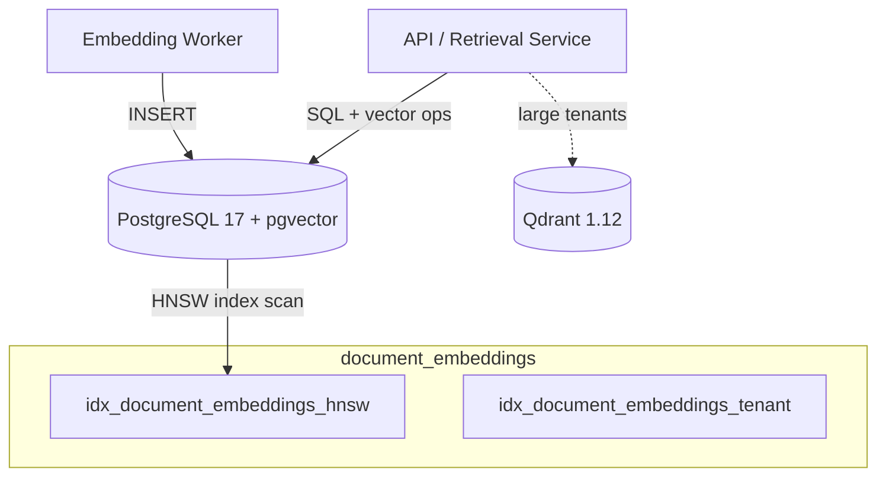
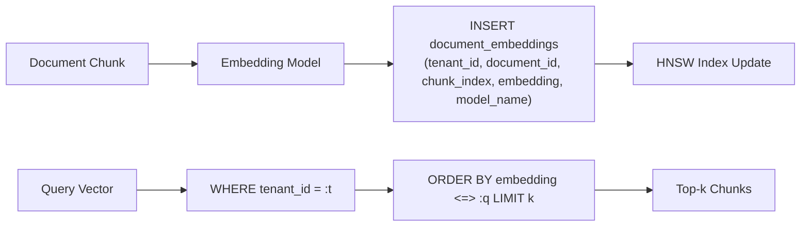

# Technical Specification

> **Title**: pgvector Schema and Index Choice for `document_embeddings`
> **Phase**: Phase 1 — Infrastructure Upgrades | **PR(s)**: PR 1.2.1
> **Author**: Tech Lead
> **Date**: 2026-04-09
> **Status**: Draft — Amended 2026-04-08 (FU-1)
> **Reviewers**: Platform Eng, DBA, AI Services Lead

---

## FU-1 Amendment (2026-04-08)

This spec assumed `tenants.id` and `documents.id` were already `UUID` columns. They were not: migrations 001 and 004 declared them as `sa.Integer()` auto-increment PKs. Migration 010 would have failed at `alembic upgrade` time on PG 17 with `foreign key constraint ... cannot be implemented ... are of incompatible types: uuid and integer`.

**Resolution** (applied in the same PR):

1. Migrations 001, 005, 006, 007, 008 were edited in-place to declare `tenants.id`, `documents.id`, and every `tenant_id` FK column as `postgresql.UUID(as_uuid=True)`. `documents.id` also became UUID.
2. Migration 001 now creates the `pgcrypto` extension so `gen_random_uuid()` is available as the server-side default for `tenants.id` / `documents.id`.
3. `backend/app/core/api_keys.py` — the only ORM model still declaring `tenant_id` as `Integer` — was updated to `PG_UUID(as_uuid=True)`.
4. `.env.example` `DEFAULT_TENANT_ID` was changed from `1` to a UUID literal.

**Operational impact**: this is a destructive schema reset. Anyone with a populated local DB from the pre-FU-1 schema must drop and recreate it. There is no data backfill path — we acted under the authorization "no data yet."

**Why not add a new migration**: because there is no data, and because changing column types under an FK graph this wide would require dropping every FK, altering each `tenant_id` column with `USING`, and recreating the FKs — a much larger, more error-prone change than editing the initial migrations in place. See Mig Guide 1.0 for the drop/recreate runbook.

---

## 1. Overview

Introduces a PostgreSQL-native vector store alongside Qdrant, using the `pgvector` extension. PR 1.2.1 defines the `document_embeddings` table, its indexing strategy, and the Alembic migration that ships it. This enables transactional, tenant-scoped similarity search for workloads where keeping embeddings colocated with relational data is simpler than a Qdrant round-trip.

### Goals
- Define a stable schema for `document_embeddings` with `vector(1536)` (OpenAI `text-embedding-3-small` / Ada-002 dimensionality).
- Pick and justify an index type (HNSW vs IVFFlat) for the target scale (≤100K vectors/tenant).
- Enforce tenant isolation and chunk uniqueness at the schema level.
- Ship a reversible Alembic migration that creates the extension, table, and indexes.

### Non-Goals
- Migrating existing Qdrant collections into pgvector (Qdrant remains the primary ANN store for large tenants; see §4).
- Query API / retrieval service design — covered by downstream ID Spec.
- Embedding generation pipeline changes.
- Multi-model embedding reconciliation logic (schema supports it via `model_name`; orchestration is out of scope).

## 2. Background

Phase 1 Tech Spec §3 Data Model Changes introduces a single new schema object for the phase — `document_embeddings` — and leaves the index type as **open question #2**: HNSW vs IVFFlat. This sub-spec resolves that question and pins the exact DDL.

Today, embeddings live exclusively in Qdrant. pgvector is additive: it serves tenants with small corpora (<100K chunks) where Qdrant's operational overhead isn't justified, and it enables joined queries against relational metadata (contract status, party, jurisdiction) in a single SQL statement.

**Relevant files:**
- `backend/app/models/` — SQLAlchemy models; new `DocumentEmbedding` model to be added.
- `backend/alembic/versions/` — migration directory; new revision lands here.
- `backend/app/core/db.py` — async engine; must load `vector` type adapter.
- `docs/phase-1/1.0_tech-spec_infrastructure-upgrades.md` §3 — upstream phase-level schema summary.

## 3. Design

### Architecture



The only new component is the `document_embeddings` table and its indexes. All access goes through SQLAlchemy; no direct psql calls from application code. Qdrant remains available for tenants exceeding the pgvector scale envelope.

### Data Flow



### Key Components

#### `DocumentEmbedding` (SQLAlchemy model)

**Responsibility**: ORM mapping for the `document_embeddings` table.

**Interface**:
```python
from pgvector.sqlalchemy import Vector
from sqlalchemy.orm import Mapped, mapped_column
from sqlalchemy import ForeignKey, UniqueConstraint, Index, text
from uuid import UUID
from datetime import datetime

class DocumentEmbedding(Base):
    __tablename__ = "document_embeddings"

    id: Mapped[UUID] = mapped_column(primary_key=True, server_default=text("gen_random_uuid()"))
    tenant_id: Mapped[UUID] = mapped_column(ForeignKey("tenants.id", ondelete="CASCADE"), nullable=False)
    document_id: Mapped[UUID] = mapped_column(ForeignKey("documents.id", ondelete="CASCADE"), nullable=False)
    chunk_index: Mapped[int] = mapped_column(nullable=False)
    embedding: Mapped[list[float]] = mapped_column(Vector(1536), nullable=False)
    model_name: Mapped[str] = mapped_column(nullable=False)
    created_at: Mapped[datetime] = mapped_column(server_default=text("NOW()"), nullable=False)

    __table_args__ = (
        UniqueConstraint("document_id", "chunk_index", "model_name",
                         name="uq_document_embeddings_doc_chunk_model"),
        Index("idx_document_embeddings_tenant", "tenant_id"),
        # HNSW index created via raw DDL in migration (see §3 Data Model Changes).
    )
```

**Behavior**:
- All queries MUST include `WHERE tenant_id = :tenant_id` — enforced by repository layer; RLS remains the belt-and-braces defense (tracked separately).
- `model_name` is denormalized, human-readable (e.g., `openai/text-embedding-3-small`). Future model rotation inserts new rows with a new `model_name` rather than UPDATE.
- Distance metric is **cosine** (operator `<=>`) — consistent with Qdrant configuration and OpenAI embedding guidance.

### State Machines / Lifecycles

N/A — rows are immutable after insert. Re-embedding a chunk inserts a new row under a different `model_name`; the old row is deleted only when the document is deleted (CASCADE).

### Concurrency Model

| Concern | Approach |
|---------|----------|
| Async pattern | SQLAlchemy async engine; all inserts/queries via `async with session`. |
| Shared state | None in application; all state in PG. HNSW index is concurrency-safe for reads and `INSERT` in pgvector ≥0.5.0. |
| Race conditions | Unique constraint on `(document_id, chunk_index, model_name)` prevents duplicate inserts on re-ingest; use `ON CONFLICT DO NOTHING` in worker. |
| Connection pooling | Existing asyncpg pool; no change. HNSW build is CPU-bound — avoid running `CREATE INDEX` during peak. |
| Deadlock prevention | Inserts touch only this table + FK parents; no multi-table write transactions introduced. |

### Data Model Changes

```sql
-- Extension (idempotent; superuser or rds_superuser)
CREATE EXTENSION IF NOT EXISTS vector;

-- Table
CREATE TABLE document_embeddings (
    id            UUID PRIMARY KEY DEFAULT gen_random_uuid(),
    tenant_id     UUID NOT NULL REFERENCES tenants(id) ON DELETE CASCADE,
    document_id   UUID NOT NULL REFERENCES documents(id) ON DELETE CASCADE,
    chunk_index   INTEGER NOT NULL,
    embedding     vector(1536) NOT NULL,
    model_name    TEXT NOT NULL,
    created_at    TIMESTAMPTZ NOT NULL DEFAULT NOW(),
    CONSTRAINT uq_document_embeddings_doc_chunk_model
        UNIQUE (document_id, chunk_index, model_name)
);

-- Tenant scoping (B-tree) — accelerates the mandatory tenant filter
CREATE INDEX idx_document_embeddings_tenant
    ON document_embeddings (tenant_id);

-- ANN index — HNSW with cosine opclass
-- m=16, ef_construction=64 are pgvector defaults and appropriate for ≤100K rows/tenant.
CREATE INDEX idx_document_embeddings_hnsw
    ON document_embeddings
    USING hnsw (embedding vector_cosine_ops)
    WITH (m = 16, ef_construction = 64);
```

**Index choice — HNSW vs IVFFlat (resolves Phase 1 Tech Spec Open Question #2):**

| Criterion | HNSW | IVFFlat | Winner |
|-----------|------|---------|--------|
| Build cost at 100K rows | ~30–60s, incremental on INSERT | ~5–10s, but requires representative training data via `lists=sqrt(N)` | HNSW |
| Query latency p95 (100K, k=10) | ~2–5 ms | ~10–20 ms (with `probes=10`) | HNSW |
| Recall @ defaults | ~0.98 | ~0.90 (tuning-sensitive) | HNSW |
| Memory overhead | Higher (~2–3× raw vectors) | Lower (~1.2×) | IVFFlat |
| Insert-heavy workloads | Good (graph updated online) | Poor (reindex needed after bulk load to stay balanced) | HNSW |
| Tuning burden | Low — `m`/`ef_construction` defaults fine | High — `lists` must be re-chosen as data grows | HNSW |

**Decision**: **HNSW** with `vector_cosine_ops`, `m=16`, `ef_construction=64`. Query-time `ef_search` is left at the pgvector default (40) and tunable per-session via `SET hnsw.ef_search`. Memory overhead is acceptable at the target scale: 100K × 1536 × 4 bytes × ~2.5 ≈ 1.5 GB per fully populated tenant, which fits the PG 17 instance budget defined in the phase Perf Spec.

### Configuration

| Env Var | Type | Default | Description |
|---------|------|---------|-------------|
| `PGVECTOR_INDEX_TYPE` | str | `hnsw` | Index type used by the migration. `ivfflat` path retained as an escape hatch; requires manual `lists` tuning. |
| `PGVECTOR_HNSW_M` | int | `16` | HNSW graph degree (migration-time). |
| `PGVECTOR_HNSW_EF_CONSTRUCTION` | int | `64` | HNSW build-time candidate list size. |
| `PGVECTOR_HNSW_EF_SEARCH` | int | `40` | Query-time candidate list; set per session in retrieval service. |

## 4. Rejected Approaches

| Approach | Why Rejected |
|----------|-------------|
| **IVFFlat index** | Requires representative training data and periodic `REINDEX` as row count grows; lower recall at defaults; worse p95 latency in the ≤100K regime. Acceptable only for >1M rows where HNSW memory becomes prohibitive — not our target scale here. |
| **No ANN index (sequential scan + cosine)** | Linear scan at 100K × 1536-dim is ~50–150 ms; exceeds the 20 ms retrieval budget in the phase Perf Spec and does not scale. |
| **`vector_l2_ops` or `vector_ip_ops`** | OpenAI embeddings are L2-normalized, so cosine is the semantically correct metric and matches existing Qdrant configuration. Mixing metrics across stores risks silent recall regressions. |
| **Store embeddings as `float4[]` + custom distance function** | Loses the operator class, planner integration, and ANN indexing that pgvector provides. No benefit. |
| **Move all embeddings from Qdrant into pgvector** | Out of scope for PR 1.2.1; decision deferred. pgvector is additive for small tenants; Qdrant stays for large corpora. |
| **Partition `document_embeddings` by `tenant_id`** | Premature at current scale. HNSW indexes are per-partition in PG, which would multiply build cost and memory. Revisit if any tenant exceeds 500K rows. |

## 5. API Changes

N/A — no external API changes. Query surface is defined by the retrieval service ID Spec (downstream, not part of PR 1.2.1).

## 6. Migration Path

| Aspect | Detail |
|--------|--------|
| Backward compatible? | Yes — new table only; no existing columns modified. |
| Requires backfill? | No for PR 1.2.1. Backfilling embeddings from Qdrant is a separate, opt-in workstream. |
| Zero-downtime migration? | Yes — `CREATE EXTENSION` and `CREATE TABLE` are fast; `CREATE INDEX` on an empty table is instant. |
| Rollback safe? | Yes — `DROP TABLE document_embeddings; DROP EXTENSION vector;` in the downgrade path. No data loss because no backfill. |

**Alembic migration shape** (`backend/alembic/versions/{rev}_pgvector_document_embeddings.py`):

```python
"""pgvector document_embeddings

Revision ID: {rev}
Revises: {prev}
Create Date: 2026-04-09
"""
from alembic import op
import sqlalchemy as sa
from pgvector.sqlalchemy import Vector

revision = "{rev}"
down_revision = "{prev}"
branch_labels = None
depends_on = None


def upgrade() -> None:
    op.execute("CREATE EXTENSION IF NOT EXISTS vector")

    op.create_table(
        "document_embeddings",
        sa.Column("id", sa.dialects.postgresql.UUID(as_uuid=True),
                  primary_key=True, server_default=sa.text("gen_random_uuid()")),
        sa.Column("tenant_id", sa.dialects.postgresql.UUID(as_uuid=True),
                  sa.ForeignKey("tenants.id", ondelete="CASCADE"), nullable=False),
        sa.Column("document_id", sa.dialects.postgresql.UUID(as_uuid=True),
                  sa.ForeignKey("documents.id", ondelete="CASCADE"), nullable=False),
        sa.Column("chunk_index", sa.Integer, nullable=False),
        sa.Column("embedding", Vector(1536), nullable=False),
        sa.Column("model_name", sa.Text, nullable=False),
        sa.Column("created_at", sa.TIMESTAMP(timezone=True),
                  server_default=sa.text("NOW()"), nullable=False),
        sa.UniqueConstraint("document_id", "chunk_index", "model_name",
                            name="uq_document_embeddings_doc_chunk_model"),
    )

    op.create_index(
        "idx_document_embeddings_tenant",
        "document_embeddings",
        ["tenant_id"],
    )

    # HNSW index — raw DDL because Alembic op.create_index does not expose
    # USING hnsw + opclass + WITH parameters cleanly.
    op.execute(
        "CREATE INDEX idx_document_embeddings_hnsw "
        "ON document_embeddings "
        "USING hnsw (embedding vector_cosine_ops) "
        "WITH (m = 16, ef_construction = 64)"
    )


def downgrade() -> None:
    op.execute("DROP INDEX IF EXISTS idx_document_embeddings_hnsw")
    op.drop_index("idx_document_embeddings_tenant", table_name="document_embeddings")
    op.drop_table("document_embeddings")
    # Intentionally DO NOT drop the extension on downgrade — other tables
    # may start depending on it before a rollback window closes.
```

**Migration guide**: N/A — trivial forward migration, no data movement.

## 7. Error Handling

### Error Classification

| Error Condition | Category | Behavior | User Impact | Propagation |
|-----------------|----------|----------|-------------|-------------|
| `CREATE EXTENSION vector` permission denied | Fatal | Migration aborts; deploy fails. | Deploy blocked. | Alembic surfaces error to CI/CD. Fix: grant `rds_superuser` or run extension install as DBA. |
| Duplicate `(document_id, chunk_index, model_name)` on INSERT | Recoverable | Worker uses `ON CONFLICT DO NOTHING`; logs at DEBUG. | None. | Caught in repository; idempotent re-ingest. |
| Vector dimensionality mismatch (≠1536) | Fatal | PG raises; row rejected. | Ingest fails for that chunk. | Caught in embedding worker; row quarantined; metric incremented. |
| HNSW index build OOM | Fatal | Migration fails on large tables (not expected at PR 1.2.1 — table is empty). | Deploy blocked. | Mitigation: migration runs on empty table. If backfill later, build index after data load with `maintenance_work_mem` bumped. |
| Query timeout on ANN search | Transient | Retrieval service retries once with lower `ef_search`, then falls back to Qdrant (for tenants where both exist). | Slightly degraded recall. | Caught in retrieval service; surfaced as metric. |

### Error Propagation Chain

```
Ingest worker → repository.insert(ON CONFLICT DO NOTHING) → PG
                                            ↓
                        UniqueViolation → swallowed (idempotent)
                        DataError (dim mismatch) → quarantine + metric → alert
```

## 8. Security Considerations

- Every query MUST filter by `tenant_id`. Repository methods take `tenant_id` as a required argument; code review gate enforces this. RLS policy on `document_embeddings` will be added under the broader RLS workstream (tracked outside PR 1.2.1).
- `embedding` vectors can leak content via inversion attacks — treat as PII-adjacent. Access to the table is restricted to the application role; no direct analyst access.
- `gen_random_uuid()` requires `pgcrypto` (already present in baseline).
- See Phase 1 Security Review for full analysis.

## 9. Performance Considerations

| Operation | Target Latency | Target Throughput |
|-----------|---------------|-------------------|
| Single-chunk INSERT | < 3 ms p95 | 500 inserts/s sustained |
| Top-10 ANN query (tenant-scoped, 100K rows) | < 20 ms p95 | 50 qps/tenant |
| Bulk INSERT 1K chunks | < 2 s | — |

Targets assume HNSW defaults and `maintenance_work_mem ≥ 256 MB` for index builds. See Phase 1 Perf Spec for the full budget.

## 10. Observability

| Type | Name | Description |
|------|------|-------------|
| Metric | `pgvector_query_duration_seconds` | Histogram of ANN query latency, labeled by `tenant_id_bucket`, `k`. |
| Metric | `pgvector_insert_total` | Counter of inserts into `document_embeddings`, labeled by `model_name`, `conflict` (bool). |
| Metric | `pgvector_rows_per_tenant` | Gauge scraped periodically to track the ≤100K scale assumption. |
| Log event | `pgvector.insert.conflict` | DEBUG when `ON CONFLICT DO NOTHING` fires. |
| Log event | `pgvector.query.fallback` | WARN when retrieval falls back to Qdrant after a PG query failure. |
| Trace span | `db.pgvector.query` | Child span of retrieval; tags: `tenant_id`, `k`, `ef_search`. |
| Dashboard | Grafana: *Retrieval Storage* | Add panels for the above metrics. |
| Alert | `pgvector_rows_per_tenant > 100000` | Warn — scale assumption broken; revisit index strategy (re-evaluate HNSW `m`, consider partitioning or Qdrant migration). |

## 11. AI-Specific Considerations

| Aspect | Detail |
|--------|--------|
| Model(s) used | OpenAI `text-embedding-3-small` (1536 dims). Dimensionality pinned in schema; model rotation requires a new `model_name` row set, not a column change. |
| Prompt design rationale | N/A — no generation at this layer. |
| Eval criteria | Recall@10 ≥ 0.95 vs brute-force cosine on a 10K gold set (measured once post-migration, tracked in Test Spec). |
| Cost per invocation | Storage-only: ~6 KB/row (vector) × 100K = ~600 MB/tenant data, plus ~1.5 GB HNSW overhead. |
| Hallucination mitigation | N/A at storage layer. |
| Human-in-the-loop triggers | N/A. |

## 12. Testing Strategy

- **Unit**: SQLAlchemy model round-trip (insert → select → distance ordering) against an ephemeral PG 17 + pgvector container. Mocked nothing.
- **Integration**: Alembic `upgrade head` then `downgrade -1` on a clean DB verifies reversibility. Unique constraint enforcement verified by double-insert test.
- **Recall test**: Insert 10K synthetic 1536-dim vectors, compare HNSW top-10 against brute-force top-10; assert recall ≥ 0.95.
- **Tenant isolation**: Insert rows for two tenants; assert queries filtered by `tenant_id` never return cross-tenant results.
- **Manual**: DBA reviews `\d+ document_embeddings` and `EXPLAIN (ANALYZE)` on a representative query before production deploy.

Detailed cases in the Phase 1 Test Spec (PR 1.2.1 section).

## 13. Rollout Plan

| Step | Action | Tracked In |
|------|--------|------------|
| 1 | Merge migration behind `PGVECTOR_ENABLED=false` (schema ships, no reads/writes yet) | PR 1.2.1 |
| 2 | Run migration on staging; verify Alembic upgrade/downgrade cycle | PR 1.2.1 |
| 3 | Enable `PGVECTOR_ENABLED=true` in staging; shadow-write from ingest worker | PR 1.2.2 |
| 4 | Recall evaluation on staging gold set | PR 1.2.2 |
| 5 | Enable in production for one pilot tenant | PR 1.2.3 |
| 6 | Enable for all tenants <100K chunks | PR 1.2.3 |

### Feature Flags

| Flag Name | Default | Description | Cleanup By |
|-----------|---------|-------------|------------|
| `PGVECTOR_ENABLED` | `false` | Gates writes/reads against `document_embeddings`. Schema ships regardless. | End of Phase 1 — remove once pgvector is the default retrieval path for eligible tenants and has been stable for 2 weeks. |

## 14. Open Questions

| # | Question | Owner | Target Date | Resolution |
|---|----------|-------|-------------|------------|
| 1 | Should we pre-create a partial index per `model_name` once we support >1 model concurrently? | Tech Lead | 2026-05-15 | Pending — defer until second model is introduced. |
| 2 | Is `ef_search=40` the right query-time default, or should we tune per tenant? | AI Services | 2026-05-01 | Pending — resolve with recall eval in PR 1.2.2. |
| 3 | When do we add RLS policy on `document_embeddings`? | Security | 2026-05-30 | Pending — tracked in broader RLS workstream. |

## 15. Related Documents

| Document | Link |
|----------|------|
| Phase 1 Tech Spec (upstream) | [1.0_tech-spec_infrastructure-upgrades.md](./1.0_tech-spec_infrastructure-upgrades.md) |
| Phase 1 BRD | [1.0_brd_infrastructure-upgrades.md](./1.0_brd_infrastructure-upgrades.md) |
| Phase 1 Test Spec | [1.0_test-spec_infrastructure-upgrades.md](./1.0_test-spec_infrastructure-upgrades.md) |
| ADR | N/A — decision captured inline in §4 (index choice) per phase Tech Spec Open Question #2. Promote to standalone ADR if revisited. |
| ID Spec | N/A — retrieval API unchanged at this PR. |
| Perf Spec | Phase 1 Perf Spec (pending) |
| Security Review | Phase 1 Security Review (pending) |

## Version History

| Date | Change | Author |
|------|--------|--------|
| 2026-04-09 | Initial draft | Tech Lead |
