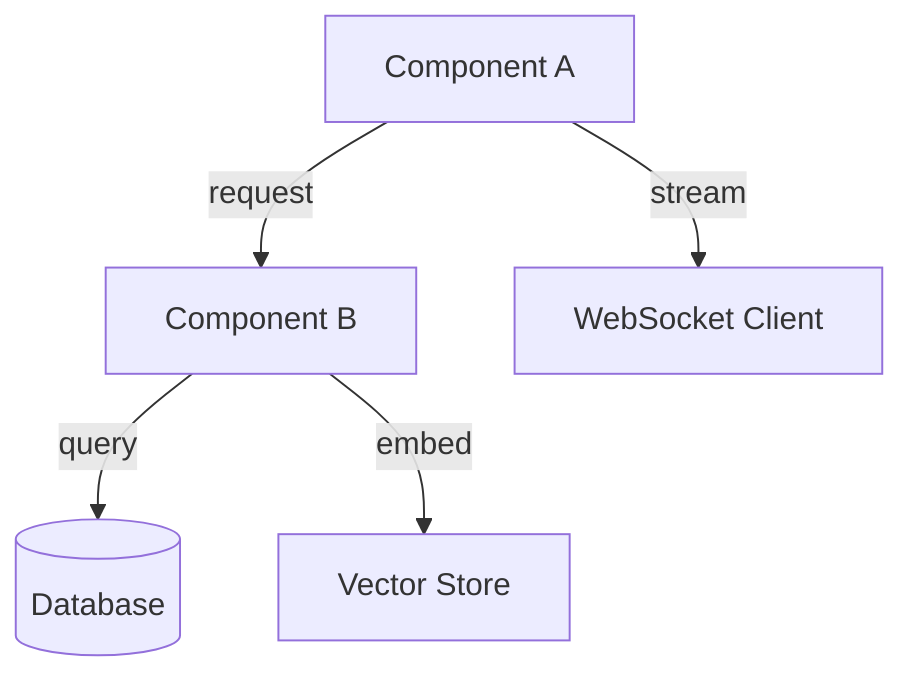
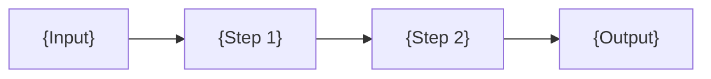
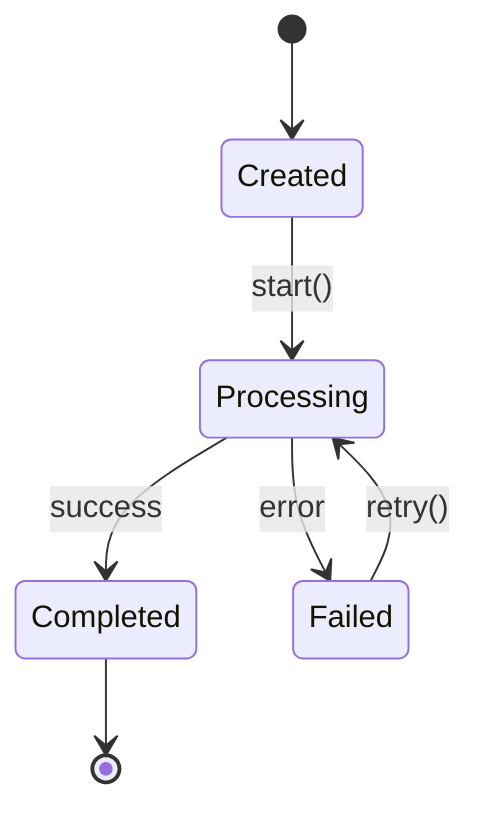

# Technical Specification

> **Title**: {feature or component name}
> **Phase**: {phase} | **PR(s)**: {PR numbers}
> **Author**: {name}
> **Date**: {YYYY-MM-DD}
> **Status**: Draft | In Review | Approved
> **Reviewers**: {names}

---

## 1. Overview

{What is being built or changed? 2-3 sentences.}

### Goals
- {Goal 1}
- {Goal 2}

### Non-Goals
- {Explicitly excluded scope}

## 2. Background

{Context needed to understand this spec. Link to ADR if a decision was made. Link to existing code that is being modified.}

**Relevant files:**
- `{path/to/file.py}` — {what it does today}
- `{path/to/other.py}` — {what it does today}

## 3. Design

### Architecture

> A component interaction diagram is **required**. Use Mermaid for diffability.



{Describe the relationships shown in the diagram. Call out any new components being introduced.}

### Data Flow



### Key Components

#### {Component A}

**Responsibility**: {what it does}

**Interface**:
```python
class ComponentA:
    async def method(self, param: Type) -> ReturnType:
        """Description."""
        ...
```

**Behavior**:
- {Rule 1}
- {Rule 2}

#### {Component B}

{Same structure}

### State Machines / Lifecycles

> If any entity has discrete states with transitions, document them here. Mark `N/A` if no stateful entities are introduced.



| State | Entry Condition | Valid Transitions | Side Effects |
|-------|----------------|-------------------|-------------|
| {Created} | {Entity instantiated} | {Processing} | {e.g., Audit log entry} |
| {Processing} | {`start()` called} | {Completed, Failed} | {e.g., Agent invoked, progress events emitted} |
| {Failed} | {Error during processing} | {Processing (retry)} | {e.g., Error logged, notification sent} |
| {Completed} | {Processing succeeds} | {Terminal} | {e.g., Results persisted, webhook fired} |

### Concurrency Model

> How does this feature handle concurrent access? Mark `N/A` if single-threaded / no shared state.

| Concern | Approach |
|---------|----------|
| Async pattern | {e.g., `asyncio` with `async def` throughout; no blocking I/O on event loop} |
| Shared state | {e.g., No shared mutable state between requests; all state in PostgreSQL with row-level locking} |
| Race conditions | {e.g., Optimistic locking via `version` column on contracts table; 409 on conflict} |
| Connection pooling | {e.g., SQLAlchemy async pool, max 20 connections per worker; Redis connection pool, max 10} |
| Deadlock prevention | {e.g., Always acquire locks in table alphabetical order; timeout after 5s} |

### Data Model Changes

{New tables, columns, indexes. Or "N/A — no schema changes."}

```sql
-- Example
ALTER TABLE documents ADD COLUMN embedding vector(1536);
CREATE INDEX idx_documents_embedding ON documents USING hnsw (embedding vector_cosine_ops);
```

### Configuration

| Env Var | Type | Default | Description |
|---------|------|---------|-------------|
| `{VAR_NAME}` | {str/int/bool} | {default} | {what it controls} |

## 4. Rejected Approaches

> What alternatives were considered and why they were rejected? If a formal decision record exists, link to the ADR: [ADR-{NNN}](../phase-{X}/{X.X}_adr_{name}.md).

| Approach | Why Rejected |
|----------|-------------|
| {e.g., Use LangChain agents instead of Claude Agent SDK} | {e.g., Too much abstraction, harder to debug, vendor lock-in to LangChain patterns} |
| {e.g., Store embeddings in PostgreSQL with pgvector} | {e.g., Qdrant provides better ANN performance at scale and supports sparse vectors} |

## 5. API Changes

> For detailed API contracts, create a separate [ID Spec](../templates/ID_SPEC_TEMPLATE.md) and link it here. Summarize changes below.

{New or modified endpoints. Or "N/A — no API changes."}

```
POST /api/v1/{resource}
  Request:  { field: type }
  Response: { field: type }
  Auth:     Bearer token required
  Errors:   400, 401, 404, 422
```

**Detailed contract**: [ID Spec](../phase-{X}/{X.X}_id-spec_{name}.md) or N/A

## 6. Migration Path

> How does existing data/state transition to the new design? Or "N/A — no schema changes or existing data affected."

| Aspect | Detail |
|--------|--------|
| Backward compatible? | {Yes / No — breaks X} |
| Requires backfill? | {Yes — script at `scripts/backfill_X.py` / No} |
| Zero-downtime migration? | {Yes / No — requires maintenance window} |
| Rollback safe? | {Yes — old code can read new schema / No — point of no return at step X} |

**Migration guide**: [Migration Guide](../phase-{X}/{X.X}_mig-guide_{name}.md) or N/A

## 7. Error Handling

### Error Classification

| Error Condition | Category | Behavior | User Impact | Propagation |
|-----------------|----------|----------|-------------|-------------|
| {e.g., LLM timeout} | Transient | {e.g., Retry 2x with backoff, then return partial result} | {e.g., Slower response, warning shown} | {e.g., Caught in AgentService, surfaced as degraded result} |
| {e.g., Tool call fails} | Recoverable | {e.g., Log error, skip tool, continue without tool output} | {e.g., Degraded accuracy} | {e.g., Caught in ToolExecutor, agent continues} |
| {e.g., Database connection lost} | Fatal | {e.g., Fail fast, return 503} | {e.g., Request fails, user retries} | {e.g., Uncaught, handled by global exception handler} |

### Error Propagation Chain

> For complex features, describe how errors bubble through layers.

```
Tool error → AgentService (retry or skip) → API endpoint (format error response) → Client (display error state)
```

## 8. Security Considerations

- {e.g., "All tool calls are tenant-scoped via the @tool wrapper"}
- {e.g., "Cypher queries are parameterized to prevent injection"}
- {Or "N/A — no security-sensitive changes. See [Security Review](../phase-{X}/{X.X}_sec-review_{name}.md) for full analysis."}

## 9. Performance Considerations

| Operation | Target Latency | Target Throughput |
|-----------|---------------|-------------------|
| {e.g., Agent invoke} | {e.g., < 5s p95} | {e.g., 10 concurrent} |

{Or "N/A — no performance-sensitive changes. See [Perf Spec](../phase-{X}/{X.X}_perf-spec_{name}.md) for budgets."}

## 10. Observability

| Type | Name | Description |
|------|------|-------------|
| Metric | {e.g., `agent_invoke_duration_seconds`} | {e.g., Histogram of agent invocation latency} |
| Metric | {e.g., `agent_token_cost_total`} | {e.g., Counter of token cost per model} |
| Log event | {e.g., `agent.invoke.start`} | {e.g., Structured log at invocation start with tenant_id, agent_type} |
| Log event | {e.g., `agent.invoke.error`} | {e.g., Structured log on failure with error type, stack trace} |
| Trace span | {e.g., `agent.invoke`} | {e.g., Parent span covering full invocation lifecycle} |
| Dashboard | {e.g., Grafana: Agent Performance} | {e.g., Update to include new agent type panels} |

{Or "N/A — no new observability needed."}

## 11. AI-Specific Considerations

> Mark `N/A` if this feature does not involve AI/ML components.

| Aspect | Detail |
|--------|--------|
| Model(s) used | {e.g., Claude 3 Opus for extraction, Ada-002 for embeddings} |
| Prompt design rationale | {e.g., Structured output via system prompt with JSON schema enforcement} |
| Eval criteria | {e.g., F1 >= 0.95 on gold-standard clause extraction set} |
| Cost per invocation | {e.g., ~$0.08 per contract (avg 15K input tokens, 2K output)} |
| Hallucination mitigation | {e.g., All outputs grounded to source spans; no free-form generation} |
| Human-in-the-loop triggers | {e.g., Confidence < 0.85 routes to analyst review queue} |

## 12. Testing Strategy

> High-level approach. Detailed test cases go in a [Test Spec](../phase-{X}/{X.X}_test-spec_{name}.md).

- **Unit**: {what is mocked, what is tested}
- **Integration**: {which real services are involved}
- **Manual**: {if any manual verification needed}

## 13. Rollout Plan

| Step | Action | Tracked In |
|------|--------|------------|
| 1 | {e.g., Merge behind feature flag} | [{PROJ-NNN}]({URL}) |
| 2 | {e.g., Enable for internal tenant} | [{PROJ-NNN}]({URL}) |
| 3 | {e.g., Enable for all tenants} | [{PROJ-NNN}]({URL}) |

{Or "N/A — ships directly, no staged rollout needed."}

### Feature Flags

> If this feature uses feature flags, define them here. Mark `N/A` if shipping without flags.

| Flag Name | Default | Description | Cleanup By |
|-----------|---------|-------------|------------|
| {e.g., `ENABLE_EXTRACTION_V2`} | {`false`} | {e.g., Gates new extraction pipeline} | {e.g., Phase 2 completion — remove after 100% rollout confirmed stable for 2 weeks} |

## 14. Open Questions

| # | Question | Owner | Target Date | Resolution |
|---|----------|-------|-------------|------------|
| 1 | {Question} | {name} | {YYYY-MM-DD} | {Pending} |
| 2 | {Question} | {name} | {YYYY-MM-DD} | {Pending} |

## 15. Related Documents

| Document | Link |
|----------|------|
| ADR | [ADR](../phase-{X}/{X.X}_adr_{name}.md) |
| PRD | [PRD](../phase-{X}/{X.X}_prd_{name}.md) |
| ID Spec | [ID Spec](../phase-{X}/{X.X}_id-spec_{name}.md) |
| Test Spec | [Test Spec](../phase-{X}/{X.X}_test-spec_{name}.md) |
| Perf Spec | [Perf Spec](../phase-{X}/{X.X}_perf-spec_{name}.md) |
| Security Review | [Security Review](../phase-{X}/{X.X}_sec-review_{name}.md) |
| {Other} | [{Title}]({relative path}) |

## Version History

| Date | Change | Author |
|------|--------|--------|
| {YYYY-MM-DD} | Initial draft | {name} |
| {YYYY-MM-DD} | {e.g., Updated design after review feedback} | {name} |
| {YYYY-MM-DD} | {e.g., Approved} | {name} |
