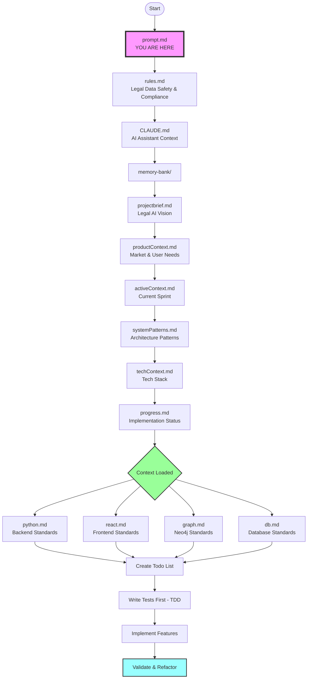

# prompt.md

## Prompt Ingestion Data Flow for Legal AI Platform



## Information Flow Summary

**Key Information Extracted at Each Stage:**

- **rules.md** → Legal data safety, multi-tenancy rules, compliance requirements, TDD enforcement
- **CLAUDE.md** → Project context, development workflow, TDD methodology, coding standards
- **Memory Bank Files** → Project vision, current phase, architecture decisions, progress tracking
- **prompts/*.md** → Language-specific TDD patterns, best practices, testing strategies

## File Loading Order

Please read and understand the Legal AI Platform project context by loading these files in order:

1. First read `rules.md` - Contains legal data safety, compliance requirements, and TDD enforcement
2. Then read `CLAUDE.md` - Contains project workflow, memory bank structure, and coding standards
3. Then read ALL files in the `memory-bank/` directory for complete project context:
   - `memory-bank/projectbrief.md` - Legal AI platform vision and competitive differentiation
   - `memory-bank/productContext.md` - Market needs, user personas, and product philosophy
   - `memory-bank/activeContext.md` - Current sprint focus and recent implementations
   - `memory-bank/systemPatterns.md` - Architecture patterns, microservices design, API patterns
   - `memory-bank/techContext.md` - Technology stack and infrastructure details
   - `memory-bank/progress.md` - Comprehensive implementation checklist (1000+ items)
4. Then read TDD guides in `prompts/` for language-specific patterns:
   - `prompts/python.md` - FastAPI backend TDD patterns
   - `prompts/react.md` - React/TypeScript frontend TDD patterns
   - `prompts/graph.md` - Neo4j/GraphRAG testing patterns
   - `prompts/db.md` - Multi-database testing strategies

## Project Directory Structure

Quick reference for Legal AI Platform layout:

```
legal-ai-platform/
├── backend/                     # FastAPI backend
│   ├── app/
│   │   ├── api/                # API endpoints
│   │   │   ├── v1/            # Versioned API routes
│   │   │   └── deps.py        # Common dependencies
│   │   ├── core/              # Core utilities
│   │   │   ├── config.py      # Configuration
│   │   │   ├── security.py    # Auth & security
│   │   │   └── database.py    # DB connections
│   │   ├── models/            # SQLAlchemy models
│   │   ├── schemas/           # Pydantic schemas
│   │   ├── services/          # Business logic
│   │   │   ├── clm/          # Contract lifecycle
│   │   │   ├── ai_services/  # AI integrations
│   │   │   └── graph/        # Graph operations
│   │   └── tasks/            # Celery tasks
│   ├── tests/                # Test suites
│   │   ├── unit/
│   │   ├── integration/
│   │   └── services/
│   └── alembic/              # DB migrations
│
├── frontend/                    # React 18 + TypeScript
│   ├── src/
│   │   ├── components/        # React components
│   │   │   ├── contracts/     # Contract management
│   │   │   ├── templates/     # Template system
│   │   │   ├── clauses/       # Clause library
│   │   │   └── ui/           # Base components
│   │   ├── pages/            # Page components
│   │   ├── services/         # API services
│   │   ├── store/            # Zustand stores
│   │   └── hooks/            # Custom hooks
│   └── tests/                # Frontend tests
│
├── memory-bank/               # Project context
│   ├── projectbrief.md       # Vision & objectives
│   ├── productContext.md     # User needs & market
│   ├── activeContext.md      # Current state
│   ├── systemPatterns.md     # Architecture
│   ├── techContext.md        # Technology stack
│   └── progress.md           # Implementation status
│
├── ml-services/               # AI/ML services
│   ├── rag_basic/            # Basic RAG implementation
│   ├── rag_graph/            # GraphRAG with Neo4j
│   ├── rag_neural/           # Neural RAG
│   └── hrm/                  # Hierarchical reasoning
│
├── docker-compose.yml         # Development environment
├── scripts/                   # Utility scripts
│   ├── start-dev.sh          # Start development
│   ├── wait-for-services.sh  # Service readiness
│   └── deploy.sh             # Deployment script
│
└── prompts/                   # TDD guides
    ├── python.md             # Python/FastAPI TDD
    ├── react.md              # React/TypeScript TDD
    ├── graph.md              # Neo4j testing
    └── db.md                 # Database testing

Key Services:
- PostgreSQL: Primary database (multi-tenant)
- Neo4j: Graph database (relationships)
- Qdrant: Vector database (embeddings)
- Redis: Cache and sessions
- MinIO: Document storage
- Celery: Background tasks
```

Create a comprehensive todo list from the tasks, then implement using these mandatory Legal AI Platform practices:

**Development Standards:**

- Review and follow ALL standards defined in `python.md` - for FastAPI backend services
- For frontend components, strictly follow `react.md` - React/TypeScript TDD patterns
- Mandatory TDD workflow: Write tests FIRST, then implementation (RED → GREEN → REFACTOR)
- All code must be under 750 lines per file (refactor if approaching limit)
- **STRICT TESTING REQUIREMENTS:**
  - Unit tests: REQUIRED for every service/component (85% minimum coverage)
  - Integration tests: REQUIRED for API endpoints and service interactions
  - E2E tests: REQUIRED for critical user workflows
  - Multi-tenant isolation tests: REQUIRED for all data operations
  - Security tests: REQUIRED for authentication and authorization
  - NO feature can be deployed without comprehensive test coverage

**File Organization:**

- Backend services in `backend/app/services/` with clear separation of concerns
- API endpoints in `backend/app/api/v1/` with versioning
- Frontend components in `frontend/src/components/` by feature
- Tests alongside implementation files or in dedicated test directories
- Maximum 750 lines per file for maintainability
- Document all services with API specifications and type hints

**Legal AI Platform Workflow:**

1. Read and understand all memory-bank context files
2. Create detailed todo list for current sprint tasks
3. For each feature implementation:
   - Write comprehensive tests first (TDD red phase):
     - Unit tests for business logic
     - Integration tests for API endpoints
     - Multi-tenant isolation tests
   - Implement minimal code to pass tests (TDD green phase):
     - Start with basic functionality
     - Ensure tests pass
   - Refactor for quality (TDD refactor phase):
     - Improve code structure
     - Add error handling
     - Optimize performance
   - Run ALL quality checks:
     - `pytest` - backend tests with coverage
     - `npm test` - frontend tests
     - Security validation (auth, RBAC, data isolation)
     - Performance testing (response times, load testing)
     - Multi-tenant isolation verification
   - Update memory-bank/progress.md with completed items

Begin by reading all the memory-bank context files, then create your todo list and start implementation following the TDD standards in the prompts/ directory.

**Key Features of Legal AI Platform Development:**

1. **Enterprise Architecture** - Multi-tenant SaaS with complete data isolation
2. **AI-First Approach** - RAG, GraphRAG, Neural RAG, and HRM integration
3. **Security Critical** - SOC 2 compliance, GDPR ready, end-to-end encryption
4. **Performance Targets** - <3 second document processing, 99.9% uptime
5. **TDD Mandatory** - RED → GREEN → REFACTOR for every feature
6. **Comprehensive Testing** - Unit, integration, E2E, security, performance
7. **API Standards** - RESTful, versioned, OpenAPI documented
8. **Phase 1 Focus** - Foundation & MVP with core CLM features
9. **Quality Gates** - No deployment without test coverage and code review

**Current Phase 1 Priorities (Weeks 3-4):**

- Essential CLM features implementation
- Document processing pipeline
- Basic RAG implementation with Qdrant
- Template management system
- Workflow engine for approvals
- Frontend component development with TDD
- Multi-tenant data isolation
- Authentication and RBAC system
